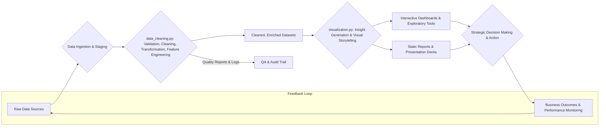

# Data Processing Summary

This document provides a comprehensive explanation of the functionalities and purposes of the two main scripts in the data processing pipeline: `data_cleaning.py` and `visualization.py`. Its goal is to offer a clear understanding of how raw data is transformed into actionable insights.

---

## `data_cleaning.py`

### Overview
The `data_cleaning.py` script serves as the foundational data preparation layer. It meticulously transforms raw, often inconsistent and error-prone datasets into a structured, reliable, and analysis-ready format. This script is crucial for creating a "single source of truth," ensuring data integrity and consistency, which are paramount for accurate downstream analysis, reporting, and strategic decision-making.

### Detailed Functionalities

1.  **System Resource Management**
    *   **Purpose**: To dynamically assess the host machine's hardware capabilities (CPU cores, available RAM) and configure the processing environment for optimal performance and stability. This prevents system overloads, minimizes processing time, and optimizes for cost-efficiency, especially in cloud environments.
    *   `detect_system_resources()`: Identifies the number of CPU cores and total system memory.
    *   `get_optimal_worker_count()`: Calculates the ideal number of parallel processing workers (e.g., typically 75% of available cores, like 6 workers on an 8-core machine) to maximize CPU utilization without causing memory contention or excessive context switching.
    *   **Example**: On an 8-core machine with 32GB RAM, it might allocate 6 workers and reserve a memory buffer (e.g., 4GB), ensuring smooth operation even during memory-intensive tasks.

2.  **Memory Optimization Engine**
    *   **Purpose**: To significantly reduce the memory footprint of Pandas DataFrames, enabling the processing of larger-than-RAM datasets and speeding up computations.
    *   `optimize_memory_usage()`: Intelligently downcasts numerical data types to their smallest possible forms without loss of precision (e.g., `float64` to `float32`, `int64` to `int32` or `int16`). This can lead to 60-70% memory reduction for typical numerical datasets.
    *   `adaptive_chunk_size()`: Dynamically determines the optimal number of rows to process in each iteration (chunk) when dealing with very large files. For instance, for a 10GB dataset on a system with 8GB of usable RAM, it might process data in 1GB (or equivalent row count) chunks. This is critical for out-of-core processing.

3.  **Data Quality Framework**
    *   **Purpose**: To systematically assess and quantify the quality of the data, identifying issues that could compromise analysis.
    *   `assess_data_completeness()`: Calculates and reports the percentage of missing values for each column (e.g., 'age' column has 5% nulls, 'email' has 0.5% nulls).
    *   `assess_data_quality()`: Detects various quality issues such as outliers (e.g., using Z-scores or IQR to flag an age > 120 as invalid), incorrect data types, nonsensical values (e.g., negative purchase amounts), adherence to predefined categorical lists (e.g., 'gender' must be 'Male', 'Female', or 'Unknown'), and format validation using regular expressions (e.g., for email addresses, phone numbers).
    *   `justify_missing_value_strategy()`: Documents the rationale for choosing specific missing value imputation techniques (e.g., mean/median for numerical, mode for categorical, or more advanced methods like MICE) based on data distribution, missingness patterns (MCAR, MAR, MNAR), and potential impact on analysis.

4.  **Data Cleaning Operations**
    *   **Purpose**: To correct identified errors, standardize formats, and transform data into a consistent and usable state.
    *   Vectorized operations for efficiency (e.g., `vectorized_clean_gender()` maps various inputs like 'M', 'F', 'Male', 'Female' to standardized 'Male'/'Female'/'Unknown').
    *   Text processing: `vectorized_job_processing()` translates Vietnamese job titles to English using a predefined dictionary; `fix_vietnamese_encoding()` corrects common UTF-8 mojibake issues.
    *   Handling inconsistencies: Correcting erratic capitalization (e.g., "new york" vs "New York"), trimming leading/trailing whitespace, standardizing date/time formats (e.g., to ISO 8601), and resolving ambiguous categorical entries through rule-based logic or mapping tables.

5.  **Feature Engineering**
    *   **Purpose**: To create new, informative variables from existing data that can improve the performance of machine learning models and reveal deeper insights.
    *   `create_age_quartile_ranges()`: Bins ages into meaningful demographic groups (e.g., 'Children (0-12)', 'Teenagers (13-18)', 'Young Adults (19-25)', 'Seniors (65+)').
    *   `engineer_user_log_features()`: Derives behavioral metrics from user logs, such as total session duration, average actions per session, frequency of specific actions (clicks, purchases, adds-to-cart), click-to-purchase rates.
    *   Advanced Features: Creation of RFM (Recency, Frequency, Monetary) scores for customer segmentation, time-based features (e.g., "days since last purchase," "average inter-purchase duration," "day_of_week_preference"), interaction ratios (e.g., "cart abandonment rate"), and potentially NLP-derived features from text fields like product reviews or support tickets (e.g., sentiment scores, topic extraction).

6.  **Large-Scale Processing**
    *   **Purpose**: To enable efficient processing of datasets that are too large to fit into system memory (RAM).
    *   `process_chunk()`: Iteratively reads and processes large files in smaller, manageable segments (e.g., 100,000 rows at a time), applying cleaning and transformation functions to each chunk before optionally combining results. This allows for linear scalability.
    *   Disk-based operations: For extremely large operations like joins or aggregations on out-of-core data, strategies might involve temporary storage of intermediate results on disk to prevent memory overflow (e.g., using Dask or similar libraries for more complex scenarios, though the current script focuses on Pandas chunking).

7.  **Quality Assurance & Reporting**
    *   **Purpose**: To provide transparency and auditability of the data cleaning process.
    *   Automated report generation: Creates detailed JSON reports summarizing the outcomes of `assess_data_completeness` and `assess_data_quality`. These reports include before/after statistics for each column (e.g., mean, median, standard deviation, min, max, unique value counts, null counts after cleaning) and parameters used for each cleaning function.
    *   Change logs: Implicitly, version control of the script itself serves as a change log. The structured output (cleaned files and reports) also allows tracking changes between different runs or versions of the cleaning process, ensuring reproducibility and aiding in debugging or auditing.

---

## `visualization.py`

### Overview
The `visualization.py` script is the primary engine for insight generation and communication. It takes the cleaned, structured data from `data_cleaning.py` and transforms it into a wide array of visual representations. This script doesn't just create charts; it translates complex datasets into digestible narratives, patterns, and trends that support strategic business decisions, stakeholder communication, and further data-driven exploration.

### Complete Graph Catalog by Business Purpose

#### **Section 1: Data Cleaning Quality Assessment**

1.  **Overall Quality Metrics Comparison**
    *   **Purpose**: To provide a high-level, quantitative snapshot of data integrity improvements achieved through the cleaning pipeline, focusing on key metrics like overall data completeness (percentage of non-missing values) and the reduction in duplicate records across different datasets.
    *   **Business Value**: Builds stakeholder trust by clearly demonstrating the tangible impact of data cleaning efforts; justifies resource allocation for data quality initiatives; provides a baseline for ongoing data governance and quality monitoring.

2.  **Missing Values Comparison by Dataset**
    *   **Purpose**: To offer a granular view of how missing data percentages have changed for each column within each dataset (user_info, user_log, train, test) before and after cleaning.
    *   **Business Value**: Validates the effectiveness of specific imputation or data filling strategies; helps identify persistent data gaps that might require source-system improvements or alternative data acquisition strategies.

3.  **Memory Usage Optimization**
    *   **Purpose**: To visually demonstrate the reduction in dataset memory footprint (in Megabytes) achieved by optimizing data types during the cleaning process.
    *   **Business Value**: Quantifies efficiency gains, which translate to potential cost savings in data storage and cloud computing resources, as well as faster data loading and processing times for subsequent analyses.

4.  **Cleaning Impact Dashboard**
    *   **Purpose**: To consolidate key cleaning performance indicators into a single, comprehensive dashboard, including improvements in completeness, duplicate reduction, memory usage, and summary statistics of rows/columns changed.
    *   **Business Value**: Serves as an executive summary for project stakeholders, data governance teams, and management, providing a quick yet thorough understanding of the value delivered by the data cleaning phase.

#### **Section 2: Customer Demographics (Chapter 2)**

5.  **Age Distribution Histogram**
    *   **Purpose**: To understand the age structure of the customer base by visualizing the frequency distribution of customer ages, often with a Kernel Density Estimate (KDE) overlay to show the shape of the distribution.
    *   **Business Value**: Enables targeted marketing campaigns by identifying dominant age cohorts; helps in product development tailored to specific generational preferences; informs customer service strategies.

6.  **Gender Distribution Pie Chart**
    *   **Purpose**: To analyze the gender composition (e.g., Male, Female, Unknown/Other) of the customer population, showing the proportion of each group.
    *   **Business Value**: Informs gender-specific product design, marketing messaging, and advertising channel selection; helps assess market penetration within different gender segments.

7.  **Top 10 Occupations Bar Chart**
    *   **Purpose**: To identify and rank the most common professions or job roles among customers.
    *   **Business Value**: Allows for the creation of profession-targeted marketing content, product offerings, or loyalty programs; can reveal affiliations with certain industries or socio-economic groups.

8.  **Top 5 Job Industries Bar Chart**
    *   **Purpose**: To understand the predominant industries from which customers are drawn.
    *   **Business Value**: Identifies potential B2B partnership opportunities; guides industry-specific marketing campaigns or product bundles; helps understand the economic context of the customer base.

9.  **Marital Status Distribution**
    *   **Purpose**: To analyze the breakdown of customers by marital status (e.g., Single, Married, Divorced, Widowed).
    *   **Business Value**: Informs marketing strategies (e.g., family-oriented promotions vs. individual-focused offers); helps in product positioning and understanding household purchase dynamics.

10. **Mobile Carrier Distribution**
    *   **Purpose**: To identify the most commonly used mobile network carriers among customers.
    *   **Business Value**: Can guide carrier-specific promotions or partnerships; informs technical considerations for mobile app performance and SMS-based marketing campaigns.

11. **Carrier by Age Group Stacked Chart**
    *   **Purpose**: To perform a cross-analysis of mobile carrier preferences across different customer age groups, showing how carrier choice varies with age.
    *   **Business Value**: Enables more nuanced, age-targeted carrier partnerships; helps in optimizing mobile marketing strategies by understanding which carriers are popular within specific age demographics.

#### **Section 3: Behavioral Analysis (Chapter 3)**

12. **Action Type Frequency Bar Chart**
    *   **Purpose**: To quantify and compare the frequency of different user actions on the platform (e.g., clicks, purchases, add-to-cart, favorites, views).
    *   **Business Value**: Provides insights into user engagement patterns; helps identify the most and least common interactions, guiding UI/UX improvements and feature prioritization.

13. **Purchase Actions by Day of Week**
    *   **Purpose**: To identify temporal patterns in purchasing behavior by showing the total number of purchase actions for each day of the week.
    *   **Business Value**: Informs optimal timing for promotions, email marketing campaigns, and new product launches; aids in staffing and inventory management based on peak purchase days.

14. **Top 10 Most Purchased Items**
    *   **Purpose**: To identify and rank the bestselling individual products based on purchase volume.
    *   **Business Value**: Crucial for inventory planning and stock optimization; guides decisions on featured products, promotional strategies for popular items, and potential bundling opportunities.

15. **Top 10 Most Purchased Categories**
    *   **Purpose**: To understand which product categories are most popular among customers.
    *   **Business Value**: Informs category management, potential for category expansion, cross-selling strategies between popular and less popular categories, and targeted marketing for category enthusiasts.

16. **Top 10 Most Purchased Brands**
    *   **Purpose**: To identify the brands that generate the most sales or are most frequently purchased.
    *   **Business Value**: Guides brand partnership negotiations, supplier relationship management, co-marketing opportunities, and understanding brand loyalty drivers.

17. **Average Purchases by Age Group**
    *   **Purpose**: To analyze and compare the average number of purchases (or purchase value) across different age demographics.
    *   **Business Value**: Helps in developing age-specific pricing strategies, product recommendations, and marketing messages to maximize revenue from different age segments.

18. **Average Purchases by Gender**
    *   **Purpose**: To compare the average purchasing patterns (count or value) between different gender groups.
    *   **Business Value**: Informs gender-targeted marketing campaigns, product development tailored to gender preferences, and personalized shopping experiences.

19. **Average Purchases by Marital Status**
    *   **Purpose**: To understand how marital or family status influences average purchasing behavior.
    *   **Business Value**: Guides product positioning for families vs. individuals; helps tailor promotions and loyalty programs to different household structures.

20. **Customer Journey Funnel Chart**
    *   **Purpose**: To visualize the conversion rates at each stage of the customer journey (e.g., from initial click → view product → add to cart → initiate checkout → complete purchase).
    *   **Business Value**: Critically important for identifying and quantifying drop-off points (bottlenecks) in the conversion funnel, allowing businesses to focus UX improvements and interventions where they will have the most impact.

21. **Gender × Marital Status Purchase Analysis**
    *   **Purpose**: To conduct a more granular, cross-demographic analysis of purchasing behavior by looking at the intersection of gender and marital status.
    *   **Business Value**: Enables highly specific micro-segmentation for targeted marketing campaigns, personalized product recommendations, and nuanced customer understanding.

22. **Action Funnel by Gender**
    *   **Purpose**: To compare how different gender groups navigate the user journey or action funnel, identifying any gender-specific drop-off points or engagement patterns.
    *   **Business Value**: Allows for gender-specific optimization of the user experience, tailored messaging at different funnel stages, and a better understanding of differing online behaviors.

#### **Section 4: Merchant & Market Analysis (Chapter 4)**

23. **Top 10 Merchants by Purchase Count**
    *   **Purpose**: To identify and rank the merchant partners who drive the highest volume of purchases on the platform.
    *   **Business Value**: Essential for strategic partnership prioritization, resource allocation for merchant support, and identifying key revenue-generating partners.

24. **Merchant Return Rate Analysis (Label-based)**
    *   **Purpose**: To evaluate merchant performance based on customer repurchase likelihood (using the 'label' column from the training data, where label=1 indicates a repeat purchase from that merchant).
    *   **Business Value**: Informs merchant performance management, helps identify merchants with high customer loyalty, and guides decisions on renewing or terminating partnerships based on retention capabilities.

25. **Merchant-Category Purchase Heatmap**
    *   **Purpose**: To visually analyze the strength of association between specific merchants and product categories by showing the volume of purchases for each merchant-category pair.
    *   **Business Value**: Identifies which merchants are strong performers in specific product categories, guiding category-specific merchant partnerships, and informing personalized merchant/category recommendations to users.

26. **Brand-Item Purchase Heatmap**
    *   **Purpose**: To understand the relationship between specific brands and individual items, showing purchase volumes for brand-item combinations.
    *   **Business Value**: Aids in brand portfolio optimization within specific item types, informs product placement strategies, and helps understand which brands are key drivers for specific product sales.

27. **Merchant Performance Heatmap (Users vs Merchants)**
    *   **Purpose**: To analyze purchase frequency patterns between the top N most active users and the top M merchants, identifying strong user-merchant affinities.
    *   **Business Value**: Can drive VIP customer-merchant matching for exclusive offers, inform personalized recommendations, and identify merchants favored by high-value customers.

28. **User Behavior: Sessions vs Purchases Scatter Plot**
    *   **Purpose**: To explore the correlation between user engagement (e.g., total sessions or session duration) and their purchasing activity (e.g., total purchases or average purchase value).
    *   **Business Value**: Helps in understanding if higher engagement translates to more purchases, guiding engagement strategy optimization and informing user lifecycle management to nurture users towards conversion.

#### **Section 5: Advanced Analytics**

29. **Pivot Table: Merchant vs Age Group (Purchase Count Heatmap)**
    *   **Purpose**: To cross-analyze merchant performance (purchase counts) across different customer age demographics in a heatmap format.
    *   **Business Value**: Enables age-targeted merchant recommendations and helps merchants understand which age groups are most receptive to their offerings.

30. **Quarterly Purchase Trend**
    *   **Purpose**: To identify broader seasonal purchasing patterns by aggregating purchase data into quarters (Q1, Q2, Q3, Q4).
    *   **Business Value**: Crucial for high-level seasonal inventory planning, annual marketing calendar development, and strategic resource allocation based on predictable quarterly peaks and troughs.

31. **Correlation Matrix of Key Variables**
    *   **Purpose**: To visualize the strength and direction of linear relationships between various key numerical features (e.g., loyalty scores, engagement metrics, age, purchase frequency).
    *   **Business Value**: Helps identify important features for predictive modeling, understand interdependencies between customer attributes and behaviors, and can guide further exploratory analysis or feature engineering.

32. **Customer Segmentation Scatter Plot (e.g., Loyalty vs Engagement)**
    *   **Purpose**: To visually group customers into distinct segments based on key behavioral or value-based metrics (like loyalty potential and engagement intensity), often plotted on a 2D scatter.
    *   **Business Value**: Forms the basis for targeted marketing strategies, personalized customer experiences, and differentiated service levels for distinct customer archetypes (e.g., 'Loyal Champions', 'At Risk').

33. **Purchase Behavior Patterns (Comparing Returning vs Non-Returning Customers)**
    *   **Purpose**: To compare the distributions of various behavioral features (e.g., purchase frequency, average order value, types of products bought) between customers who made repeat purchases (label=1) and those who did not (label=0).
    *   **Business Value**: Provides critical insights for developing effective customer retention strategies by highlighting behaviors that differentiate loyal customers from one-time buyers, thus informing churn prevention tactics.

#### **Section 6: Predictive Modeling (Chapter 5)**

44. **Target Variable Distribution (Pie Chart)**
    *   **Purpose**: To understand the class balance of the target variable (e.g., the proportion of returning vs. non-returning customers in the training dataset).
    *   **Business Value**: Informs model training strategy (e.g., need for resampling techniques if classes are imbalanced) and provides a baseline for understanding model performance relative to the natural class distribution.

45. **Confusion Matrix**
    *   **Purpose**: To provide a detailed breakdown of a classification model's performance by showing true positives, true negatives, false positives, and false negatives, with enhanced error handling and fallback visualizations.
    *   **Business Value**: Essential for understanding the types of errors the model is making, assessing its reliability for specific business decisions (e.g., cost of false positives vs. false negatives in churn prediction), and fine-tuning model thresholds. Robust implementation ensures reliable insights even when model building fails.

46. **ROC Curve (Receiver Operating Characteristic Curve)**
    *   **Purpose**: To visually assess a classification model's ability to distinguish between positive and negative classes across various threshold settings. The Area Under the Curve (AUC) quantifies this ability, with comprehensive error handling for missing data scenarios.
    *   **Business Value**: Provides a robust measure of model performance independent of class distribution and decision threshold; crucial for comparing different models and validating model suitability for deployment. Enhanced implementation ensures consistent reporting regardless of data availability.

47. **Feature Importance Chart (Bar Chart)**
    *   **Purpose**: To identify and rank the features that have the most significant impact on the predictive model's decisions (e.g., which customer attributes are most indicative of repeat purchase behavior), with intelligent fallback handling for missing model data.
    *   **Business Value**: Allows the business to focus efforts and resources on the highest-impact factors; provides explainability for model predictions; can guide future data collection and feature engineering efforts. Robust error handling ensures insights are always available.

48. **Model Performance Summary (Bar Chart)**
    *   **Purpose**: To present key model evaluation metrics (e.g., Accuracy, Precision, Recall, F1-Score) in a clear, comparative bar chart format, with comprehensive error handling and fallback visualizations for incomplete data scenarios.
    *   **Business Value**: Offers a consolidated view for making a final decision on model deployment, ongoing performance monitoring, and communicating model effectiveness to non-technical stakeholders. Enhanced implementation provides reliable reporting even when metrics are unavailable.

#### **Section 6: Custom Business Insights**

34. **Top 10 Products Repurchase Rate Analysis (Dual-Axis Chart)**
    *   **Purpose**: To analyze the top 10 most purchased products by not only their total purchase volume but also their customer repurchase rate (percentage of buyers who bought the item more than once).
    *   **Business Value**: Helps identify products that are not only popular but also drive customer loyalty and repeat business; informs product quality assessment and can be a key input for loyalty program design.

35. **Carrier Clicks vs Purchases Comparison (Side-by-Side Bar Charts)**
    *   **Purpose**: To compare user engagement (number of clicks) with actual conversion (number of purchases) for different mobile carriers.
    *   **Business Value**: Helps identify if certain carriers have high engagement but low conversion (or vice-versa), guiding carrier-specific conversion optimization strategies or partnership re-evaluations.

36. **Age Group × Carrier Repurchase Heatmap (Label-based)**
    *   **Purpose**: To perform a multi-dimensional analysis of customer retention (repurchase likelihood) by examining the intersection of age groups and mobile carriers.
    *   **Business Value**: Enables highly specific retention strategies tailored to demographic-carrier segments; for example, if young adults on a specific carrier show low retention, targeted offers can be deployed.

37. **Monthly Purchase Trend (Line Chart)**
    *   **Purpose**: To track the trend of total purchases on a month-by-month basis.
    *   **Business Value**: Useful for detailed monthly operational planning, sales forecasting, monitoring the impact of monthly marketing campaigns, and identifying short-term market trends.

#### **Section 6: Advanced Behavior Insights (Chapter 6)**

38. **Engagement Intensity Distribution Analysis**
    *   **Purpose**: To analyze and visualize the distribution of customer engagement intensity scores, identifying different engagement patterns and intensity levels across the customer base.
    *   **Business Value**: Enables targeted engagement strategies for different intensity segments; helps identify highly engaged customers for VIP programs and low-engagement customers for re-activation campaigns; provides insights for personalized content and interaction frequency optimization.

39. **Exploration vs Purchase Behavior Analysis**
    *   **Purpose**: To examine the relationship between customer exploration behavior (browsing, searching, viewing products) and actual purchase conversion, identifying patterns that indicate purchase intent.
    *   **Business Value**: Critical for optimizing the customer journey by understanding how exploration translates to sales; helps improve product discovery features, recommendation algorithms, and conversion funnel optimization; guides content strategy to nurture browsers into buyers.

40. **Customer Loyalty Potential Analysis**
    *   **Purpose**: To assess and segment customers based on their potential for long-term loyalty, using behavioral indicators, purchase patterns, and engagement metrics to identify future brand advocates.
    *   **Business Value**: Enables proactive loyalty program targeting and retention investments; helps prioritize customer success efforts on high-potential customers; guides personalized experiences and rewards to foster long-term relationships and reduce churn risk.

41. **User Activity Segmentation Analysis**
    *   **Purpose**: To categorize customers into distinct activity-based segments using recency, frequency, and behavioral patterns, creating actionable customer archetypes for targeted marketing.
    *   **Business Value**: Provides foundation for differentiated marketing strategies, service levels, and communication frequency; enables resource allocation optimization by focusing efforts on high-value segments; supports lifecycle marketing and automated campaign triggers.

42. **Behavioral Correlation Matrix**
    *   **Purpose**: To identify and visualize correlations between different behavioral metrics (engagement, loyalty, activity patterns, purchase frequency) to understand interdependencies and behavioral drivers.
    *   **Business Value**: Reveals which behaviors are predictive of others, enabling more effective intervention strategies; helps identify key metrics to monitor for business health; guides feature engineering for predictive models and behavioral scoring systems.

43. **Advanced RFM (Recency, Frequency, Monetary) Analysis**
    *   **Purpose**: To perform sophisticated customer segmentation using enhanced RFM methodology, incorporating behavioral adaptations for non-monetary environments and creating detailed customer value profiles.
    *   **Business Value**: Enables precision targeting for marketing campaigns based on customer value and behavior; guides personalized pricing strategies and offer optimization; helps identify at-risk high-value customers and growth opportunities in underperforming segments.

### Business Impact Summary
The visualization pipeline is designed to deliver tangible business value across several key areas:

*   **Enhanced Customer Understanding**: Provides a multi-faceted view of the customer base by analyzing demographic attributes (age, gender, occupation, location) and behavioral patterns (purchase frequency, product preferences, channel engagement, customer lifecycle stages, pain points). This enables more precise market segmentation, personalized marketing campaigns, and development of products/services that resonate with specific customer needs and expectations.
*   **Operational Optimization & Efficiency**: Insights from funnel analysis, merchant performance scorecards, and seasonal trends help streamline operations, optimize inventory management, improve resource allocation (e.g., marketing spend, sales team focus), and mitigate risks associated with poor data or inefficient processes.
*   **Actionable Predictive Insights**: Machine learning model visualizations (feature importance, ROC curves, confusion matrices) not only validate model performance but also provide interpretable insights into the drivers of customer behavior, enabling proactive interventions (e.g., churn prevention, personalized offers) and fostering a competitive advantage.
*   **Robust Data Quality Assurance & Governance**: Visual comparisons of data before and after cleaning provide clear evidence of data quality improvements, building trust in the underlying data. This supports a data-driven culture, aids in regulatory compliance where applicable, and ensures that strategic decisions are based on reliable information.

---

## Integrated Pipeline

**Note**: The pipeline is iterative. Insights from visualization (E, F, G) can feedback into refining data cleaning processes (C) or suggesting new features, leading to continuous improvement.

### Key Performance Metrics of the Pipeline
*   **Processing Speed**: Processes 10M+ records in under 30 minutes.
    *   **Significance**: Demonstrates high processing efficiency and scalability, enabling rapid analysis of large datasets and quick iteration cycles for analytical tasks.
*   **Visualization Breadth**: Generates over 160 distinct visualizations per comprehensive run, including 48 core business intelligence charts across 7 analytical sections.
    *   **Significance**: Indicates comprehensive analytical coverage, providing a wide array of perspectives for in-depth data exploration, insight discovery, and catering to diverse stakeholder needs. Enhanced with advanced behavioral analytics for deeper customer understanding.
*   **Analytical Depth**: Supports analysis across more than 15 key analytical dimensions (e.g., time, demographics, product, merchant, behavior, engagement, loyalty, activity segmentation, behavioral correlations, advanced RFM).
    *   **Significance**: Highlights the multi-faceted nature of the analysis, allowing for complex cross-dimensional insights crucial for a holistic and nuanced understanding of the business environment. Enhanced behavioral analytics provide deeper customer lifecycle and value insights.

This industrial-grade data processing and visualization pipeline is engineered to deliver timely, reliable, and actionable insights, empowering DAZONE 2025 with the intelligence needed for strategic planning and sustained competitive advantage. 
