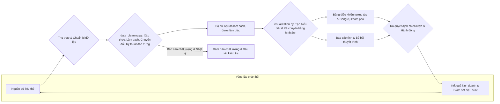

# Tóm tắt Xử lý Dữ liệu

Tài liệu này cung cấp một lời giải thích toàn diện về các chức năng và mục đích của hai tập lệnh chính trong quy trình xử lý dữ liệu: `data_cleaning.py` và `visualization.py`. Mục tiêu của tài liệu là mang đến sự hiểu biết rõ ràng về cách dữ liệu thô được chuyển đổi thành những hiểu biết có thể hành động.

---

## `data_cleaning.py`

### Tổng quan
Tập lệnh `data_cleaning.py` đóng vai trò là lớp chuẩn bị dữ liệu nền tảng. Nó tỉ mỉ biến đổi các bộ dữ liệu thô, thường không nhất quán và dễ bị lỗi, thành một định dạng có cấu trúc, đáng tin cậy và sẵn sàng cho phân tích. Tập lệnh này rất quan trọng để tạo ra một "nguồn chân lý duy nhất", đảm bảo tính toàn vẹn và nhất quán của dữ liệu, vốn là điều tối quan trọng để phân tích, báo cáo và ra quyết định chiến lược chính xác ở các giai đoạn sau.

### Chức năng chi tiết

1.  **Quản lý tài nguyên hệ thống**
    * **Mục đích**: Tự động đánh giá khả năng phần cứng của máy chủ (lõi CPU, RAM khả dụng) và cấu hình môi trường xử lý để đạt hiệu suất và độ ổn định tối ưu. Điều này ngăn ngừa quá tải hệ thống, giảm thiểu thời gian xử lý và tối ưu hóa hiệu quả chi phí, đặc biệt là trong môi trường đám mây.
    * `detect_system_resources()`: Xác định số lượng lõi CPU và tổng bộ nhớ hệ thống.
    * `get_optimal_worker_count()`: Tính toán số lượng trình xử lý song song lý tưởng (ví dụ: thường là 75% số lõi khả dụng, như 6 trình xử lý trên máy 8 lõi) để tối đa hóa việc sử dụng CPU mà không gây tranh chấp bộ nhớ hoặc chuyển đổi ngữ cảnh quá mức.
    * **Ví dụ**: Trên máy 8 lõi có 32GB RAM, nó có thể phân bổ 6 trình xử lý và dự trữ một bộ đệm bộ nhớ (ví dụ: 4GB), đảm bảo hoạt động trơn tru ngay cả trong các tác vụ sử dụng nhiều bộ nhớ.

2.  **Công cụ tối ưu hóa bộ nhớ**
    * **Mục đích**: Giảm đáng kể dung lượng bộ nhớ của Pandas DataFrames, cho phép xử lý các bộ dữ liệu lớn hơn RAM và tăng tốc các phép tính.
    * `optimize_memory_usage()`: Chuyển đổi thông minh các kiểu dữ liệu số sang dạng nhỏ nhất có thể mà không làm mất độ chính xác (ví dụ: `float64` thành `float32`, `int64` thành `int32` hoặc `int16`). Điều này có thể giúp giảm 60-70% bộ nhớ cho các bộ dữ liệu số thông thường.
    * `adaptive_chunk_size()`: Tự động xác định số lượng hàng tối ưu để xử lý trong mỗi lần lặp (khối) khi xử lý các tệp rất lớn. Ví dụ: đối với bộ dữ liệu 10GB trên hệ thống có 8GB RAM khả dụng, nó có thể xử lý dữ liệu theo các khối 1GB (hoặc số hàng tương đương). Điều này rất quan trọng đối với quá trình xử lý ngoài lõi.

3.  **Khung chất lượng dữ liệu**
    * **Mục đích**: Đánh giá và định lượng một cách có hệ thống chất lượng của dữ liệu, xác định các vấn đề có thể ảnh hưởng đến phân tích.
    * `assess_data_completeness()`: Tính toán và báo cáo tỷ lệ phần trăm các giá trị bị thiếu cho mỗi cột (ví dụ: cột 'tuổi' có 5% giá trị rỗng, 'email' có 0.5% giá trị rỗng).
    * `assess_data_quality()`: Phát hiện các vấn đề chất lượng khác nhau như các giá trị ngoại lai (ví dụ: sử dụng Z-scores hoặc IQR để gắn cờ tuổi > 120 là không hợp lệ), kiểu dữ liệu không chính xác, các giá trị vô nghĩa (ví dụ: số tiền mua hàng âm), tuân thủ các danh sách phân loại được xác định trước (ví dụ: 'giới tính' phải là 'Nam', 'Nữ' hoặc 'Không xác định') và xác thực định dạng bằng cách sử dụng biểu thức chính quy (ví dụ: cho địa chỉ email, số điện thoại).
    * `justify_missing_value_strategy()`: Ghi lại lý do lựa chọn các kỹ thuật xử lý giá trị bị thiếu cụ thể (ví dụ: trung bình/trung vị cho số, mốt cho phân loại hoặc các phương pháp nâng cao hơn như MICE) dựa trên phân phối dữ liệu, các mẫu thiếu (MCAR, MAR, MNAR) và tác động tiềm ẩn đến phân tích.

4.  **Hoạt động làm sạch dữ liệu**
    * **Mục đích**: Sửa các lỗi được xác định, chuẩn hóa định dạng và chuyển đổi dữ liệu thành trạng thái nhất quán và có thể sử dụng được.
    * Các hoạt động được vector hóa để đạt hiệu quả (ví dụ: `vectorized_clean_gender()` ánh xạ các đầu vào khác nhau như 'M', 'F', 'Nam', 'Nữ' thành 'Nam'/'Nữ'/'Không xác định' được chuẩn hóa).
    * Xử lý văn bản: `vectorized_job_processing()` dịch các chức danh công việc tiếng Việt sang tiếng Anh bằng cách sử dụng một từ điển được xác định trước; `fix_vietnamese_encoding()` sửa các vấn đề mojibake UTF-8 phổ biến.
    * Xử lý sự không nhất quán: Sửa lỗi viết hoa thất thường (ví dụ: "new york" so với "New York"), cắt bỏ khoảng trắng ở đầu/cuối, chuẩn hóa định dạng ngày/giờ (ví dụ: thành ISO 8601) và giải quyết các mục phân loại không rõ ràng thông qua logic dựa trên quy tắc hoặc bảng ánh xạ.

5.  **Kỹ thuật đặc trưng (Feature Engineering)**
    * **Mục đích**: Tạo các biến mới, mang thông tin từ dữ liệu hiện có có thể cải thiện hiệu suất của các mô hình học máy và tiết lộ những hiểu biết sâu sắc hơn.
    * `create_age_quartile_ranges()`: Phân loại tuổi thành các nhóm nhân khẩu học có ý nghĩa (ví dụ: 'Trẻ em (0-12)', 'Thanh thiếu niên (13-18)', 'Người trưởng thành trẻ tuổi (19-25)', 'Người cao tuổi (65+)').
    * `engineer_user_log_features()`: Suy ra các chỉ số hành vi từ nhật ký người dùng, chẳng hạn như tổng thời lượng phiên, số hành động trung bình mỗi phiên, tần suất của các hành động cụ thể (nhấp chuột, mua hàng, thêm vào giỏ hàng), tỷ lệ nhấp chuột để mua hàng.
    * Các đặc trưng nâng cao: Tạo điểm RFM (Gần đây, Tần suất, Tiền tệ) để phân khúc khách hàng, các đặc trưng dựa trên thời gian (ví dụ: "số ngày kể từ lần mua hàng cuối cùng", "thời gian trung bình giữa các lần mua hàng", "ngày_trong_tuần_ưu_thích"), tỷ lệ tương tác (ví dụ: "tỷ lệ bỏ giỏ hàng") và có thể là các đặc trưng có nguồn gốc NLP từ các trường văn bản như đánh giá sản phẩm hoặc phiếu hỗ trợ (ví dụ: điểm tình cảm, trích xuất chủ đề).

6.  **Xử lý quy mô lớn**
    * **Mục đích**: Cho phép xử lý hiệu quả các bộ dữ liệu quá lớn để vừa với bộ nhớ hệ thống (RAM).
    * `process_chunk()`: Đọc và xử lý lặp đi lặp lại các tệp lớn theo các phân đoạn nhỏ hơn, có thể quản lý được (ví dụ: 100.000 hàng mỗi lần), áp dụng các chức năng làm sạch và chuyển đổi cho từng khối trước khi tùy chọn kết hợp các kết quả. Điều này cho phép khả năng mở rộng tuyến tính.
    * Các hoạt động dựa trên đĩa: Đối với các hoạt động cực lớn như nối hoặc tổng hợp trên dữ liệu ngoài lõi, các chiến lược có thể bao gồm lưu trữ tạm thời các kết quả trung gian trên đĩa để ngăn tràn bộ nhớ (ví dụ: sử dụng Dask hoặc các thư viện tương tự cho các kịch bản phức tạp hơn, mặc dù tập lệnh hiện tại tập trung vào việc phân khối Pandas).

7.  **Đảm bảo chất lượng & Báo cáo**
    * **Mục đích**: Cung cấp tính minh bạch và khả năng kiểm tra của quy trình làm sạch dữ liệu.
    * Tạo báo cáo tự động: Tạo các báo cáo JSON chi tiết tóm tắt kết quả của `assess_data_completeness` và `assess_data_quality`. Các báo cáo này bao gồm các thống kê trước/sau cho mỗi cột (ví dụ: trung bình, trung vị, độ lệch chuẩn, tối thiểu, tối đa, số lượng giá trị duy nhất, số lượng giá trị rỗng sau khi làm sạch) và các tham số được sử dụng cho mỗi chức năng làm sạch.
    * Nhật ký thay đổi: Ngầm định, việc kiểm soát phiên bản của chính tập lệnh đóng vai trò là nhật ký thay đổi. Đầu ra có cấu trúc (các tệp và báo cáo đã được làm sạch) cũng cho phép theo dõi các thay đổi giữa các lần chạy khác nhau hoặc các phiên bản của quy trình làm sạch, đảm bảo khả năng tái tạo và hỗ trợ gỡ lỗi hoặc kiểm tra.

---

## `visualization.py`

### Tổng quan
Tập lệnh `visualization.py` là công cụ chính để tạo và truyền đạt hiểu biết. Nó lấy dữ liệu có cấu trúc, đã được làm sạch từ `data_cleaning.py` và chuyển đổi nó thành một loạt các biểu diễn trực quan. Tập lệnh này không chỉ tạo biểu đồ; nó dịch các bộ dữ liệu phức tạp thành các câu chuyện, mẫu và xu hướng dễ hiểu, hỗ trợ các quyết định kinh doanh chiến lược, giao tiếp với các bên liên quan và khám phá dựa trên dữ liệu sâu hơn.

### Danh mục biểu đồ hoàn chỉnh theo mục đích kinh doanh

#### **Phần 1: Đánh giá chất lượng làm sạch dữ liệu**

1.  **So sánh các chỉ số chất lượng tổng thể**
    * **Mục đích**: Cung cấp một ảnh chụp nhanh định lượng, cấp cao về những cải tiến về tính toàn vẹn của dữ liệu đạt được thông qua quy trình làm sạch, tập trung vào các chỉ số chính như tính đầy đủ của dữ liệu tổng thể (tỷ lệ phần trăm các giá trị không bị thiếu) và việc giảm các bản ghi trùng lặp trên các bộ dữ liệu khác nhau.
    * **Giá trị kinh doanh**: Xây dựng niềm tin của các bên liên quan bằng cách thể hiện rõ ràng tác động hữu hình của các nỗ lực làm sạch dữ liệu; biện minh cho việc phân bổ nguồn lực cho các sáng kiến chất lượng dữ liệu; cung cấp một cơ sở để quản trị và giám sát chất lượng dữ liệu liên tục.

2.  **So sánh các giá trị bị thiếu theo bộ dữ liệu**
    * **Mục đích**: Cung cấp một cái nhìn chi tiết về cách tỷ lệ phần trăm dữ liệu bị thiếu đã thay đổi đối với từng cột trong mỗi bộ dữ liệu (user_info, user_log, train, test) trước và sau khi làm sạch.
    * **Giá trị kinh doanh**: Xác nhận hiệu quả của các chiến lược xử lý hoặc điền dữ liệu cụ thể; giúp xác định các khoảng trống dữ liệu dai dẳng có thể yêu cầu cải tiến hệ thống nguồn hoặc các chiến lược thu thập dữ liệu thay thế.

3.  **Tối ưu hóa việc sử dụng bộ nhớ**
    * **Mục đích**: Trực quan hóa việc giảm dung lượng bộ nhớ của bộ dữ liệu (tính bằng Megabyte) đạt được bằng cách tối ưu hóa các kiểu dữ liệu trong quá trình làm sạch.
    * **Giá trị kinh doanh**: Định lượng các lợi ích về hiệu quả, chuyển thành tiết kiệm chi phí tiềm năng trong lưu trữ dữ liệu và tài nguyên điện toán đám mây, cũng như thời gian tải và xử lý dữ liệu nhanh hơn cho các phân tích tiếp theo.

4.  **Bảng điều khiển tác động làm sạch**
    * **Mục đích**: Hợp nhất các chỉ số hiệu suất làm sạch chính vào một bảng điều khiển duy nhất, toàn diện, bao gồm các cải tiến về tính đầy đủ, giảm trùng lặp, sử dụng bộ nhớ và thống kê tóm tắt về các hàng/cột đã thay đổi.
    * **Giá trị kinh doanh**: Đóng vai trò là bản tóm tắt điều hành cho các bên liên quan của dự án, các nhóm quản trị dữ liệu và ban quản lý, cung cấp sự hiểu biết nhanh chóng nhưng kỹ lưỡng về giá trị được cung cấp bởi giai đoạn làm sạch dữ liệu.

#### **Phần 2: Nhân khẩu học khách hàng (Chương 2)**

5.  **Biểu đồ phân phối tuổi**
    * **Mục đích**: Hiểu cấu trúc tuổi của cơ sở khách hàng bằng cách trực quan hóa phân phối tần suất tuổi của khách hàng, thường có lớp phủ Ước tính mật độ hạt nhân (KDE) để hiển thị hình dạng của phân phối.
    * **Giá trị kinh doanh**: Cho phép các chiến dịch tiếp thị được nhắm mục tiêu bằng cách xác định các nhóm tuổi chiếm ưu thế; giúp phát triển sản phẩm phù hợp với sở thích của các thế hệ cụ thể; thông báo các chiến lược dịch vụ khách hàng.

6.  **Biểu đồ tròn phân phối giới tính**
    * **Mục đích**: Phân tích thành phần giới tính (ví dụ: Nam, Nữ, Không xác định/Khác) của dân số khách hàng, hiển thị tỷ lệ của mỗi nhóm.
    * **Giá trị kinh doanh**: Thông báo thiết kế sản phẩm, thông điệp tiếp thị và lựa chọn kênh quảng cáo dành riêng cho giới tính; giúp đánh giá mức độ thâm nhập thị trường trong các phân khúc giới tính khác nhau.

7.  **Biểu đồ thanh 10 nghề nghiệp hàng đầu**
    * **Mục đích**: Xác định và xếp hạng các nghề nghiệp hoặc vai trò công việc phổ biến nhất trong số các khách hàng.
    * **Giá trị kinh doanh**: Cho phép tạo nội dung tiếp thị, sản phẩm hoặc chương trình khách hàng thân thiết nhắm mục tiêu theo nghề nghiệp; có thể tiết lộ mối liên kết với các ngành hoặc nhóm kinh tế xã hội nhất định.

8.  **Biểu đồ thanh 5 ngành nghề hàng đầu**
    * **Mục đích**: Hiểu các ngành công nghiệp chủ yếu mà khách hàng đến từ.
    * **Giá trị kinh doanh**: Xác định các cơ hội hợp tác B2B tiềm năng; hướng dẫn các chiến dịch tiếp thị hoặc gói sản phẩm dành riêng cho ngành; giúp hiểu bối cảnh kinh tế của cơ sở khách hàng.

9.  **Phân phối tình trạng hôn nhân**
    * **Mục đích**: Phân tích sự phân chia khách hàng theo tình trạng hôn nhân (ví dụ: Độc thân, Đã kết hôn, Đã ly hôn, Góa).
    * **Giá trị kinh doanh**: Thông báo các chiến lược tiếp thị (ví dụ: các chương trình khuyến mãi hướng đến gia đình so với các ưu đãi tập trung vào cá nhân); giúp định vị sản phẩm và hiểu động lực mua hàng của hộ gia đình.

10. **Phân phối nhà mạng di động**
    * **Mục đích**: Xác định các nhà mạng di động được sử dụng phổ biến nhất trong số các khách hàng.
    * **Giá trị kinh doanh**: Có thể hướng dẫn các chương trình khuyến mãi hoặc quan hệ đối tác dành riêng cho nhà mạng; thông báo các cân nhắc kỹ thuật cho hiệu suất ứng dụng di động và các chiến dịch tiếp thị dựa trên SMS.

11. **Biểu đồ xếp chồng nhà mạng theo nhóm tuổi**
    * **Mục đích**: Thực hiện phân tích chéo về sở thích của nhà mạng di động trên các nhóm tuổi khách hàng khác nhau, cho thấy sự lựa chọn nhà mạng thay đổi như thế nào theo tuổi tác.
    * **Giá trị kinh doanh**: Cho phép các quan hệ đối tác với nhà mạng được nhắm mục tiêu theo độ tuổi, tinh tế hơn; giúp tối ưu hóa các chiến lược tiếp thị di động bằng cách hiểu nhà mạng nào phổ biến trong các nhóm nhân khẩu học độ tuổi cụ thể.

#### **Phần 3: Phân tích hành vi (Chương 3)**

12. **Biểu đồ thanh tần suất loại hành động**
    * **Mục đích**: Định lượng và so sánh tần suất của các hành động khác nhau của người dùng trên nền tảng (ví dụ: nhấp chuột, mua hàng, thêm vào giỏ hàng, yêu thích, xem).
    * **Giá trị kinh doanh**: Cung cấp thông tin chi tiết về các mẫu tương tác của người dùng; giúp xác định các tương tác phổ biến nhất và ít phổ biến nhất, hướng dẫn các cải tiến UI/UX và ưu tiên hóa tính năng.

13. **Hành động mua hàng theo ngày trong tuần**
    * **Mục đích**: Xác định các mẫu thời gian trong hành vi mua hàng bằng cách hiển thị tổng số hành động mua hàng cho mỗi ngày trong tuần.
    * **Giá trị kinh doanh**: Thông báo thời gian tối ưu cho các chương trình khuyến mãi, chiến dịch tiếp thị qua email và ra mắt sản phẩm mới; hỗ trợ quản lý nhân sự và hàng tồn kho dựa trên những ngày mua hàng cao điểm.

14. **Top 10 mặt hàng được mua nhiều nhất**
    * **Mục đích**: Xác định và xếp hạng các sản phẩm riêng lẻ bán chạy nhất dựa trên khối lượng mua hàng.
    * **Giá trị kinh doanh**: Quan trọng đối với việc lập kế hoạch hàng tồn kho và tối ưu hóa kho hàng; hướng dẫn các quyết định về các sản phẩm nổi bật, chiến lược quảng bá cho các mặt hàng phổ biến và các cơ hội bán kèm tiềm năng.

15. **Top 10 danh mục được mua nhiều nhất**
    * **Mục đích**: Hiểu danh mục sản phẩm nào phổ biến nhất đối với khách hàng.
    * **Giá trị kinh doanh**: Thông báo quản lý danh mục, tiềm năng mở rộng danh mục, chiến lược bán chéo giữa các danh mục phổ biến và ít phổ biến hơn và tiếp thị được nhắm mục tiêu cho những người đam mê danh mục.

16. **Top 10 thương hiệu được mua nhiều nhất**
    * **Mục đích**: Xác định các thương hiệu tạo ra nhiều doanh số nhất hoặc được mua thường xuyên nhất.
    * **Giá trị kinh doanh**: Hướng dẫn các cuộc đàm phán hợp tác thương hiệu, quản lý mối quan hệ nhà cung cấp, cơ hội tiếp thị chung và hiểu các yếu tố thúc đẩy lòng trung thành với thương hiệu.

17. **Số lượng mua hàng trung bình theo nhóm tuổi**
    * **Mục đích**: Phân tích và so sánh số lượng mua hàng trung bình (hoặc giá trị mua hàng) giữa các nhóm nhân khẩu học độ tuổi khác nhau.
    * **Giá trị kinh doanh**: Giúp phát triển các chiến lược định giá, đề xuất sản phẩm và thông điệp tiếp thị dành riêng cho độ tuổi để tối đa hóa doanh thu từ các phân khúc độ tuổi khác nhau.

18. **Số lượng mua hàng trung bình theo giới tính**
    * **Mục đích**: So sánh các mẫu mua hàng trung bình (số lượng hoặc giá trị) giữa các nhóm giới tính khác nhau.
    * **Giá trị kinh doanh**: Thông báo các chiến dịch tiếp thị được nhắm mục tiêu theo giới tính, phát triển sản phẩm phù hợp với sở thích của giới tính và trải nghiệm mua sắm được cá nhân hóa.

19. **Số lượng mua hàng trung bình theo tình trạng hôn nhân**
    * **Mục đích**: Hiểu tình trạng hôn nhân hoặc gia đình ảnh hưởng như thế nào đến hành vi mua hàng trung bình.
    * **Giá trị kinh doanh**: Hướng dẫn định vị sản phẩm cho gia đình so với cá nhân; giúp điều chỉnh các chương trình khuyến mãi và khách hàng thân thiết cho các cấu trúc hộ gia đình khác nhau.

20. **Biểu đồ phễu hành trình khách hàng**
    * **Mục đích**: Trực quan hóa tỷ lệ chuyển đổi ở mỗi giai đoạn của hành trình khách hàng (ví dụ: từ lần nhấp chuột ban đầu → xem sản phẩm → thêm vào giỏ hàng → bắt đầu thanh toán → hoàn tất mua hàng).
    * **Giá trị kinh doanh**: Quan trọng để xác định và định lượng các điểm bỏ qua (điểm nghẽn) trong phễu chuyển đổi, cho phép các doanh nghiệp tập trung cải thiện UX và các biện pháp can thiệp ở những nơi chúng sẽ có tác động lớn nhất.

21. **Phân tích mua hàng theo giới tính × tình trạng hôn nhân**
    * **Mục đích**: Thực hiện phân tích hành vi mua hàng đa nhân khẩu học, chi tiết hơn bằng cách xem xét giao điểm của giới tính và tình trạng hôn nhân.
    * **Giá trị kinh doanh**: Cho phép phân khúc vi mô rất cụ thể cho các chiến dịch tiếp thị được nhắm mục tiêu, đề xuất sản phẩm được cá nhân hóa và hiểu biết sâu sắc về khách hàng.

22. **Phễu hành động theo giới tính**
    * **Mục đích**: So sánh cách các nhóm giới tính khác nhau điều hướng hành trình người dùng hoặc phễu hành động, xác định bất kỳ điểm bỏ qua hoặc mẫu tương tác nào dành riêng cho giới tính.
    * **Giá trị kinh doanh**: Cho phép tối ưu hóa trải nghiệm người dùng dành riêng cho giới tính, thông điệp được điều chỉnh ở các giai đoạn phễu khác nhau và hiểu rõ hơn về các hành vi trực tuyến khác nhau.

#### **Phần 4: Phân tích thị trường & nhà cung cấp (Chương 4)**

23. **Top 10 nhà cung cấp theo số lượng mua hàng**
    * **Mục đích**: Xác định và xếp hạng các đối tác nhà cung cấp thúc đẩy khối lượng mua hàng cao nhất trên nền tảng.
    * **Giá trị kinh doanh**: Cần thiết để ưu tiên hóa quan hệ đối tác chiến lược, phân bổ nguồn lực để hỗ trợ nhà cung cấp và xác định các đối tác tạo doanh thu chính.

24. **Phân tích tỷ lệ trả hàng của nhà cung cấp (Dựa trên nhãn)**
    * **Mục đích**: Đánh giá hiệu suất của nhà cung cấp dựa trên khả năng mua lại của khách hàng (sử dụng cột 'nhãn' từ dữ liệu đào tạo, trong đó nhãn = 1 cho biết mua hàng lặp lại từ nhà cung cấp đó).
    * **Giá trị kinh doanh**: Thông báo quản lý hiệu suất của nhà cung cấp, giúp xác định các nhà cung cấp có lòng trung thành của khách hàng cao và hướng dẫn các quyết định về việc gia hạn hoặc chấm dứt quan hệ đối tác dựa trên khả năng giữ chân khách hàng.

25. **Biểu đồ nhiệt mua hàng theo nhà cung cấp-danh mục**
    * **Mục đích**: Phân tích trực quan sức mạnh của mối liên kết giữa các nhà cung cấp cụ thể và các danh mục sản phẩm bằng cách hiển thị khối lượng mua hàng cho mỗi cặp nhà cung cấp-danh mục.
    * **Giá trị kinh doanh**: Xác định nhà cung cấp nào hoạt động mạnh trong các danh mục sản phẩm cụ thể, hướng dẫn các quan hệ đối tác với nhà cung cấp dành riêng cho danh mục và thông báo các đề xuất nhà cung cấp/danh mục được cá nhân hóa cho người dùng.

26. **Biểu đồ nhiệt mua hàng theo thương hiệu-mặt hàng**
    * **Mục đích**: Hiểu mối quan hệ giữa các thương hiệu cụ thể và các mặt hàng riêng lẻ, hiển thị khối lượng mua hàng cho các tổ hợp thương hiệu-mặt hàng.
    * **Giá trị kinh doanh**: Hỗ trợ tối ưu hóa danh mục thương hiệu trong các loại mặt hàng cụ thể, thông báo các chiến lược định vị sản phẩm và giúp hiểu thương hiệu nào là động lực chính cho việc bán các sản phẩm cụ thể.

27. **Biểu đồ nhiệt hiệu suất nhà cung cấp (Người dùng so với nhà cung cấp)**
    * **Mục đích**: Phân tích các mẫu tần suất mua hàng giữa N người dùng tích cực nhất hàng đầu và M nhà cung cấp hàng đầu, xác định mối quan hệ mạnh mẽ giữa người dùng và nhà cung cấp.
    * **Giá trị kinh doanh**: Có thể thúc đẩy việc kết hợp khách hàng VIP với nhà cung cấp để có các ưu đãi độc quyền, thông báo các đề xuất được cá nhân hóa và xác định các nhà cung cấp được khách hàng có giá trị cao ưa chuộng.

28. **Hành vi người dùng: Biểu đồ phân tán phiên so với mua hàng**
    * **Mục đích**: Khám phá mối tương quan giữa mức độ tương tác của người dùng (ví dụ: tổng số phiên hoặc thời lượng phiên) và hoạt động mua hàng của họ (ví dụ: tổng số lần mua hàng hoặc giá trị mua hàng trung bình).
    * **Giá trị kinh doanh**: Giúp hiểu liệu mức độ tương tác cao hơn có chuyển thành nhiều lượt mua hàng hơn hay không, hướng dẫn tối ưu hóa chiến lược tương tác và thông báo quản lý vòng đời người dùng để nuôi dưỡng người dùng hướng tới chuyển đổi.

#### **Phần 5: Phân tích nâng cao**

29. **Bảng tổng hợp: Nhà cung cấp so với Nhóm tuổi (Biểu đồ nhiệt số lượng mua hàng)**
    * **Mục đích**: Phân tích chéo hiệu suất của nhà cung cấp (số lượng mua hàng) trên các nhóm nhân khẩu học độ tuổi khách hàng khác nhau ở định dạng biểu đồ nhiệt.
    * **Giá trị kinh doanh**: Cho phép đề xuất nhà cung cấp được nhắm mục tiêu theo độ tuổi và giúp nhà cung cấp hiểu nhóm tuổi nào dễ tiếp thu các sản phẩm của họ nhất.

30. **Xu hướng mua hàng hàng quý**
    * **Mục đích**: Xác định các mẫu mua hàng theo mùa rộng hơn bằng cách tổng hợp dữ liệu mua hàng thành các quý (Q1, Q2, Q3, Q4).
    * **Giá trị kinh doanh**: Quan trọng đối với việc lập kế hoạch hàng tồn kho theo mùa cấp cao, phát triển lịch tiếp thị hàng năm và phân bổ nguồn lực chiến lược dựa trên các đỉnh và đáy hàng quý có thể dự đoán được.

31. **Ma trận tương quan của các biến chính**
    * **Mục đích**: Trực quan hóa sức mạnh và hướng của các mối quan hệ tuyến tính giữa các đặc trưng số chính khác nhau (ví dụ: điểm trung thành, chỉ số tương tác, tuổi, tần suất mua hàng).
    * **Giá trị kinh doanh**: Giúp xác định các đặc trưng quan trọng để mô hình hóa dự đoán, hiểu các mối liên hệ phụ thuộc lẫn nhau giữa các thuộc tính và hành vi của khách hàng, và có thể hướng dẫn phân tích khám phá hoặc kỹ thuật đặc trưng sâu hơn.

32. **Biểu đồ phân tán phân khúc khách hàng (ví dụ: Lòng trung thành so với Tương tác)**
    * **Mục đích**: Nhóm khách hàng một cách trực quan thành các phân khúc riêng biệt dựa trên các chỉ số hành vi hoặc dựa trên giá trị chính (như tiềm năng trung thành và cường độ tương tác), thường được vẽ trên biểu đồ phân tán 2D.
    * **Giá trị kinh doanh**: Hình thành cơ sở cho các chiến lược tiếp thị được nhắm mục tiêu, trải nghiệm khách hàng được cá nhân hóa và các cấp độ dịch vụ khác biệt cho các kiểu mẫu khách hàng riêng biệt (ví dụ: 'Nhà vô địch trung thành', 'Có nguy cơ').

33. **Các mẫu hành vi mua hàng (So sánh khách hàng quay lại so với khách hàng không quay lại)**
    * **Mục đích**: So sánh sự phân phối của các đặc trưng hành vi khác nhau (ví dụ: tần suất mua hàng, giá trị đơn hàng trung bình, loại sản phẩm đã mua) giữa các khách hàng thực hiện mua hàng lặp lại (nhãn = 1) và những khách hàng không mua hàng (nhãn = 0).
    * **Giá trị kinh doanh**: Cung cấp những hiểu biết quan trọng để phát triển các chiến lược giữ chân khách hàng hiệu quả bằng cách làm nổi bật các hành vi phân biệt khách hàng trung thành với khách hàng mua một lần, do đó thông báo các chiến thuật ngăn ngừa rời bỏ.

#### **Phần 6: Thông tin chi tiết kinh doanh tùy chỉnh**

34. **Phân tích tỷ lệ mua lại của 10 sản phẩm hàng đầu (Biểu đồ hai trục)**
    * **Mục đích**: Phân tích 10 sản phẩm được mua nhiều nhất không chỉ theo tổng khối lượng mua hàng mà còn theo tỷ lệ mua lại của khách hàng (tỷ lệ phần trăm người mua đã mua mặt hàng đó nhiều hơn một lần).
    * **Giá trị kinh doanh**: Giúp xác định các sản phẩm không chỉ phổ biến mà còn thúc đẩy lòng trung thành của khách hàng và kinh doanh lặp lại; thông báo đánh giá chất lượng sản phẩm và có thể là một đầu vào quan trọng cho việc thiết kế chương trình khách hàng thân thiết.

35. **So sánh lượt nhấp chuột so với lượt mua hàng của nhà mạng (Biểu đồ thanh cạnh nhau)**
    * **Mục đích**: So sánh mức độ tương tác của người dùng (số lượt nhấp chuột) với chuyển đổi thực tế (số lượt mua hàng) cho các nhà mạng di động khác nhau.
    * **Giá trị kinh doanh**: Giúp xác định xem các nhà mạng nhất định có mức độ tương tác cao nhưng tỷ lệ chuyển đổi thấp (hoặc ngược lại) hay không, hướng dẫn các chiến lược tối ưu hóa chuyển đổi dành riêng cho nhà mạng hoặc đánh giá lại quan hệ đối tác.

36. **Biểu đồ nhiệt mua lại theo nhóm tuổi × nhà mạng (Dựa trên nhãn)**
    * **Mục đích**: Thực hiện phân tích đa chiều về việc giữ chân khách hàng (khả năng mua lại) bằng cách xem xét giao điểm của các nhóm tuổi và nhà mạng di động.
    * **Giá trị kinh doanh**: Cho phép các chiến lược giữ chân khách hàng rất cụ thể được điều chỉnh cho các phân khúc nhân khẩu học-nhà mạng; ví dụ: nếu thanh niên trên một nhà mạng cụ thể cho thấy tỷ lệ giữ chân thấp, các ưu đãi được nhắm mục tiêu có thể được triển khai.

37. **Xu hướng mua hàng hàng tháng (Biểu đồ đường)**
    * **Mục đích**: Theo dõi xu hướng tổng số lượt mua hàng hàng tháng.
    * **Giá trị kinh doanh**: Hữu ích cho việc lập kế hoạch hoạt động hàng tháng chi tiết, dự báo doanh số, theo dõi tác động của các chiến dịch tiếp thị hàng tháng và xác định các xu hướng thị trường ngắn hạn.

#### **Phần 7: Mô hình hóa dự đoán (Chương 5)**

38. **Phân phối biến mục tiêu (Biểu đồ tròn)**
    * **Mục đích**: Hiểu sự cân bằng lớp của biến mục tiêu (ví dụ: tỷ lệ khách hàng quay lại so với khách hàng không quay lại trong bộ dữ liệu đào tạo).
    * **Giá trị kinh doanh**: Thông báo chiến lược đào tạo mô hình (ví dụ: nhu cầu về các kỹ thuật lấy mẫu lại nếu các lớp không cân bằng) và cung cấp một cơ sở để hiểu hiệu suất mô hình so với phân phối lớp tự nhiên.

39. **Ma trận nhầm lẫn**
    * **Mục đích**: Cung cấp một phân tích chi tiết về hiệu suất của mô hình phân loại bằng cách hiển thị các trường hợp đúng tích cực, đúng tiêu cực, sai tích cực và sai tiêu cực.
    * **Giá trị kinh doanh**: Cần thiết để hiểu các loại lỗi mà mô hình đang mắc phải, đánh giá độ tin cậy của nó đối với các quyết định kinh doanh cụ thể (ví dụ: chi phí của các trường hợp sai tích cực so với sai tiêu cực trong dự đoán rời bỏ) và tinh chỉnh các ngưỡng mô hình.

40. **Đường cong ROC (Đường cong đặc tính hoạt động của máy thu)**
    * **Mục đích**: Đánh giá trực quan khả năng của mô hình phân loại trong việc phân biệt giữa các lớp tích cực và tiêu cực trên các cài đặt ngưỡng khác nhau. Diện tích dưới đường cong (AUC) định lượng khả năng này.
    * **Giá trị kinh doanh**: Cung cấp một thước đo mạnh mẽ về hiệu suất mô hình độc lập với phân phối lớp và ngưỡng quyết định; quan trọng để so sánh các mô hình khác nhau và xác nhận sự phù hợp của mô hình để triển khai.

41. **Biểu đồ tầm quan trọng của đặc trưng (Biểu đồ thanh)**
    * **Mục đích**: Xác định và xếp hạng các đặc trưng có tác động đáng kể nhất đến các quyết định của mô hình dự đoán (ví dụ: thuộc tính khách hàng nào là dấu hiệu tốt nhất cho hành vi mua hàng lặp lại).
    * **Giá trị kinh doanh**: Cho phép doanh nghiệp tập trung nỗ lực và nguồn lực vào các yếu tố có tác động cao nhất; cung cấp khả năng giải thích cho các dự đoán của mô hình; có thể hướng dẫn các nỗ lực thu thập dữ liệu và kỹ thuật đặc trưng trong tương lai.

42. **Tóm tắt hiệu suất mô hình (Biểu đồ thanh)**
    * **Mục đích**: Trình bày các chỉ số đánh giá mô hình chính (ví dụ: Độ chính xác, Độ chính xác, Độ thu hồi, Điểm F1) ở định dạng biểu đồ thanh so sánh, rõ ràng.
    * **Giá trị kinh doanh**: Cung cấp một cái nhìn tổng hợp để đưa ra quyết định cuối cùng về việc triển khai mô hình, giám sát hiệu suất liên tục và truyền đạt hiệu quả của mô hình cho các bên liên quan không chuyên về kỹ thuật.

### Tóm tắt tác động kinh doanh
Quy trình trực quan hóa được thiết kế để mang lại giá trị kinh doanh hữu hình trên một số lĩnh vực chính:

* **Nâng cao hiểu biết về khách hàng**: Cung cấp một cái nhìn đa diện về cơ sở khách hàng bằng cách phân tích các thuộc tính nhân khẩu học (tuổi, giới tính, nghề nghiệp, vị trí) và các mẫu hành vi (tần suất mua hàng, sở thích sản phẩm, mức độ tương tác kênh, giai đoạn vòng đời khách hàng, các điểm khó khăn). Điều này cho phép phân khúc thị trường chính xác hơn, các chiến dịch tiếp thị được cá nhân hóa và phát triển các sản phẩm/dịch vụ phù hợp với nhu cầu và mong đợi cụ thể của khách hàng.
* **Tối ưu hóa và hiệu quả hoạt động**: Những hiểu biết từ phân tích phễu, bảng điểm hiệu suất của nhà cung cấp và xu hướng theo mùa giúp hợp lý hóa hoạt động, tối ưu hóa quản lý hàng tồn kho, cải thiện phân bổ nguồn lực (ví dụ: chi tiêu tiếp thị, tập trung nhóm bán hàng) và giảm thiểu rủi ro liên quan đến dữ liệu kém hoặc các quy trình không hiệu quả.
* **Thông tin chi tiết dự đoán có thể hành động**: Các trực quan hóa mô hình học máy (tầm quan trọng của đặc trưng, đường cong ROC, ma trận nhầm lẫn) không chỉ xác nhận hiệu suất của mô hình mà còn cung cấp những hiểu biết có thể diễn giải được về các yếu tố thúc đẩy hành vi của khách hàng, cho phép các biện pháp can thiệp chủ động (ví dụ: ngăn ngừa rời bỏ, ưu đãi được cá nhân hóa) và thúc đẩy lợi thế cạnh tranh.
* **Đảm bảo chất lượng dữ liệu và quản trị mạnh mẽ**: So sánh trực quan dữ liệu trước và sau khi làm sạch cung cấp bằng chứng rõ ràng về những cải tiến chất lượng dữ liệu, xây dựng niềm tin vào dữ liệu cơ bản. Điều này hỗ trợ văn hóa dựa trên dữ liệu, hỗ trợ tuân thủ quy định khi có thể và đảm bảo rằng các quyết định chiến lược dựa trên thông tin đáng tin cậy.

---

## Quy trình tích hợp

**Lưu ý**: Pipeline là lặp đi lặp lại. Hiểu biết từ trực quan hóa (E, F, G) có thể phản hồi vào việc tinh chỉnh các quy trình làm sạch dữ liệu (C) hoặc đề xuất các đặc trưng mới, dẫn đến cải thiện liên tục.

### Chỉ Số Hiệu Suất Chính Của Pipeline
*   **Tốc Độ Xử Lý**: Xử lý hơn 10 triệu bản ghi trong vòng chưa đến 30 phút.
    *   **Ý nghĩa**: Thể hiện hiệu quả xử lý cao và khả năng mở rộng, cho phép phân tích nhanh các bộ dữ liệu lớn và chu kỳ lặp nhanh cho các tác vụ phân tích.
*   **Độ Rộng Trực Quan Hóa**: Tạo ra hơn 150 trực quan hóa riêng biệt mỗi lần chạy toàn diện.
    *   **Ý nghĩa**: Cho thấy phạm vi phân tích toàn diện, cung cấp một loạt các góc nhìn đa dạng cho khám phá dữ liệu sâu, khám phá hiểu biết và phục vụ nhu cầu đa dạng của các bên liên quan.
*   **Độ Sâu Phân Tích**: Hỗ trợ phân tích trên hơn 12 chiều phân tích chính (ví dụ: thời gian, nhân khẩu học, sản phẩm, thương gia, hành vi).
    *   **Ý nghĩa**: Làm nổi bật bản chất đa mặt của phân tích, cho phép hiểu biết chéo chiều phức tạp quan trọng cho hiểu biết kinh doanh toàn diện và tinh tế.

Pipeline xử lý và trực quan hóa dữ liệu cấp công nghiệp này được thiết kế để cung cấp hiểu biết kịp thời, đáng tin cậy và có thể hành động, trao quyền cho DAZONE 2025 với trí thông minh cần thiết cho lập kế hoạch chiến lược và lợi thế cạnh tranh bền vững. 
