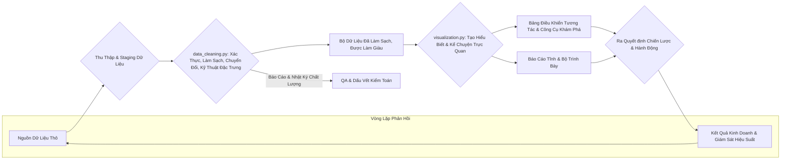

# Tóm Tắt Xử Lý Dữ Liệu

Tài liệu này cung cấp giải thích toàn diện về các chức năng và mục đích của hai script chính trong pipeline xử lý dữ liệu: `data_cleaning.py` và `visualization.py`. Mục tiêu là cung cấp hiểu biết rõ ràng về cách dữ liệu thô được chuyển đổi thành những hiểu biết có thể hành động.

---

## `data_cleaning.py`

### Tổng Quan
Script `data_cleaning.py` đóng vai trò là lớp chuẩn bị dữ liệu nền tảng. Nó tỉ mỉ chuyển đổi các bộ dữ liệu thô, thường không nhất quán và dễ bị lỗi thành định dạng có cấu trúc, đáng tin cậy và sẵn sàng cho phân tích. Script này rất quan trọng để tạo ra "nguồn sự thật duy nhất", đảm bảo tính toàn vẹn và nhất quán của dữ liệu, điều này là tối quan trọng cho việc phân tích, báo cáo và ra quyết định chiến lược chính xác.

### Các Chức Năng Chi Tiết

1.  **Quản Lý Tài Nguyên Hệ Thống**
    *   **Mục đích**: Đánh giá động các khả năng phần cứng của máy chủ (lõi CPU, RAM khả dụng) và cấu hình môi trường xử lý để đạt hiệu suất và ổn định tối ưu. Điều này ngăn ngừa quá tải hệ thống, giảm thiểu thời gian xử lý và tối ưu hóa hiệu quả chi phí, đặc biệt trong môi trường đám mây.
    *   `detect_system_resources()`: Xác định số lõi CPU và tổng bộ nhớ hệ thống.
    *   `get_optimal_worker_count()`: Tính toán số lượng worker xử lý song song lý tưởng (ví dụ: thường là 75% số lõi khả dụng, như 6 worker trên máy 8 lõi) để tối đa hóa việc sử dụng CPU mà không gây tranh chấp bộ nhớ hoặc chuyển đổi ngữ cảnh quá mức.
    *   **Ví dụ**: Trên máy 8 lõi với 32GB RAM, có thể phân bổ 6 worker và dự trữ bộ đệm bộ nhớ (ví dụ: 4GB), đảm bảo hoạt động mượt mà ngay cả trong các tác vụ sử dụng nhiều bộ nhớ.

2.  **Công Cụ Tối Ưu Hóa Bộ Nhớ**
    *   **Mục đích**: Giảm đáng kể dung lượng bộ nhớ của Pandas DataFrames, cho phép xử lý các bộ dữ liệu lớn hơn RAM và tăng tốc độ tính toán.
    *   `optimize_memory_usage()`: Chuyển đổi thông minh các kiểu dữ liệu số về dạng nhỏ nhất có thể mà không mất độ chính xác (ví dụ: `float64` thành `float32`, `int64` thành `int32` hoặc `int16`). Điều này có thể dẫn đến giảm 60-70% bộ nhớ cho các bộ dữ liệu số điển hình.
    *   `adaptive_chunk_size()`: Xác định động số hàng tối ưu để xử lý trong mỗi lần lặp (chunk) khi xử lý các file rất lớn. Ví dụ, đối với bộ dữ liệu 10GB trên hệ thống có 8GB RAM khả dụng, có thể xử lý dữ liệu theo chunk 1GB (hoặc số hàng tương đương). Điều này rất quan trọng cho xử lý ngoài lõi.

3.  **Khung Đánh Giá Chất Lượng Dữ Liệu**
    *   **Mục đích**: Đánh giá và định lượng một cách có hệ thống chất lượng dữ liệu, xác định các vấn đề có thể ảnh hưởng đến phân tích.
    *   `assess_data_completeness()`: Tính toán và báo cáo tỷ lệ phần trăm giá trị thiếu cho mỗi cột (ví dụ: cột 'age' có 5% null, 'email' có 0.5% null).
    *   `assess_data_quality()`: Phát hiện các vấn đề chất lượng khác nhau như ngoại lệ (ví dụ: sử dụng Z-scores hoặc IQR để đánh dấu tuổi > 120 là không hợp lệ), kiểu dữ liệu không chính xác, giá trị vô nghĩa (ví dụ: số tiền mua hàng âm), tuân thủ danh sách phân loại được xác định trước (ví dụ: 'gender' phải là 'Male', 'Female', hoặc 'Unknown'), và xác thực định dạng bằng biểu thức chính quy (ví dụ: cho địa chỉ email, số điện thoại).
    *   `justify_missing_value_strategy()`: Ghi lại lý do chọn các kỹ thuật điền giá trị thiếu cụ thể (ví dụ: mean/median cho số, mode cho phân loại, hoặc các phương pháp nâng cao hơn như MICE) dựa trên phân phối dữ liệu, mẫu thiếu (MCAR, MAR, MNAR), và tác động tiềm năng đến phân tích.

4.  **Các Hoạt Động Làm Sạch Dữ Liệu**
    *   **Mục đích**: Sửa chữa các lỗi đã xác định, chuẩn hóa định dạng và chuyển đổi dữ liệu thành trạng thái nhất quán và có thể sử dụng.
    *   Các hoạt động vector hóa để đạt hiệu quả (ví dụ: `vectorized_clean_gender()` ánh xạ các đầu vào khác nhau như 'M', 'F', 'Male', 'Female' thành 'Male'/'Female'/'Unknown' chuẩn hóa).
    *   Xử lý văn bản: `vectorized_job_processing()` dịch các chức danh công việc tiếng Việt sang tiếng Anh bằng từ điển được xác định trước; `fix_vietnamese_encoding()` sửa các vấn đề mojibake UTF-8 phổ biến.
    *   Xử lý sự không nhất quán: Sửa chữa viết hoa bất thường (ví dụ: "new york" vs "New York"), cắt bỏ khoảng trắng đầu/cuối, chuẩn hóa định dạng ngày/giờ (ví dụ: theo ISO 8601), và giải quyết các mục phân loại mơ hồ thông qua logic dựa trên quy tắc hoặc bảng ánh xạ.

5.  **Kỹ Thuật Tạo Đặc Trưng**
    *   **Mục đích**: Tạo ra các biến mới, có thông tin từ dữ liệu hiện có có thể cải thiện hiệu suất của các mô hình học máy và tiết lộ những hiểu biết sâu sắc hơn.
    *   `create_age_quartile_ranges()`: Phân nhóm tuổi thành các nhóm nhân khẩu học có ý nghĩa (ví dụ: 'Trẻ em (0-12)', 'Thiếu niên (13-18)', 'Thanh niên (19-25)', 'Người cao tuổi (65+)').
    *   `engineer_user_log_features()`: Tạo ra các chỉ số hành vi từ nhật ký người dùng, như tổng thời gian phiên, trung bình hành động mỗi phiên, tần suất các hành động cụ thể (clicks, purchases, adds-to-cart), tỷ lệ click-to-purchase.
    *   Đặc trưng nâng cao: Tạo điểm RFM (Recency, Frequency, Monetary) cho phân khúc khách hàng, đặc trưng dựa trên thời gian (ví dụ: "ngày kể từ lần mua cuối", "thời gian trung bình giữa các lần mua", "sở thích ngày trong tuần"), tỷ lệ tương tác (ví dụ: "tỷ lệ bỏ giỏ hàng"), và có thể các đặc trưng từ NLP từ các trường văn bản như đánh giá sản phẩm hoặc vé hỗ trợ (ví dụ: điểm cảm xúc, trích xuất chủ đề).

6.  **Xử Lý Quy Mô Lớn**
    *   **Mục đích**: Cho phép xử lý hiệu quả các bộ dữ liệu quá lớn để vừa với bộ nhớ hệ thống (RAM).
    *   `process_chunk()`: Đọc và xử lý lặp đi lặp lại các file lớn thành các phân đoạn nhỏ hơn, có thể quản lý (ví dụ: 100.000 hàng mỗi lần), áp dụng các hàm làm sạch và chuyển đổi cho mỗi chunk trước khi tùy chọn kết hợp kết quả. Điều này cho phép khả năng mở rộng tuyến tính.
    *   Các hoạt động dựa trên đĩa: Đối với các hoạt động cực kỳ lớn như join hoặc tổng hợp trên dữ liệu ngoài lõi, các chiến lược có thể bao gồm lưu trữ tạm thời các kết quả trung gian trên đĩa để ngăn tràn bộ nhớ (ví dụ: sử dụng Dask hoặc các thư viện tương tự cho các tình huống phức tạp hơn, mặc dù script hiện tại tập trung vào chunking Pandas).

7.  **Đảm Bảo Chất Lượng & Báo Cáo**
    *   **Mục đích**: Cung cấp tính minh bạch và khả năng kiểm toán của quá trình làm sạch dữ liệu.
    *   Tạo báo cáo tự động: Tạo các báo cáo JSON chi tiết tóm tắt kết quả của `assess_data_completeness` và `assess_data_quality`. Các báo cáo này bao gồm thống kê trước/sau cho mỗi cột (ví dụ: mean, median, độ lệch chuẩn, min, max, số lượng giá trị duy nhất, số lượng null sau làm sạch) và các tham số được sử dụng cho mỗi hàm làm sạch.
    *   Nhật ký thay đổi: Ngầm định, kiểm soát phiên bản của chính script đóng vai trò như nhật ký thay đổi. Đầu ra có cấu trúc (file đã làm sạch và báo cáo) cũng cho phép theo dõi các thay đổi giữa các lần chạy hoặc phiên bản khác nhau của quá trình làm sạch, đảm bảo khả năng tái tạo và hỗ trợ gỡ lỗi hoặc kiểm toán.

---

## `visualization.py`

### Tổng Quan
Script `visualization.py` là công cụ chính để tạo ra hiểu biết và truyền đạt thông tin. Nó lấy dữ liệu đã được làm sạch, có cấu trúc từ `data_cleaning.py` và chuyển đổi thành một loạt các biểu diễn trực quan đa dạng. Script này không chỉ tạo biểu đồ; nó dịch các bộ dữ liệu phức tạp thành những câu chuyện, mẫu và xu hướng dễ hiểu hỗ trợ quyết định kinh doanh chiến lược, giao tiếp với các bên liên quan và khám phá dữ liệu sâu hơn.

### Danh Mục Biểu Đồ Hoàn Chỉnh Theo Mục Đích Kinh Doanh

#### **Phần 1: Đánh Giá Chất Lượng Làm Sạch Dữ Liệu**

1.  **So Sánh Chỉ Số Chất Lượng Tổng Thể**
    *   **Mục đích**: Cung cấp cái nhìn tổng quan định lượng cấp cao về các cải thiện tính toàn vẹn dữ liệu đạt được thông qua pipeline làm sạch, tập trung vào các chỉ số chính như độ hoàn chỉnh dữ liệu tổng thể (tỷ lệ phần trăm giá trị không thiếu) và việc giảm bản ghi trùng lặp trên các bộ dữ liệu khác nhau.
    *   **Giá trị kinh doanh**: Xây dựng niềm tin của các bên liên quan bằng cách thể hiện rõ ràng tác động hữu hình của các nỗ lực làm sạch dữ liệu; biện minh phân bổ tài nguyên cho các sáng kiến chất lượng dữ liệu; cung cấp đường cơ sở cho giám sát quản trị và chất lượng dữ liệu liên tục.

2.  **So Sánh Giá Trị Thiếu Theo Bộ Dữ Liệu**
    *   **Mục đích**: Cung cấp cái nhìn chi tiết về cách tỷ lệ phần trăm dữ liệu thiếu đã thay đổi cho mỗi cột trong mỗi bộ dữ liệu (user_info, user_log, train, test) trước và sau khi làm sạch.
    *   **Giá trị kinh doanh**: Xác thực hiệu quả của các chiến lược điền hoặc điền dữ liệu cụ thể; giúp xác định các khoảng trống dữ liệu dai dẳng có thể yêu cầu cải thiện hệ thống nguồn hoặc chiến lược thu thập dữ liệu thay thế.

3.  **Tối Ưu Hóa Sử Dụng Bộ Nhớ**
    *   **Mục đích**: Thể hiện trực quan việc giảm dung lượng bộ nhớ của bộ dữ liệu (tính bằng Megabytes) đạt được bằng cách tối ưu hóa kiểu dữ liệu trong quá trình làm sạch.
    *   **Giá trị kinh doanh**: Định lượng các lợi ích hiệu quả, dịch thành tiết kiệm chi phí tiềm năng trong lưu trữ dữ liệu và tài nguyên điện toán đám mây, cũng như thời gian tải và xử lý dữ liệu nhanh hơn cho các phân tích tiếp theo.

4.  **Bảng Điều Khiển Tác Động Làm Sạch**
    *   **Mục đích**: Hợp nhất các chỉ số hiệu suất làm sạch chính vào một bảng điều khiển duy nhất, toàn diện, bao gồm cải thiện về độ hoàn chỉnh, giảm trùng lặp, sử dụng bộ nhớ và thống kê tóm tắt về hàng/cột đã thay đổi.
    *   **Giá trị kinh doanh**: Đóng vai trò như tóm tắt điều hành cho các bên liên quan dự án, nhóm quản trị dữ liệu và quản lý, cung cấp hiểu biết nhanh chóng nhưng kỹ lưỡng về giá trị được cung cấp bởi giai đoạn làm sạch dữ liệu.

#### **Phần 2: Nhân Khẩu Học Khách Hàng (Chương 2)**

5.  **Biểu Đồ Phân Phối Tuổi**
    *   **Mục đích**: Hiểu cấu trúc tuổi của cơ sở khách hàng bằng cách trực quan hóa phân phối tần suất tuổi khách hàng, thường với lớp phủ Ước tính Mật độ Kernel (KDE) để hiển thị hình dạng của phân phối.
    *   **Giá trị kinh doanh**: Cho phép các chiến dịch marketing có mục tiêu bằng cách xác định các nhóm tuổi chủ đạo; giúp phát triển sản phẩm phù hợp với sở thích thế hệ cụ thể; thông báo các chiến lược dịch vụ khách hàng.

6.  **Biểu Đồ Tròn Phân Phối Giới Tính**
    *   **Mục đích**: Phân tích thành phần giới tính (ví dụ: Nam, Nữ, Không xác định/Khác) của dân số khách hàng, hiển thị tỷ lệ của mỗi nhóm.
    *   **Giá trị kinh doanh**: Thông báo thiết kế sản phẩm theo giới tính, thông điệp marketing và lựa chọn kênh quảng cáo; giúp đánh giá sự thâm nhập thị trường trong các phân khúc giới tính khác nhau.

7.  **Biểu Đồ Cột Top 10 Nghề Nghiệp**
    *   **Mục đích**: Xác định và xếp hạng các nghề nghiệp hoặc vai trò công việc phổ biến nhất trong số khách hàng.
    *   **Giá trị kinh doanh**: Cho phép tạo nội dung marketing nhắm mục tiêu nghề nghiệp, cung cấp sản phẩm hoặc chương trình khách hàng thân thiết; có thể tiết lộ mối liên kết với các ngành hoặc nhóm kinh tế xã hội nhất định.

8.  **Biểu Đồ Cột Top 5 Ngành Nghề**
    *   **Mục đích**: Hiểu các ngành chủ đạo mà khách hàng được rút ra.
    *   **Giá trị kinh doanh**: Xác định cơ hội đối tác B2B tiềm năng; hướng dẫn các chiến dịch marketing hoặc gói sản phẩm theo ngành; giúp hiểu bối cảnh kinh tế của cơ sở khách hàng.

9.  **Phân Phối Tình Trạng Hôn Nhân**
    *   **Mục đích**: Phân tích sự phân chia khách hàng theo tình trạng hôn nhân (ví dụ: Độc thân, Đã kết hôn, Ly hôn, Góa phụ).
    *   **Giá trị kinh doanh**: Thông báo các chiến lược marketing (ví dụ: khuyến mãi hướng gia đình vs. ưu đãi tập trung cá nhân); giúp định vị sản phẩm và hiểu động lực mua sắm hộ gia đình.

10. **Phân Phối Nhà Mạng Di Động**
    *   **Mục đích**: Xác định các nhà mạng di động được sử dụng phổ biến nhất trong số khách hàng.
    *   **Giá trị kinh doanh**: Có thể hướng dẫn các khuyến mãi hoặc đối tác theo nhà mạng; thông báo các cân nhắc kỹ thuật cho hiệu suất ứng dụng di động và các chiến dịch marketing dựa trên SMS.

11. **Biểu Đồ Xếp Chồng Nhà Mạng Theo Nhóm Tuổi**
    *   **Mục đích**: Thực hiện phân tích chéo về sở thích nhà mạng di động trên các nhóm tuổi khách hàng khác nhau, hiển thị cách lựa chọn nhà mạng thay đổi theo tuổi.
    *   **Giá trị kinh doanh**: Cho phép các đối tác nhà mạng nhắm mục tiêu tuổi tinh tế hơn; giúp tối ưu hóa các chiến lược marketing di động bằng cách hiểu nhà mạng nào phổ biến trong các nhân khẩu học tuổi cụ thể.

#### **Phần 3: Phân Tích Hành Vi (Chương 3)**

12. **Biểu Đồ Cột Tần Suất Loại Hành Động**
    *   **Mục đích**: Định lượng và so sánh tần suất của các hành động người dùng khác nhau trên nền tảng (ví dụ: clicks, purchases, add-to-cart, favorites, views).
    *   **Giá trị kinh doanh**: Cung cấp hiểu biết về các mẫu tương tác người dùng; giúp xác định các tương tác phổ biến nhất và ít nhất, hướng dẫn cải thiện UI/UX và ưu tiên tính năng.

13. **Hành Động Mua Hàng Theo Ngày Trong Tuần**
    *   **Mục đích**: Xác định các mẫu thời gian trong hành vi mua sắm bằng cách hiển thị tổng số hành động mua hàng cho mỗi ngày trong tuần.
    *   **Giá trị kinh doanh**: Thông báo thời điểm tối ưu cho khuyến mãi, chiến dịch email marketing và ra mắt sản phẩm mới; hỗ trợ quản lý nhân sự và hàng tồn kho dựa trên các ngày mua hàng cao điểm.

14. **Top 10 Sản Phẩm Được Mua Nhiều Nhất**
    *   **Mục đích**: Xác định và xếp hạng các sản phẩm cá nhân bán chạy nhất dựa trên khối lượng mua hàng.
    *   **Giá trị kinh doanh**: Quan trọng cho lập kế hoạch hàng tồn kho và tối ưu hóa kho; hướng dẫn quyết định về sản phẩm nổi bật, chiến lược khuyến mãi cho các mặt hàng phổ biến và cơ hội đóng gói tiềm năng.

15. **Top 10 Danh Mục Được Mua Nhiều Nhất**
    *   **Mục đích**: Hiểu danh mục sản phẩm nào phổ biến nhất trong số khách hàng.
    *   **Giá trị kinh doanh**: Thông báo quản lý danh mục, tiềm năng mở rộng danh mục, chiến lược bán chéo giữa các danh mục phổ biến và ít phổ biến, và marketing nhắm mục tiêu cho những người đam mê danh mục.

16. **Top 10 Thương Hiệu Được Mua Nhiều Nhất**
    *   **Mục đích**: Xác định các thương hiệu tạo ra doanh số nhiều nhất hoặc được mua thường xuyên nhất.
    *   **Giá trị kinh doanh**: Hướng dẫn đàm phán đối tác thương hiệu, quản lý mối quan hệ nhà cung cấp, cơ hội đồng marketing và hiểu các động lực trung thành thương hiệu.

17. **Trung Bình Mua Hàng Theo Nhóm Tuổi**
    *   **Mục đích**: Phân tích và so sánh số lượng mua hàng trung bình (hoặc giá trị mua hàng) trên các nhân khẩu học tuổi khác nhau.
    *   **Giá trị kinh doanh**: Giúp phát triển các chiến lược giá theo tuổi, đề xuất sản phẩm và thông điệp marketing để tối đa hóa doanh thu từ các phân khúc tuổi khác nhau.

18. **Trung Bình Mua Hàng Theo Giới Tính**
    *   **Mục đích**: So sánh các mẫu mua sắm trung bình (số lượng hoặc giá trị) giữa các nhóm giới tính khác nhau.
    *   **Giá trị kinh doanh**: Thông báo các chiến dịch marketing nhắm mục tiêu giới tính, phát triển sản phẩm phù hợp với sở thích giới tính và trải nghiệm mua sắm cá nhân hóa.

19. **Trung Bình Mua Hàng Theo Tình Trạng Hôn Nhân**
    *   **Mục đích**: Hiểu cách tình trạng hôn nhân hoặc gia đình ảnh hưởng đến hành vi mua sắm trung bình.
    *   **Giá trị kinh doanh**: Hướng dẫn định vị sản phẩm cho gia đình vs. cá nhân; giúp điều chỉnh khuyến mãi và chương trình khách hàng thân thiết cho các cấu trúc hộ gia đình khác nhau.

20. **Biểu Đồ Phễu Hành Trình Khách Hàng**
    *   **Mục đích**: Trực quan hóa tỷ lệ chuyển đổi tại mỗi giai đoạn của hành trình khách hàng (ví dụ: từ click ban đầu → xem sản phẩm → thêm vào giỏ → bắt đầu thanh toán → hoàn thành mua hàng).
    *   **Giá trị kinh doanh**: Cực kỳ quan trọng để xác định và định lượng các điểm rơi (nút thắt cổ chai) trong phễu chuyển đổi, cho phép doanh nghiệp tập trung cải thiện UX và can thiệp nơi chúng sẽ có tác động lớn nhất.

21. **Phân Tích Mua Hàng Giới Tính × Tình Trạng Hôn Nhân**
    *   **Mục đích**: Tiến hành phân tích chéo nhân khẩu học chi tiết hơn về hành vi mua sắm bằng cách xem xét giao điểm của giới tính và tình trạng hôn nhân.
    *   **Giá trị kinh doanh**: Cho phép phân khúc vi mô cực kỳ cụ thể cho các chiến dịch marketing nhắm mục tiêu, đề xuất sản phẩm cá nhân hóa và hiểu biết khách hàng tinh tế.

22. **Phễu Hành Động Theo Giới Tính**
    *   **Mục đích**: So sánh cách các nhóm giới tính khác nhau điều hướng hành trình người dùng hoặc phễu hành động, xác định bất kỳ điểm rơi hoặc mẫu tương tác cụ thể theo giới tính nào.
    *   **Giá trị kinh doanh**: Cho phép tối ưu hóa trải nghiệm người dùng theo giới tính, thông điệp phù hợp tại các giai đoạn phễu khác nhau và hiểu biết tốt hơn về các hành vi trực tuyến khác biệt.

#### **Phần 4: Phân Tích Thương Gia & Thị Trường (Chương 4)**

23. **Top 10 Thương Gia Theo Số Lượng Mua Hàng**
    *   **Mục đích**: Xác định và xếp hạng các đối tác thương gia thúc đẩy khối lượng mua hàng cao nhất trên nền tảng.
    *   **Giá trị kinh doanh**: Thiết yếu cho ưu tiên đối tác chiến lược, phân bổ tài nguyên cho hỗ trợ thương gia và xác định các đối tác tạo doanh thu chính.

24. **Phân Tích Tỷ Lệ Quay Lại Thương Gia (Dựa trên Label)**
    *   **Mục đích**: Đánh giá hiệu suất thương gia dựa trên khả năng mua lại của khách hàng (sử dụng cột 'label' từ dữ liệu huấn luyện, trong đó label=1 cho biết mua lại từ thương gia đó).
    *   **Giá trị kinh doanh**: Thông báo quản lý hiệu suất thương gia, giúp xác định thương gia có lòng trung thành khách hàng cao và hướng dẫn quyết định về gia hạn hoặc chấm dứt đối tác dựa trên khả năng giữ chân.

25. **Bản Đồ Nhiệt Mua Hàng Thương Gia-Danh Mục**
    *   **Mục đích**: Phân tích trực quan sức mạnh liên kết giữa các thương gia cụ thể và danh mục sản phẩm bằng cách hiển thị khối lượng mua hàng cho mỗi cặp thương gia-danh mục.
    *   **Giá trị kinh doanh**: Xác định thương gia nào là người thực hiện mạnh trong các danh mục sản phẩm cụ thể, hướng dẫn đối tác thương gia theo danh mục và thông báo đề xuất thương gia/danh mục cá nhân hóa cho người dùng.

26. **Bản Đồ Nhiệt Mua Hàng Thương Hiệu-Sản Phẩm**
    *   **Mục đích**: Hiểu mối quan hệ giữa các thương hiệu cụ thể và các mặt hàng riêng lẻ, hiển thị khối lượng mua hàng cho các kết hợp thương hiệu-mặt hàng.
    *   **Giá trị kinh doanh**: Hỗ trợ tối ưu hóa danh mục thương hiệu trong các loại mặt hàng cụ thể, thông báo chiến lược đặt sản phẩm và giúp hiểu thương hiệu nào là động lực chính cho doanh số sản phẩm cụ thể.

27. **Bản Đồ Nhiệt Hiệu Suất Thương Gia (Người Dùng vs Thương Gia)**
    *   **Mục đích**: Phân tích các mẫu tần suất mua hàng giữa N người dùng hoạt động nhất và M thương gia hàng đầu, xác định mối quan hệ mạnh mẽ giữa người dùng và thương gia.
    *   **Giá trị kinh doanh**: Có thể thúc đẩy việc ghép nối khách hàng VIP-thương gia cho các ưu đãi độc quyền, thông báo đề xuất cá nhân hóa và xác định thương gia được ưa chuộng bởi khách hàng có giá trị cao.

28. **Biểu Đồ Phân Tán Hành Vi Người Dùng: Phiên vs Mua Hàng**
    *   **Mục đích**: Khám phá mối tương quan giữa sự tương tác của người dùng (ví dụ: tổng phiên hoặc thời lượng phiên) và hoạt động mua sắm của họ (ví dụ: tổng mua hàng hoặc giá trị mua hàng trung bình).
    *   **Giá trị kinh doanh**: Giúp hiểu liệu sự tương tác cao hơn có dịch thành nhiều mua hàng hơn không, hướng dẫn tối ưu hóa chiến lược tương tác và thông báo quản lý vòng đời người dùng để nuôi dưỡng người dùng hướng tới chuyển đổi.

#### **Phần 5: Phân Tích Nâng Cao**

29. **Bảng Pivot: Thương Gia vs Nhóm Tuổi (Bản Đồ Nhiệt Số Lượng Mua Hàng)**
    *   **Mục đích**: Phân tích chéo hiệu suất thương gia (số lượng mua hàng) trên các nhân khẩu học tuổi khách hàng khác nhau ở định dạng bản đồ nhiệt.
    *   **Giá trị kinh doanh**: Cho phép đề xuất thương gia nhắm mục tiêu tuổi và giúp thương gia hiểu nhóm tuổi nào tiếp nhận nhất với các ưu đãi của họ.

30. **Xu Hướng Mua Hàng Theo Quý**
    *   **Mục đích**: Xác định các mẫu mua sắm theo mùa rộng hơn bằng cách tổng hợp dữ liệu mua hàng thành các quý (Q1, Q2, Q3, Q4).
    *   **Giá trị kinh doanh**: Quan trọng cho lập kế hoạch hàng tồn kho theo mùa cấp cao, phát triển lịch marketing hàng năm và phân bổ tài nguyên chiến lược dựa trên các đỉnh và đáy quý có thể dự đoán.

31. **Ma Trận Tương Quan Các Biến Chính**
    *   **Mục đích**: Trực quan hóa sức mạnh và hướng của các mối quan hệ tuyến tính giữa các đặc trưng số chính khác nhau (ví dụ: điểm trung thành, chỉ số tương tác, tuổi, tần suất mua hàng).
    *   **Giá trị kinh doanh**: Giúp xác định các đặc trưng quan trọng cho mô hình dự đoán, hiểu sự phụ thuộc lẫn nhau giữa các thuộc tính và hành vi khách hàng, và có thể hướng dẫn phân tích khám phá thêm hoặc kỹ thuật đặc trưng.

32. **Biểu Đồ Phân Tán Phân Khúc Khách Hàng (ví dụ: Trung Thành vs Tương Tác)**
    *   **Mục đích**: Nhóm trực quan khách hàng thành các phân khúc riêng biệt dựa trên các chỉ số hành vi hoặc dựa trên giá trị chính (như tiềm năng trung thành và cường độ tương tác), thường được vẽ trên phân tán 2D.
    *   **Giá trị kinh doanh**: Tạo cơ sở cho các chiến lược marketing nhắm mục tiêu, trải nghiệm khách hàng cá nhân hóa và các cấp độ dịch vụ khác biệt cho các nguyên mẫu khách hàng riêng biệt (ví dụ: 'Nhà Vô Địch Trung Thành', 'Có Nguy Cơ').

33. **Mẫu Hành Vi Mua Hàng (So Sánh Khách Hàng Quay Lại vs Không Quay Lại)**
    *   **Mục đích**: So sánh phân phối của các đặc trưng hành vi khác nhau (ví dụ: tần suất mua hàng, giá trị đơn hàng trung bình, loại sản phẩm đã mua) giữa khách hàng đã mua lại (label=1) và những người không mua (label=0).
    *   **Giá trị kinh doanh**: Cung cấp hiểu biết quan trọng để phát triển các chiến lược giữ chân khách hàng hiệu quả bằng cách làm nổi bật các hành vi phân biệt khách hàng trung thành với người mua một lần, do đó thông báo các chiến thuật ngăn chặn churn.

#### **Phần 6: Hiểu Biết Kinh Doanh Tùy Chỉnh**

34. **Phân Tích Tỷ Lệ Mua Lại Top 10 Sản Phẩm (Biểu Đồ Trục Kép)**
    *   **Mục đích**: Phân tích top 10 sản phẩm được mua nhiều nhất không chỉ theo khối lượng mua hàng tổng thể mà còn theo tỷ lệ mua lại khách hàng (tỷ lệ phần trăm người mua đã mua mặt hàng nhiều hơn một lần).
    *   **Giá trị kinh doanh**: Giúp xác định các sản phẩm không chỉ phổ biến mà còn thúc đẩy lòng trung thành khách hàng và kinh doanh lặp lại; thông báo đánh giá chất lượng sản phẩm và có thể là đầu vào chính cho thiết kế chương trình khách hàng thân thiết.

35. **So Sánh Click vs Mua Hàng Theo Nhà Mạng (Biểu Đồ Cột Cạnh Nhau)**
    *   **Mục đích**: So sánh sự tương tác của người dùng (số lượng click) với chuyển đổi thực tế (số lượng mua hàng) cho các nhà mạng di động khác nhau.
    *   **Giá trị kinh doanh**: Giúp xác định liệu các nhà mạng nhất định có tương tác cao nhưng chuyển đổi thấp (hoặc ngược lại) không, hướng dẫn các chiến lược tối ưu hóa chuyển đổi theo nhà mạng hoặc đánh giá lại đối tác.

36. **Bản Đồ Nhiệt Mua Lại Nhóm Tuổi × Nhà Mạng (Dựa trên Label)**
    *   **Mục đích**: Thực hiện phân tích đa chiều về giữ chân khách hàng (khả năng mua lại) bằng cách xem xét giao điểm của các nhóm tuổi và nhà mạng di động.
    *   **Giá trị kinh doanh**: Cho phép các chiến lược giữ chân cực kỳ cụ thể phù hợp với các phân khúc nhân khẩu học-nhà mạng; ví dụ: nếu thanh niên trên một nhà mạng cụ thể cho thấy giữ chân thấp, các ưu đãi nhắm mục tiêu có thể được triển khai.

37. **Xu Hướng Mua Hàng Hàng Tháng (Biểu Đồ Đường)**
    *   **Mục đích**: Theo dõi xu hướng tổng mua hàng theo từng tháng.
    *   **Giá trị kinh doanh**: Hữu ích cho lập kế hoạch hoạt động hàng tháng chi tiết, dự báo doanh số, giám sát tác động của các chiến dịch marketing hàng tháng và xác định xu hướng thị trường ngắn hạn.

#### **Phần 6: Mô Hình Dự Đoán (Chương 5)**

44. **Phân Phối Biến Mục Tiêu (Biểu Đồ Tròn)**
    *   **Mục đích**: Hiểu sự cân bằng lớp của biến mục tiêu (ví dụ: tỷ lệ khách hàng quay lại vs. không quay lại trong bộ dữ liệu huấn luyện).
    *   **Giá trị kinh doanh**: Thông báo chiến lược huấn luyện mô hình (ví dụ: cần các kỹ thuật lấy mẫu lại nếu các lớp không cân bằng) và cung cấp đường cơ sở để hiểu hiệu suất mô hình so với phân phối lớp tự nhiên.

45. **Ma Trận Nhầm Lẫn**
    *   **Mục đích**: Cung cấp phân tích chi tiết về hiệu suất của mô hình phân loại bằng cách hiển thị true positives, true negatives, false positives và false negatives, với xử lý lỗi nâng cao và trực quan hóa dự phòng.
    *   **Giá trị kinh doanh**: Thiết yếu để hiểu các loại lỗi mà mô hình đang mắc phải, đánh giá độ tin cậy của nó cho các quyết định kinh doanh cụ thể (ví dụ: chi phí false positives vs. false negatives trong dự đoán churn), và tinh chỉnh ngưỡng mô hình. Triển khai mạnh mẽ đảm bảo hiểu biết đáng tin cậy ngay cả khi xây dựng mô hình thất bại.

46. **Đường Cong ROC (Đường Cong Đặc Tính Hoạt Động Receiver)**
    *   **Mục đích**: Đánh giá trực quan khả năng của mô hình phân loại để phân biệt giữa các lớp tích cực và tiêu cực trên các cài đặt ngưỡng khác nhau. Diện tích Dưới Đường Cong (AUC) định lượng khả năng này, với xử lý lỗi toàn diện cho các tình huống dữ liệu thiếu.
    *   **Giá trị kinh doanh**: Cung cấp thước đo mạnh mẽ về hiệu suất mô hình độc lập với phân phối lớp và ngưỡng quyết định; quan trọng để so sánh các mô hình khác nhau và xác thực tính phù hợp của mô hình để triển khai. Triển khai nâng cao đảm bảo báo cáo nhất quán bất kể tình trạng dữ liệu có sẵn.

47. **Biểu Đồ Tầm Quan Trọng Đặc Trưng (Biểu Đồ Cột)**
    *   **Mục đích**: Xác định và xếp hạng các đặc trưng có tác động đáng kể nhất đến quyết định của mô hình dự đoán (ví dụ: thuộc tính khách hàng nào chỉ ra nhất về hành vi mua lại), với xử lý dự phòng thông minh cho dữ liệu mô hình thiếu.
    *   **Giá trị kinh doanh**: Cho phép doanh nghiệp tập trung nỗ lực và tài nguyên vào các yếu tố có tác động cao; cung cấp khả năng giải thích cho dự đoán mô hình; có thể hướng dẫn thu thập dữ liệu trong tương lai và nỗ lực kỹ thuật đặc trưng. Xử lý lỗi mạnh mẽ đảm bảo hiểu biết luôn có sẵn.

48. **Tóm Tắt Hiệu Suất Mô Hình (Biểu Đồ Cột)**
    *   **Mục đích**: Trình bày các chỉ số đánh giá mô hình chính (ví dụ: Accuracy, Precision, Recall, F1-Score) ở định dạng biểu đồ cột so sánh rõ ràng, với xử lý lỗi toàn diện và trực quan hóa dự phòng cho các tình huống dữ liệu không đầy đủ.
    *   **Giá trị kinh doanh**: Cung cấp cái nhìn hợp nhất để đưa ra quyết định cuối cùng về triển khai mô hình, giám sát hiệu suất liên tục và truyền đạt hiệu quả mô hình cho các bên liên quan không kỹ thuật. Triển khai nâng cao cung cấp báo cáo đáng tin cậy ngay cả khi các chỉ số không có sẵn.

#### **Phần 6: Hiểu Biết Hành Vi Nâng Cao (Chương 6)**

38. **Phân Tích Phân Phối Cường Độ Tương Tác**
    *   **Mục đích**: Phân tích và trực quan hóa phân phối điểm cường độ tương tác khách hàng, xác định các mẫu tương tác khác nhau và mức độ cường độ trên cơ sở khách hàng.
    *   **Giá trị kinh doanh**: Cho phép các chiến lược tương tác nhắm mục tiêu cho các phân khúc cường độ khác nhau; giúp xác định khách hàng có tương tác cao cho chương trình VIP và khách hàng tương tác thấp cho chiến dịch kích hoạt lại; cung cấp hiểu biết để tối ưu hóa nội dung cá nhân hóa và tần suất tương tác.

39. **Phân Tích Hành Vi Khám Phá vs Mua Hàng**
    *   **Mục đích**: Kiểm tra mối quan hệ giữa hành vi khám phá của khách hàng (duyệt, tìm kiếm, xem sản phẩm) và chuyển đổi mua hàng thực tế, xác định các mẫu cho thấy ý định mua hàng.
    *   **Giá trị kinh doanh**: Quan trọng để tối ưu hóa hành trình khách hàng bằng cách hiểu cách khám phá chuyển thành doanh số; giúp cải thiện tính năng khám phá sản phẩm, thuật toán đề xuất và tối ưu hóa phễu chuyển đổi; hướng dẫn chiến lược nội dung để nuôi dưỡng người duyệt thành người mua.

40. **Phân Tích Tiềm Năng Trung Thành Khách Hàng**
    *   **Mục đích**: Đánh giá và phân khúc khách hàng dựa trên tiềm năng trung thành dài hạn, sử dụng các chỉ báo hành vi, mẫu mua hàng và chỉ số tương tác để xác định những người ủng hộ thương hiệu trong tương lai.
    *   **Giá trị kinh doanh**: Cho phép nhắm mục tiêu chương trình trung thành chủ động và đầu tư giữ chân; giúp ưu tiên nỗ lực thành công khách hàng cho khách hàng có tiềm năng cao; hướng dẫn trải nghiệm và phần thưởng cá nhân hóa để thúc đẩy mối quan hệ dài hạn và giảm rủi ro churn.

41. **Phân Tích Phân Khúc Hoạt Động Người Dùng**
    *   **Mục đích**: Phân loại khách hàng thành các phân khúc riêng biệt dựa trên hoạt động bằng cách sử dụng tính gần đây, tần suất và mẫu hành vi, tạo ra các nguyên mẫu khách hàng có thể hành động cho marketing nhắm mục tiêu.
    *   **Giá trị kinh doanh**: Cung cấp nền tảng cho các chiến lược marketing khác biệt, mức độ dịch vụ và tần suất giao tiếp; cho phép tối ưu hóa phân bổ tài nguyên bằng cách tập trung nỗ lực vào các phân khúc có giá trị cao; hỗ trợ marketing vòng đời và kích hoạt chiến dịch tự động.

42. **Ma Trận Tương Quan Hành Vi**
    *   **Mục đích**: Xác định và trực quan hóa mối tương quan giữa các chỉ số hành vi khác nhau (tương tác, trung thành, mẫu hoạt động, tần suất mua hàng) để hiểu sự phụ thuộc lẫn nhau và động lực hành vi.
    *   **Giá trị kinh doanh**: Tiết lộ hành vi nào dự đoán những hành vi khác, cho phép các chiến lược can thiệp hiệu quả hơn; giúp xác định các chỉ số chính để giám sát sức khỏe kinh doanh; hướng dẫn kỹ thuật tính năng cho mô hình dự đoán và hệ thống chấm điểm hành vi.

43. **Phân Tích RFM Nâng Cao (Recency, Frequency, Monetary)**
    *   **Mục đích**: Thực hiện phân khúc khách hàng tinh vi bằng phương pháp RFM nâng cao, kết hợp các thích ứng hành vi cho môi trường không tiền tệ và tạo hồ sơ giá trị khách hàng chi tiết.
    *   **Giá trị kinh doanh**: Cho phép nhắm mục tiêu chính xác cho các chiến dịch marketing dựa trên giá trị và hành vi khách hàng; hướng dẫn các chiến lược giá cá nhân hóa và tối ưu hóa ưu đãi; giúp xác định khách hàng có giá trị cao có nguy cơ và cơ hội tăng trưởng trong các phân khúc hoạt động kém.

### Tóm Tắt Tác Động Kinh Doanh
Pipeline trực quan hóa được thiết kế để mang lại giá trị kinh doanh hữu hình trên một số lĩnh vực chính:

*   **Hiểu Biết Khách Hàng Nâng Cao**: Cung cấp cái nhìn đa chiều về cơ sở khách hàng bằng cách phân tích các thuộc tính nhân khẩu học (tuổi, giới tính, nghề nghiệp, địa điểm) và các mẫu hành vi (tần suất mua hàng, sở thích sản phẩm, tương tác kênh, giai đoạn vòng đời khách hàng, điểm đau). Điều này cho phép phân khúc thị trường chính xác hơn, các chiến dịch marketing cá nhân hóa và phát triển sản phẩm/dịch vụ phù hợp với nhu cầu và kỳ vọng khách hàng cụ thể.
*   **Tối Ưu Hóa Hoạt Động & Hiệu Quả**: Hiểu biết từ phân tích phễu, bảng điểm hiệu suất thương gia và xu hướng theo mùa giúp hợp lý hóa hoạt động, tối ưu hóa quản lý hàng tồn kho, cải thiện phân bổ tài nguyên (ví dụ: chi tiêu marketing, tập trung nhóm bán hàng) và giảm thiểu rủi ro liên quan đến dữ liệu kém hoặc quy trình không hiệu quả.
*   **Hiểu Biết Dự Đoán Có Thể Hành Động**: Trực quan hóa mô hình học máy (tầm quan trọng đặc trưng, đường cong ROC, ma trận nhầm lẫn) không chỉ xác thực hiệu suất mô hình mà còn cung cấp hiểu biết có thể diễn giải về các động lực của hành vi khách hàng, cho phép can thiệp chủ động (ví dụ: ngăn chặn churn, ưu đãi cá nhân hóa) và thúc đẩy lợi thế cạnh tranh.
*   **Đảm Bảo Chất Lượng Dữ Liệu & Quản Trị Mạnh Mẽ**: So sánh trực quan dữ liệu trước và sau khi làm sạch cung cấp bằng chứng rõ ràng về cải thiện chất lượng dữ liệu, xây dựng niềm tin vào dữ liệu cơ bản. Điều này hỗ trợ văn hóa dựa trên dữ liệu, hỗ trợ tuân thủ quy định khi có thể áp dụng và đảm bảo rằng các quyết định chiến lược dựa trên thông tin đáng tin cậy.

---

## Pipeline Tích Hợp

**Lưu ý**: Pipeline là lặp đi lặp lại. Hiểu biết từ trực quan hóa (E, F, G) có thể phản hồi vào việc tinh chỉnh các quy trình làm sạch dữ liệu (C) hoặc đề xuất các đặc trưng mới, dẫn đến cải thiện liên tục.

### Chỉ Số Hiệu Suất Chính Của Pipeline
*   **Tốc Độ Xử Lý**: Xử lý hơn 10 triệu bản ghi trong vòng chưa đến 30 phút.
    *   **Ý nghĩa**: Thể hiện hiệu quả xử lý cao và khả năng mở rộng, cho phép phân tích nhanh các bộ dữ liệu lớn và chu kỳ lặp nhanh cho các tác vụ phân tích.
*   **Độ Rộng Trực Quan Hóa**: Tạo ra hơn 160 trực quan hóa riêng biệt mỗi lần chạy toàn diện, bao gồm 48 biểu đồ thông minh kinh doanh cốt lõi trên 7 phần phân tích.
    *   **Ý nghĩa**: Cho thấy phạm vi phân tích toàn diện, cung cấp một loạt các góc nhìn đa dạng cho khám phá dữ liệu sâu, khám phá hiểu biết và phục vụ nhu cầu đa dạng của các bên liên quan. Được nâng cao với phân tích hành vi tiên tiến để hiểu khách hàng sâu sắc hơn.
*   **Độ Sâu Phân Tích**: Hỗ trợ phân tích trên hơn 15 chiều phân tích chính (ví dụ: thời gian, nhân khẩu học, sản phẩm, thương gia, hành vi, tương tác, trung thành, phân khúc hoạt động, tương quan hành vi, RFM nâng cao).
    *   **Ý nghĩa**: Làm nổi bật bản chất đa mặt của phân tích, cho phép hiểu biết chéo chiều phức tạp quan trọng cho hiểu biết kinh doanh toàn diện và tinh tế. Phân tích hành vi nâng cao cung cấp hiểu biết sâu sắc hơn về vòng đời khách hàng và giá trị.

Pipeline xử lý và trực quan hóa dữ liệu cấp công nghiệp này được thiết kế để cung cấp hiểu biết kịp thời, đáng tin cậy và có thể hành động, trao quyền cho DAZONE 2025 với trí thông minh cần thiết cho lập kế hoạch chiến lược và lợi thế cạnh tranh bền vững. 
