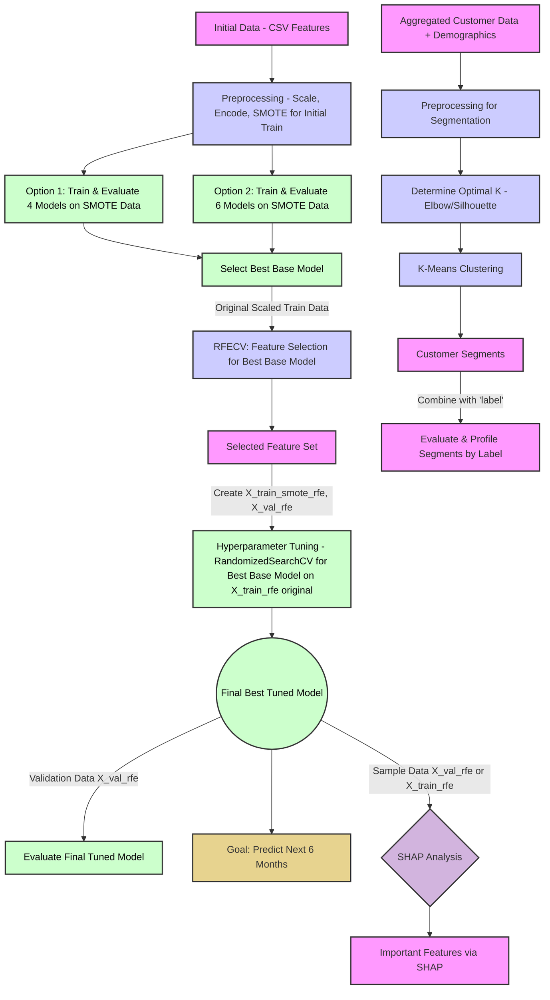

# README: Hành Trình Khai Phá Dữ Liệu Khách Hàng Sàn TMĐT - Sứ Mệnh DAZONE 2025 Vòng 2.2

## Mục Lục

1. [Nhiệm Vụ Bí Mật: Hiểu Lòng Khách Hàng, Giữ Chân Doanh Thu](#nhiệm-vụ-bí-mật-hiểu-lòng-khách-hàng-giữ-chân-doanh-thu)
2. [Kích Hoạt "Cỗ Máy Thời Gian": Hướng Dẫn Vận Hành Script](#kích-hoạt-cỗ-máy-thời-gian-hướng-dẫn-vận-hành-script)
3. [Bản Thiết Kế "Cỗ Máy": Cấu Trúc Script và Câu Chuyện Đằng Sau](#bản-thiết-kế-cỗ-máy-cấu-trúc-script-và-câu-chuyện-đằng-sau)
   * [Tổng Quan Lộ Trình Khám Phá](#tổng-quan-lộ-trình-khám-phá)
   * [Chương 1: Thu Thập Thông Tin Tình Báo - Chuẩn Bị Dữ Liệu](#chương-1-thu-thập-thông-tin-tình-báo---chuẩn-bị-dữ-liệu)
   * [Chương 2: Chế Tạo Quả Cầu Tiên Tri - Xây Dựng và Đánh Giá Model](#chương-2-chế-tạo-quả-cầu-tiên-tri---xây-dựng-và-đánh-giá-model)
   * [Chương 3: Đọc Vị Quả Cầu & Phân Loại "Chiến Binh" - Phân Tích Sâu và Tạo Chân Dung Khách Hàng](#chương-3-đọc-vị-quả-cầu--phân-loại-chiến-binh---phân-tích-sâu-và-tạo-chân-dung-khách-hàng)
4. [Đáp Án Cho "Sếp Tổng": Đối Chiếu Với Barem Chấm Điểm DAZONE 2025](#đáp-án-cho-sếp-tổng-đối-chiếu-với-barem-chấm-điểm-dazone-2025)
5. [Báo Cáo Chiến Công Lên "Bộ Chỉ Huy": Gợi Ý Trực Quan Hóa Cho Bài Thuyết Trình](#báo-cáo-chiến-công-lên-bộ-chỉ-huy-gợi-ý-trực-quan-hóa-cho-bài-thuyết-trình)
6. [Thông Điệp Từ "Chỉ Huy Trưởng" Đội Đặc Nhiệm](#thông-điệp-từ-chỉ-huy-trưởng-đội-đặc-nhiệm)

## Nhiệm Vụ Bí Mật: Hiểu Lòng Khách Hàng, Giữ Chân Doanh Thu

Sàn thương mại điện tử của chúng ta có hàng triệu khách hàng. Nhưng, ai trong số họ sẽ thực sự gắn bó và quay lại mua hàng tại một gian hàng cụ thể trong 6 tháng tới? Đây không chỉ là một câu hỏi, mà là một "nhiệm vụ tối mật" ảnh hưởng trực tiếp đến doanh thu và sự phát triển bền vững. Nếu chúng ta biết được điều này, chúng ta có thể:

* Chăm sóc đúng người, đúng lúc.
* Tung ra các chương trình khuyến mãi hiệu quả hơn.
* Biến khách hàng mới thành khách hàng trung thành.

"Cỗ máy thời gian" (script Python này) sẽ giúp chúng ta giải quyết nhiệm vụ này bằng cách:

1. **"Thu thập và làm sạch các mảnh ghép quá khứ"**: Chuẩn bị dữ liệu giao dịch và thông tin khách hàng.
2. **"Chế tạo các phiên bản quả cầu tiên tri"**: Xây dựng các mô hình dự đoán.
3. **"Kiểm tra độ chính xác của từng quả cầu"**: Đánh giá model nào "phán" chuẩn nhất.
4. **"Nhận diện các nhóm chiến binh mua sắm"**: Phân loại khách hàng dựa trên hành vi và đặc điểm.
5. **"Vạch ra kế hoạch tác chiến"**: Đề xuất các chiến lược kinh doanh thông minh.

## Kích Hoạt "Cỗ Máy Thời Gian": Hướng Dẫn Vận Hành Script

Để "cỗ máy" của chúng ta bắt đầu hành trình xuyên không về quá khứ và dự đoán tương lai, cả đội cần chuẩn bị:

1. **"Trang bị cá nhân" (Môi trường):** Máy tính được cài Python và các "vũ khí" cần thiết (thư viện) như `pandas`, `numpy` (để xử lý số liệu), `matplotlib`, `seaborn` (để vẽ biểu đồ), `scikit-learn` (bộ công cụ xây model), `imblearn` (để cân bằng lực lượng các nhóm khách hàng), `xgboost`, `lightgbm` (2 "chiến mã" mạnh mẽ), và `shap` (kính lúp soi thấu model).

2. **"Bản đồ kho báu cổ" (Dữ liệu đầu vào):** Các file CSV đã được "lau chùi" từ vòng trước hoặc từ script `data_cleaning.py`, cất giữ trong `cleaning_results/cleaned_data/`:
   * `competition_train_features.csv`: Thông tin huấn luyện các "nhà tiên tri".
   * `competition_test_features.csv`: Thông tin để "thử tài" các "nhà tiên tri".
   * `cleaned_user_info.csv`: Hồ sơ chi tiết của từng khách hàng.

3. **"Niệm thần chú" (Chạy script):** Thực thi file `DAZONE2025_R2.2_Main_Analysis.py`.

4. **"Chiến lợi phẩm" (Kết quả):** Mọi "bí mật" và "kho báu" sẽ được tập hợp tại thư mục `round_2.2`:
   * `model_outputs`: Nơi cất giữ các "quả cầu tiên tri" mạnh nhất.
   * `segmentation_outputs`: "Hồ sơ mật" của từng nhóm khách hàng.
   * `shap_outputs`: "Bản giải mã" cách "quả cầu" đưa ra dự đoán.
   * `visualizations_from_main_analysis`: "Album ảnh" ghi lại những khám phá quan trọng.
   * `logs`: "Biên niên sử" của cuộc hành trình.

## Bản Thiết Kế "Cỗ Máy": Cấu Trúc Script và Câu Chuyện Đằng Sau

Hành trình của chúng ta được chia thành 3 chương lớn, mỗi chương hé lộ một phần của bức tranh toàn cảnh về khách hàng của sàn thương mại điện tử.

### Tổng Quan Lộ Trình Khám Phá

Đây là bức tranh toàn cảnh về hành trình của chúng ta, từ lúc bắt đầu với dữ liệu thô cho đến khi tìm ra những "viên ngọc" insight:

