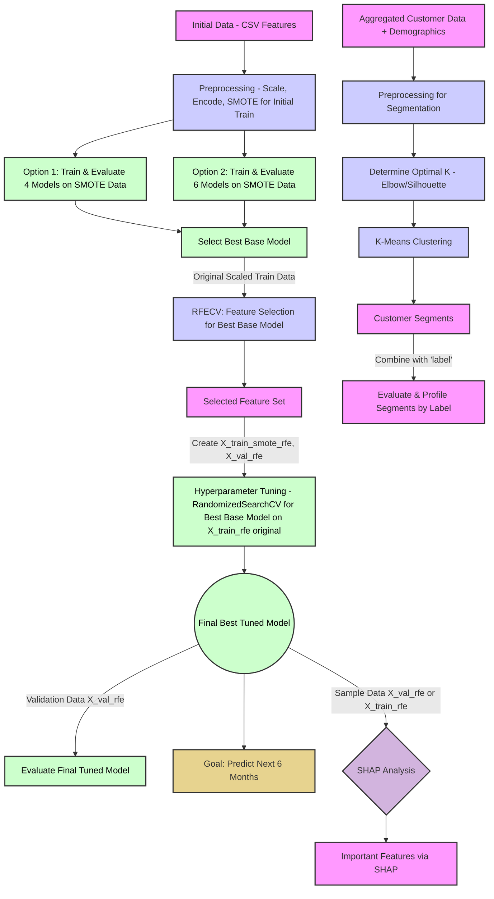

# README: Hành Trình Khai Phá Dữ Liệu Khách Hàng Sàn TMĐT - Sứ Mệnh DAZONE 2025 Vòng 2.2

## Mục Lục

1. [Nhiệm Vụ Bí Mật: Hiểu Lòng Khách Hàng, Giữ Chân Doanh Thu](#nhiệm-vụ-bí-mật-hiểu-lòng-khách-hàng-giữ-chân-doanh-thu)
2. [Kích Hoạt "Cỗ Máy Thời Gian": Hướng Dẫn Vận Hành Script](#kích-hoạt-cỗ-máy-thời-gian-hướng-dẫn-vận-hành-script)
3. [Bản Thiết Kế "Cỗ Máy": Cấu Trúc Script và Câu Chuyện Đằng Sau](#bản-thiết-kế-cỗ-máy-cấu-trúc-script-và-câu-chuyện-đằng-sau)
   * [Tổng Quan Lộ Trình Khám Phá](#tổng-quan-lộ-trình-khám-phá)
   * [Chương 1: Thu Thập Thông Tin Tình Báo - Chuẩn Bị Dữ Liệu](#chương-1-thu-thập-thông-tin-tình-báo---chuẩn-bị-dữ-liệu)
   * [Chương 2: Chế Tạo Quả Cầu Tiên Tri - Xây Dựng và Đánh Giá Model](#chương-2-chế-tạo-quả-cầu-tiên-tri---xây-dựng-và-đánh-giá-model)
   * [Chương 3: Đọc Vị Quả Cầu & Phân Loại "Chiến Binh" - Phân Tích Sâu và Tạo Chân Dung Khách Hàng](#chương-3-đọc-vị-quả-cầu--phân-loại-chiến-binh---phân-tích-sâu-và-tạo-chân-dung-khách-hàng)
4. [Đáp Án Cho "Sếp Tổng": Đối Chiếu Với Barem Chấm Điểm DAZONE 2025](#đáp-án-cho-sếp-tổng-đối-chiếu-với-barem-chấm-điểm-dazone-2025)
5. [Báo Cáo Chiến Công Lên "Bộ Chỉ Huy": Gợi Ý Trực Quan Hóa Cho Bài Thuyết Trình](#báo-cáo-chiến-công-lên-bộ-chỉ-huy-gợi-ý-trực-quan-hóa-cho-bài-thuyết-trình)
6. [Thông Điệp Từ "Chỉ Huy Trưởng" Đội Đặc Nhiệm](#thông-điệp-từ-chỉ-huy-trưởng-đội-đặc-nhiệm)

## Nhiệm Vụ Bí Mật: Hiểu Lòng Khách Hàng, Giữ Chân Doanh Thu

Sàn thương mại điện tử của chúng ta có hàng triệu khách hàng. Nhưng, ai trong số họ sẽ thực sự gắn bó và quay lại mua hàng tại một gian hàng cụ thể trong 6 tháng tới? Đây không chỉ là một câu hỏi, mà là một "nhiệm vụ tối mật" ảnh hưởng trực tiếp đến doanh thu và sự phát triển bền vững. Nếu chúng ta biết được điều này, chúng ta có thể:

* Chăm sóc đúng người, đúng lúc.
* Tung ra các chương trình khuyến mãi hiệu quả hơn.
* Biến khách hàng mới thành khách hàng trung thành.

"Cỗ máy thời gian" (script Python này) sẽ giúp chúng ta giải quyết nhiệm vụ này bằng cách:

1. **"Thu thập và làm sạch các mảnh ghép quá khứ"**: Chuẩn bị dữ liệu giao dịch và thông tin khách hàng.
2. **"Chế tạo các phiên bản quả cầu tiên tri"**: Xây dựng các mô hình dự đoán.
3. **"Kiểm tra độ chính xác của từng quả cầu"**: Đánh giá model nào "phán" chuẩn nhất.
4. **"Nhận diện các nhóm chiến binh mua sắm"**: Phân loại khách hàng dựa trên hành vi và đặc điểm.
5. **"Vạch ra kế hoạch tác chiến"**: Đề xuất các chiến lược kinh doanh thông minh.

## Kích Hoạt "Cỗ Máy Thời Gian": Hướng Dẫn Vận Hành Script

Để "cỗ máy" của chúng ta bắt đầu hành trình xuyên không về quá khứ và dự đoán tương lai, cả đội cần chuẩn bị:

1. **"Trang bị cá nhân" (Môi trường):** Máy tính được cài Python và các "vũ khí" cần thiết (thư viện) như `pandas`, `numpy` (để xử lý số liệu), `matplotlib`, `seaborn` (để vẽ biểu đồ), `scikit-learn` (bộ công cụ xây model), `imblearn` (để cân bằng lực lượng các nhóm khách hàng), `xgboost`, `lightgbm` (2 "chiến mã" mạnh mẽ), và `shap` (kính lúp soi thấu model).

2. **"Bản đồ kho báu cổ" (Dữ liệu đầu vào):** Các file CSV đã được "lau chùi" từ vòng trước hoặc từ script `data_cleaning.py`, cất giữ trong `cleaning_results/cleaned_data/`:
   * `competition_train_features.csv`: Thông tin huấn luyện các "nhà tiên tri".
   * `competition_test_features.csv`: Thông tin để "thử tài" các "nhà tiên tri".
   * `cleaned_user_info.csv`: Hồ sơ chi tiết của từng khách hàng.

3. **"Niệm thần chú" (Chạy script):** Thực thi file `DAZONE2025_R2.2_Main_Analysis.py`.

4. **"Chiến lợi phẩm" (Kết quả):** Mọi "bí mật" và "kho báu" sẽ được tập hợp tại thư mục `round_2.2`:
   * `model_outputs`: Nơi cất giữ các "quả cầu tiên tri" mạnh nhất.
   * `segmentation_outputs`: "Hồ sơ mật" của từng nhóm khách hàng.
   * `shap_outputs`: "Bản giải mã" cách "quả cầu" đưa ra dự đoán.
   * `visualizations_from_main_analysis`: "Album ảnh" ghi lại những khám phá quan trọng.
   * `logs`: "Biên niên sử" của cuộc hành trình.

## Bản Thiết Kế "Cỗ Máy": Cấu Trúc Script và Câu Chuyện Đằng Sau

Hành trình của chúng ta được chia thành 3 chương lớn, mỗi chương hé lộ một phần của bức tranh toàn cảnh về khách hàng của sàn thương mại điện tử.

### Tổng Quan Lộ Trình Khám Phá

Đây là bức tranh toàn cảnh về hành trình của chúng ta, từ lúc bắt đầu với dữ liệu thô cho đến khi tìm ra những "viên ngọc" insight:

# DAZONE2025 R2.2 ML Analysis Workflow

## Comprehensive Machine Learning Pipeline for Customer Repurchase Prediction

graph TD
    %% Data Sources
    A1["📊 competition_train_features.csv <i>Training Features</i>"] --> SETUP
    A2["📊 competition_test_features.csv <i>Test Features</i>"] --> SETUP
    A3["👥 cleaned_user_info.csv <i>User Demographics</i>"] --> SETUP
    
    SETUP["🔧 Environment Setup Libraries & Config"] --> PART1

    subgraph PART1 ["📁 PART 1: Data Loading & Feature Preparation"]
        direction TB
        
        subgraph DATA_LOAD ["📥 Data Loading & Initial Processing"]
            LOAD_TRAIN["📈 Load Training Data competition_train_features.csv"]
            LOAD_TEST["📈 Load Test Data competition_test_features.csv"]
            LOAD_USER["👥 Load User Info cleaned_user_info.csv"]
        end
        
        subgraph PREPROCESSING ["⚙️ Data Preprocessing"]
            DROP_DATES["🗓️ Drop Date Columns Non-predictive features"]
            ENCODE_CAT["🔤 Categorical Encoding Label/One-hot encoding"]
            HANDLE_MISSING["❓ Handle Missing Values Imputation strategies"]
            FEATURE_ENG["🛠️ Feature Engineering Create derived features"]
        end
        
        LOAD_TRAIN --> DROP_DATES
        LOAD_TEST --> DROP_DATES
        DROP_DATES --> ENCODE_CAT
        ENCODE_CAT --> HANDLE_MISSING
        HANDLE_MISSING --> FEATURE_ENG
        
        FEATURE_ENG --> DF_ALIGNED["📊 Aligned Datasets <i>Train & Test Ready</i>"]
        DF_ALIGNED --> TRAIN_VAL_SPLIT["🔀 Train/Validation Split <i>80/20 split</i>"]
        
        TRAIN_VAL_SPLIT --> X_TRAIN["🎯 X_train <i>Training Features</i>"]
        TRAIN_VAL_SPLIT --> Y_TRAIN["🏷️ y_train <i>Training Labels</i>"]
        TRAIN_VAL_SPLIT --> X_VAL["🎯 X_val <i>Validation Features</i>"]
        TRAIN_VAL_SPLIT --> Y_VAL["🏷️ y_val <i>Validation Labels</i>"]
        
        X_TRAIN --> SCALING["📏 Feature Scaling StandardScaler"]
        X_VAL --> SCALING
        SCALING --> SCALED_DATA["✨ Scaled Features <i>Normalized datasets</i>"]
    end

    subgraph PART2 ["🤖 PART 2: Model Training, Evaluation & Optimization"]
        direction TB
        
        SCALED_DATA --> SMOTE_BALANCE["🔄 SMOTE Balancing Address class imbalance"]
        SMOTE_BALANCE --> BALANCED_DATA["⚖️ Balanced Training Set <i>Equal class distribution</i>"]
        
        subgraph MODEL_EVAL ["📊 Initial Model Evaluation"]
            direction TB
            OPTION1["🎯 Option 1: Base Models Random Forest, Logistic Regression Gradient Boosting, Decision Tree"]
            OPTION2["🎯 Option 2: Extended Models + MLP, SVC, Extra Trees AdaBoost, Naive Bayes"]
            
            BALANCED_DATA --> OPTION1
            BALANCED_DATA --> OPTION2
            
            OPTION1 --> METRICS1["📈 Performance Metrics 1 Accuracy, Precision, Recall, F1"]
            OPTION2 --> METRICS2["📈 Performance Metrics 2 Extended evaluation"]
            
            METRICS1 --> MODEL_SELECTION["🏆 Best Model Selection Based on validation performance"]
            METRICS2 --> MODEL_SELECTION
        end
        
        subgraph FEATURE_SELECTION ["🎯 Feature Selection with RFECV"]
            direction TB
            MODEL_SELECTION --> RFECV["🔍 Recursive Feature Elimination Cross-Validation (RFECV)"]
            RFECV --> OPTIMAL_FEATURES["⭐ Optimal Feature Set <i>~19 selected features</i>"]
            
            SCALED_DATA --> FILTER_FEATURES["🎛️ Apply Feature Selection Filter to optimal features"]
            OPTIMAL_FEATURES --> FILTER_FEATURES
            FILTER_FEATURES --> REDUCED_DATA["🎯 Feature-Reduced Dataset <i>Optimized for performance</i>"]
        end
        
        REDUCED_DATA --> FINAL_SMOTE["🔄 Final SMOTE Application On selected features"]
        FINAL_SMOTE --> FINAL_TRAINING_SET["⚖️ Final Training Set <i>Balanced + Feature-Selected</i>"]
        
        subgraph HYPERPARAMETER_TUNING ["⚡ Hyperparameter Tuning"]
            direction TB
            MODEL_SELECTION --> SELECT_TOP2["🎯 Select Top 2 Models For intensive tuning"]
            SELECT_TOP2 --> GRID_SEARCH["🔧 Grid Search CV Hyperparameter optimization"]
            
            GRID_SEARCH --> TUNED_MODEL1["🔧 Tuned Model 1 <i>Optimized hyperparameters</i>"]
            GRID_SEARCH --> TUNED_MODEL2["🔧 Tuned Model 2 <i>Optimized hyperparameters</i>"]
            
            FINAL_TRAINING_SET --> FINAL_EVALUATION["📊 Final Model Evaluation Cross-validation + holdout"]
            TUNED_MODEL1 --> FINAL_EVALUATION
            TUNED_MODEL2 --> FINAL_EVALUATION
            
            FINAL_EVALUATION --> CHAMPION_MODEL["👑 Champion Model <i>Best performing model</i>"]
        end
    end

    subgraph PART3 ["🔍 PART 3: SHAP Analysis, User Segmentation & Business Insights"]
        direction TB
        
        subgraph SHAP_ANALYSIS ["💡 SHAP Explainability Analysis"]
            direction LR
            CHAMPION_MODEL --> SHAP_CALC["🔬 SHAP Value Calculation Feature importance analysis"]
            REDUCED_DATA --> SHAP_CALC
            
            SHAP_CALC --> SHAP_PLOTS["📊 SHAP Visualizations Summary, waterfall, dependence plots"]
            SHAP_CALC --> FEATURE_IMPORTANCE["⭐ Global Feature Importance Most predictive features"]
        end
        
        subgraph USER_SEGMENTATION ["👥 User Segmentation & Clustering"]
            direction TB
            DF_ALIGNED --> USER_BEHAVIOR["📊 Aggregate User Behavior Transaction patterns & metrics"]
            LOAD_USER --> USER_DEMOGRAPHICS["👤 User Demographics Age, location, preferences"]
            
            USER_BEHAVIOR --> MERGE_DATA["🔗 Merge Behavioral & Demographic Comprehensive user profiles"]
            USER_DEMOGRAPHICS --> MERGE_DATA
            
            MERGE_DATA --> SEGMENT_PREP["⚙️ Segmentation Preprocessing Scaling & normalization"]
            SEGMENT_PREP --> ELBOW_METHOD["📈 Optimal K Determination Elbow method analysis"]
            
            ELBOW_METHOD --> KMEANS["🎯 K-Means Clustering <i>Typically K=4 segments</i>"]
            KMEANS --> USER_CLUSTERS["👥 User Clusters Behavioral segments"]
            
            USER_CLUSTERS --> CLUSTER_PROFILES["📊 Initial Cluster Profiling Segment characteristics"]
            
            DF_ALIGNED --> REPURCHASE_LABELS["🏷️ User-Level Repurchase Rates Aggregate purchase behavior"]
            
            CLUSTER_PROFILES --> MERGE_OUTCOMES["🔗 Merge Clusters with Outcomes Segment + repurchase data"]
            REPURCHASE_LABELS --> MERGE_OUTCOMES
            
            MERGE_OUTCOMES --> ENHANCED_PROFILES["✨ Enhanced Cluster Profiles Segments with repurchase rates"]
        end
        
        subgraph PERSONA_DEVELOPMENT ["🎭 Persona Development"]
            direction TB
            ENHANCED_PROFILES --> PERSONA_RULES["👤 Define Persona Criteria Thresholds & characteristics"]
            PERSONA_RULES --> ASSIGN_PERSONAS["🎭 Assign User Personas Map clusters to personas"]
            
            ASSIGN_PERSONAS --> FINAL_PERSONAS["🎭 Final User Personas Named & characterized segments"]
            FINAL_PERSONAS --> PERSONA_ANALYSIS["📈 Persona Repurchase Analysis Conversion rates by persona"]
            
            ENHANCED_PROFILES --> VISUALIZATION["📊 Cluster Visualizations 2D/3D scatter plots"]
            PERSONA_ANALYSIS --> PERSONA_VIZ["🎨 Persona Visualizations Business-friendly charts"]
        end
    end

    subgraph BUSINESS_INSIGHTS ["🚀 Business Impact & Recommendations"]
        direction TB
        CHAMPION_MODEL --> INSIGHTS_ENGINE["💡 Business Insights Generator Automated insight extraction"]
        FEATURE_IMPORTANCE --> INSIGHTS_ENGINE
        FINAL_PERSONAS --> INSIGHTS_ENGINE
        PERSONA_ANALYSIS --> INSIGHTS_ENGINE
        
        INSIGHTS_ENGINE --> KEY_INSIGHTS["📋 Key Business Insights Actionable recommendations"]
        INSIGHTS_ENGINE --> MARKETING_STRATEGY["🎯 Marketing Strategy Persona-based targeting"]
        INSIGHTS_ENGINE --> RETENTION_TACTICS["🔄 Retention Tactics Segment-specific approaches"]
        
        CHAMPION_MODEL --> DEPLOYMENT_PLAN["🚀 Model Deployment Plan Production implementation"]
        CHAMPION_MODEL --> PREDICTION_PIPELINE["🔮 Future Prediction Pipeline Real-time scoring"]
    end

    %% Styling with GitHub-compatible colors
    classDef dataSource fill:#e1f5fe,stroke:#0277bd,stroke-width:2px,color:#000
    classDef process fill:#f3e5f5,stroke:#7b1fa2,stroke-width:2px,color:#000
    classDef model fill:#e8f5e8,stroke:#388e3c,stroke-width:2px,color:#000
    classDef decision fill:#fff3e0,stroke:#f57c00,stroke-width:2px,color:#000
    classDef analysis fill:#fce4ec,stroke:#c2185b,stroke-width:2px,color:#000
    classDef insights fill:#e0f2f1,stroke:#00695c,stroke-width:2px,color:#000
    classDef champion fill:#fff9c4,stroke:#f57f17,stroke-width:3px,color:#000,font-weight:bold
    classDef intermediate fill:#f5f5f5,stroke:#616161,stroke-width:1px,color:#000

    %% Apply classes
    class A1,A2,A3,LOAD_TRAIN,LOAD_TEST,LOAD_USER dataSource
    class DROP_DATES,ENCODE_CAT,HANDLE_MISSING,FEATURE_ENG,SCALING,SMOTE_BALANCE,FINAL_SMOTE,FILTER_FEATURES,SEGMENT_PREP process
    class OPTION1,OPTION2,RFECV,GRID_SEARCH,TUNED_MODEL1,TUNED_MODEL2,KMEANS,SHAP_CALC model
    class MODEL_SELECTION,SELECT_TOP2,ELBOW_METHOD,PERSONA_RULES,ASSIGN_PERSONAS decision
    class SHAP_PLOTS,FEATURE_IMPORTANCE,CLUSTER_PROFILES,ENHANCED_PROFILES,PERSONA_ANALYSIS,VISUALIZATION,PERSONA_VIZ analysis
    class KEY_INSIGHTS,MARKETING_STRATEGY,RETENTION_TACTICS,DEPLOYMENT_PLAN,PREDICTION_PIPELINE,INSIGHTS_ENGINE insights
    class CHAMPION_MODEL champion
    class SETUP,DF_ALIGNED,TRAIN_VAL_SPLIT,X_TRAIN,Y_TRAIN,X_VAL,Y_VAL,SCALED_DATA,BALANCED_DATA,METRICS1,METRICS2,OPTIMAL_FEATURES,REDUCED_DATA,FINAL_TRAINING_SET,FINAL_EVALUATION,USER_BEHAVIOR,USER_DEMOGRAPHICS,MERGE_DATA,USER_CLUSTERS,REPURCHASE_LABELS,MERGE_OUTCOMES,FINAL_PERSONAS intermediate

## 📋 Workflow Summary

This comprehensive ML workflow diagram represents the **DAZONE2025 R2.2 Main Analysis** pipeline, structured in three main parts:

### 🔧 **PART 1: Data Loading & Feature Preparation**
- **Data Sources**: Training features, test features, and user demographic data
- **Preprocessing**: Date removal, categorical encoding, missing value handling
- **Feature Engineering**: Creation of derived features for enhanced predictive power
- **Data Splitting**: Train/validation split with proper scaling and normalization

### 🤖 **PART 2: Model Training, Evaluation & Optimization**
- **Initial Evaluation**: Comparison of 4-6 different ML algorithms
- **Feature Selection**: RFECV (Recursive Feature Elimination with Cross-Validation)
- **Class Balancing**: SMOTE technique to address imbalanced datasets
- **Hyperparameter Tuning**: Grid search optimization for top-performing models
- **Model Selection**: Champion model selection based on cross-validation performance

### 🔍 **PART 3: SHAP Analysis, User Segmentation & Business Insights**
- **Explainability**: SHAP analysis for feature importance and model interpretability
- **User Segmentation**: K-means clustering for behavioral pattern identification
- **Persona Development**: Business-meaningful user personas with repurchase characteristics
- **Business Impact**: Actionable insights and deployment recommendations

## 🎨 Visual Features

- **GitHub Compatible**: Uses solid colors instead of gradients for perfect GitHub display
- **Clear Hierarchy**: Distinguished node types with consistent color schemes
- **Professional Styling**: Clean borders, readable fonts, and logical flow
- **Comprehensive Coverage**: End-to-end ML pipeline from data to deployment

## 🚀 Usage

Copy the Mermaid code above and paste it into:
- **GitHub README files** (automatic rendering)
- **GitLab documentation** 
- **Notion pages**
- **Mermaid Live Editor**
- **VS Code with Mermaid extension**

Perfect for technical documentation, project presentations, and stakeholder communications!

