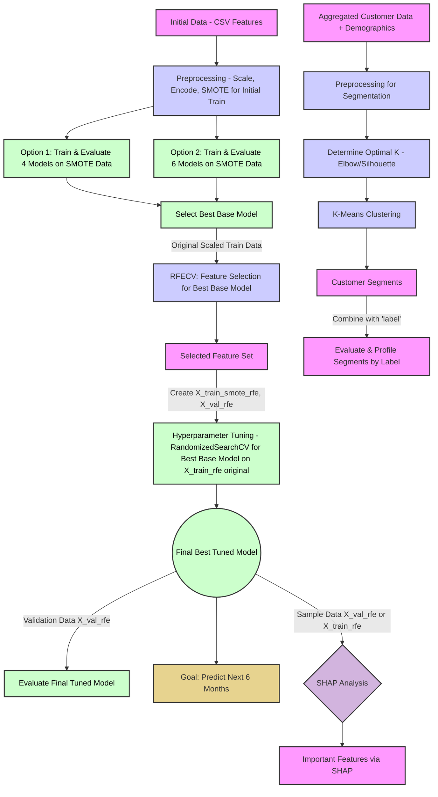

# README: Hành Trình Khai Phá Dữ Liệu Khách Hàng Sàn TMĐT - Sứ Mệnh DAZONE 2025 Vòng 2.2


## Mục Lục

1. [Nhiệm Vụ Bí Mật: Hiểu Lòng Khách Hàng, Giữ Chân Doanh Thu](#nhiệm-vụ-bí-mật-hiểu-lòng-khách-hàng-giữ-chân-doanh-thu)
2. [Kích Hoạt "Cỗ Máy Thời Gian": Hướng Dẫn Vận Hành Script](#kích-hoạt-cỗ-máy-thời-gian-hướng-dẫn-vận-hành-script)
3. [Bản Thiết Kế "Cỗ Máy": Cấu Trúc Script và Câu Chuyện Đằng Sau](#bản-thiết-kế-cỗ-máy-cấu-trúc-script-và-câu-chuyện-đằng-sau)
   * [Tổng Quan Lộ Trình Khám Phá](#tổng-quan-lộ-trình-khám-phá)
   * [Chương 1: Thu Thập Thông Tin Tình Báo - Chuẩn Bị Dữ Liệu](#chương-1-thu-thập-thông-tin-tình-báo---chuẩn-bị-dữ-liệu)
   * [Chương 2: Chế Tạo Quả Cầu Tiên Tri - Xây Dựng và Đánh Giá Model](#chương-2-chế-tạo-quả-cầu-tiên-tri---xây-dựng-và-đánh-giá-model)
   * [Chương 3: Đọc Vị Quả Cầu & Phân Loại "Chiến Binh" - Phân Tích Sâu và Tạo Chân Dung Khách Hàng](#chương-3-đọc-vị-quả-cầu--phân-loại-chiến-binh---phân-tích-sâu-và-tạo-chân-dung-khách-hàng)
4. [Đáp Án Cho "Sếp Tổng": Đối Chiếu Với Barem Chấm Điểm DAZONE 2025](#đáp-án-cho-sếp-tổng-đối-chiếu-với-barem-chấm-điểm-dazone-2025)
5. [Báo Cáo Chiến Công Lên "Bộ Chỉ Huy": Gợi Ý Trực Quan Hóa Cho Bài Thuyết Trình](#báo-cáo-chiến-công-lên-bộ-chỉ-huy-gợi-ý-trực-quan-hóa-cho-bài-thuyết-trình)
6. [Thông Điệp Từ "Chỉ Huy Trưởng" Đội Đặc Nhiệm](#thông-điệp-từ-chỉ-huy-trưởng-đội-đặc-nhiệm)

## Nhiệm Vụ Bí Mật: Hiểu Lòng Khách Hàng, Giữ Chân Doanh Thu

Sàn thương mại điện tử của chúng ta có hàng triệu khách hàng. Nhưng, ai trong số họ sẽ thực sự gắn bó và quay lại mua hàng tại một gian hàng cụ thể trong 6 tháng tới? Đây không chỉ là một câu hỏi, mà là một "nhiệm vụ tối mật" ảnh hưởng trực tiếp đến doanh thu và sự phát triển bền vững. Nếu chúng ta biết được điều này, chúng ta có thể:

* Chăm sóc đúng người, đúng lúc.
* Tung ra các chương trình khuyến mãi hiệu quả hơn.
* Biến khách hàng mới thành khách hàng trung thành.

"Cỗ máy thời gian" (script Python này) sẽ giúp chúng ta giải quyết nhiệm vụ này bằng cách:

1. **"Thu thập và làm sạch các mảnh ghép quá khứ"**: Chuẩn bị dữ liệu giao dịch và thông tin khách hàng.
2. **"Chế tạo các phiên bản quả cầu tiên tri"**: Xây dựng các mô hình dự đoán.
3. **"Kiểm tra độ chính xác của từng quả cầu"**: Đánh giá model nào "phán" chuẩn nhất.
4. **"Nhận diện các nhóm chiến binh mua sắm"**: Phân loại khách hàng dựa trên hành vi và đặc điểm.
5. **"Vạch ra kế hoạch tác chiến"**: Đề xuất các chiến lược kinh doanh thông minh.

## Kích Hoạt "Cỗ Máy Thời Gian": Hướng Dẫn Vận Hành Script

Để "cỗ máy" của chúng ta bắt đầu hành trình xuyên không về quá khứ và dự đoán tương lai, cả đội cần chuẩn bị:

1. **"Trang bị cá nhân" (Môi trường):** Máy tính được cài Python và các "vũ khí" cần thiết (thư viện) như `pandas`, `numpy` (để xử lý số liệu), `matplotlib`, `seaborn` (để vẽ biểu đồ), `scikit-learn` (bộ công cụ xây model), `imblearn` (để cân bằng lực lượng các nhóm khách hàng), `xgboost`, `lightgbm` (2 "chiến mã" mạnh mẽ), và `shap` (kính lúp soi thấu model).

2. **"Bản đồ kho báu cổ" (Dữ liệu đầu vào):** Các file CSV đã được "lau chùi" từ vòng trước hoặc từ script `data_cleaning.py`, cất giữ trong `cleaning_results/cleaned_data/`:
   * `competition_train_features.csv`: Thông tin huấn luyện các "nhà tiên tri".
   * `competition_test_features.csv`: Thông tin để "thử tài" các "nhà tiên tri".
   * `cleaned_user_info.csv`: Hồ sơ chi tiết của từng khách hàng.

3. **"Niệm thần chú" (Chạy script):** Thực thi file `DAZONE2025_R2.2_Main_Analysis.py`.

4. **"Chiến lợi phẩm" (Kết quả):** Mọi "bí mật" và "kho báu" sẽ được tập hợp tại thư mục `round_2.2`:
   * `model_outputs`: Nơi cất giữ các "quả cầu tiên tri" mạnh nhất.
   * `segmentation_outputs`: "Hồ sơ mật" của từng nhóm khách hàng.
   * `shap_outputs`: "Bản giải mã" cách "quả cầu" đưa ra dự đoán.
   * `visualizations_from_main_analysis`: "Album ảnh" ghi lại những khám phá quan trọng.
   * `logs`: "Biên niên sử" của cuộc hành trình.

## Bản Thiết Kế "Cỗ Máy": Cấu Trúc Script và Câu Chuyện Đằng Sau

Hành trình của chúng ta được chia thành 3 chương lớn, mỗi chương hé lộ một phần của bức tranh toàn cảnh về khách hàng của sàn thương mại điện tử.

### Tổng Quan Lộ Trình Khám Phá

Đây là bức tranh toàn cảnh về hành trình của chúng ta, từ lúc bắt đầu với dữ liệu thô cho đến khi tìm ra những "viên ngọc" insight:


# Beautiful ML Workflow Diagram

```mermaid
graph TD
    %% Data Ingestion with icons
    A1["📊 CSV: competition_train_features.csv"] --> PROC_TRAIN_FEAT
    A2["📊 CSV: competition_test_features.csv"] --> PROC_TEST_FEAT
    A3["👥 CSV: cleaned_user_info.csv"] --> MERGE_USER_INFO_SEG

    subgraph PART1 ["🔧 Part 1: Data Preparation"]
        direction TB
        PROC_TRAIN_FEAT["⚙️ Preprocess Train Features<br/>Drop Dates, Encode Categories"] --> DF_TRAIN_ALIGNED["📈 df_train_aligned<br/><i>Features + Labels</i>"]
        PROC_TEST_FEAT["⚙️ Preprocess Test Features"] --> DF_TEST_ALIGNED["📈 df_test_aligned"]

        DF_TRAIN_ALIGNED -.-> SPLIT_DATA["🔀 Train/Validation Split"]
        SPLIT_DATA --> X_TRAIN_RAW["🎯 X_train_raw"]
        SPLIT_DATA --> Y_TRAIN["🏷️ y_train<br/><i>labels</i>"]
        SPLIT_DATA --> X_VAL_RAW["🎯 X_val_raw"]
        SPLIT_DATA --> Y_VAL["🏷️ y_val<br/><i>labels</i>"]

        X_TRAIN_RAW --> SCALE_TRAIN["📏 Scale Features"]
        X_VAL_RAW --> SCALE_VAL["📏 Scale Features"]
        
        SCALE_TRAIN --> X_TRAIN_SCALED["✨ X_train_scaled<br/><i>~20 features</i>"]
        SCALE_VAL --> X_VAL_SCALED["✨ X_val_scaled<br/><i>~20 features</i>"]

        X_TRAIN_SCALED -.-> SMOTE_INITIAL["🔄 SMOTE Balancing"]
        SMOTE_INITIAL --> X_TRAIN_SMOTE["⚖️ X_train_smote<br/><i>balanced dataset</i>"]
    end

    subgraph PART2 ["🤖 Part 2: Model Training & Optimization"]
        direction TB
        
        subgraph EVAL ["📊 Initial Model Evaluation"]
            direction LR
            X_TRAIN_SMOTE --> OPT1_EVAL["🎯 Option 1<br/>4 Base Models"]
            X_TRAIN_SMOTE --> OPT2_EVAL["🎯 Option 2<br/>6 Models (MLP, SVC)"]
            OPT1_EVAL --> METRICS_OPT1["📈 Metrics Set 1"]
            OPT2_EVAL --> METRICS_OPT2["📈 Metrics Set 2"]
            METRICS_OPT1 --> SELECT_BEST_BASE["🏆 Select Best<br/>Base Model"]
            METRICS_OPT2 --> SELECT_BEST_BASE
        end

        subgraph FEATURE_SEL ["🎯 Feature Selection (RFECV)"]
            direction TB
            SELECT_BEST_BASE --> RFECV_STEP["🔍 RFECV Analysis<br/>Recursive Feature Elimination"]
            RFECV_STEP --> SELECTED_FEATURES["⭐ Selected Features<br/><i>~19 optimal features</i>"]
            X_TRAIN_SCALED -.-> FILTER_TRAIN["🎛️ Filter Features"]
            X_VAL_SCALED -.-> FILTER_VAL["🎛️ Filter Features"]
            SELECTED_FEATURES --> FILTER_TRAIN
            SELECTED_FEATURES --> FILTER_VAL
            FILTER_TRAIN --> X_TRAIN_RFE["🎯 X_train_rfe<br/><i>scaled + selected</i>"]
            FILTER_VAL --> X_VAL_RFE["🎯 X_val_rfe<br/><i>scaled + selected</i>"]
        end

        X_TRAIN_RFE -.-> SMOTE_FINAL["🔄 SMOTE on RFE Data"]
        SMOTE_FINAL --> X_TRAIN_SMOTE_RFE["⚖️ X_train_smote_rfe<br/><i>final training set</i>"]
        
        subgraph TUNING ["⚡ Hyperparameter Tuning"]
            direction TB
            SELECTED_FEATURES --> TUNE_SETUP["🛠️ Setup Tuning<br/>Top 2 Models"]
            TUNE_SETUP --> TUNE_MODEL_1["🎛️ Tune Model 1<br/><i>e.g., MLP</i>"]
            TUNE_SETUP --> TUNE_MODEL_2["🎛️ Tune Model 2<br/><i>e.g., Random Forest</i>"]
            
            TUNE_MODEL_1 --> TUNED_1["🔧 Tuned Model 1"]
            TUNE_MODEL_2 --> TUNED_2["🔧 Tuned Model 2"]

            TUNED_1 -.-> EVAL_1["📊 Evaluate Model 1"]
            TUNED_2 -.-> EVAL_2["📊 Evaluate Model 2"]
            X_TRAIN_SMOTE_RFE -.-> EVAL_1
            X_TRAIN_SMOTE_RFE -.-> EVAL_2
            X_VAL_RFE -.-> EVAL_1
            X_VAL_RFE -.-> EVAL_2
            
            EVAL_1 --> FINAL_COMPARE["🏆 Final Model<br/>Selection"]
            EVAL_2 --> FINAL_COMPARE
            SELECT_BEST_BASE -.-> FINAL_COMPARE
            FINAL_COMPARE --> FINAL_MODEL["👑 Champion Model<br/><i>e.g., RF_Tuned</i>"]
        end
    end
    
    subgraph PART3 ["🔍 Part 3 & 4: Analysis & Insights"]
        direction TB
        
        subgraph SHAP_SECTION ["💡 SHAP Analysis"]
            direction LR
            FINAL_MODEL --> SHAP_ANALYSIS["🔬 SHAP Analysis<br/>Feature Importance"]
            X_VAL_RFE -.-> SHAP_ANALYSIS
            SHAP_ANALYSIS --> SHAP_OUTPUT["📊 SHAP Visualizations<br/>& Importance Scores"]
        end

        subgraph SEGMENTATION ["👥 User Segmentation & Personas"]
            direction TB
            DF_TRAIN_ALIGNED --> AGG_BEHAVIOR["📊 Aggregate User<br/>Behavior Patterns"]
            AGG_BEHAVIOR --> DATA_MERGE["🔗 Merge Data"]
            MERGE_USER_INFO_SEG --> DATA_MERGE
            DATA_MERGE --> DATA_FOR_SEG["🎯 Segmentation Dataset"]
            
            DATA_FOR_SEG --> PREPROC_SEG["⚙️ Preprocess &<br/>Scale for Clustering"]
            PREPROC_SEG --> OPTIMAL_K["📈 Determine Optimal K<br/><i>e.g., K=4</i>"]
            OPTIMAL_K --> KMEANS_CLUSTER["🎯 K-Means Clustering"]
            KMEANS_CLUSTER --> CLUSTERS["👥 User Clusters<br/>with Labels"]
            
            CLUSTERS --> CLUSTER_PROFILES["📊 Initial Cluster<br/>Profiles"]
            DF_TRAIN_ALIGNED --> USER_LABELS["🏷️ User-Level<br/>Repurchase Labels"]
            
            CLUSTERS --> MERGE_LABELS["🔗 Merge with Labels"]
            USER_LABELS --> MERGE_LABELS
            MERGE_LABELS --> ENHANCED_PROFILES["✨ Enhanced Profiles<br/>with Repurchase Rates"]
            
            ENHANCED_PROFILES --> PERSONA_DEF["👤 Define Persona<br/>Thresholds"]
            PERSONA_DEF --> PERSONA_ASSIGN["🎭 Assign Personas<br/>to Clusters"]
            PERSONA_ASSIGN --> FINAL_PERSONAS["🎭 Final User Personas<br/>with Segments"]
            
            FINAL_PERSONAS --> PERSONA_ANALYSIS["📈 Persona Repurchase<br/>Analysis"]
            ENHANCED_PROFILES --> CLUSTER_VIZ["📊 Cluster Visualizations"]
            PERSONA_ANALYSIS --> PERSONA_VIZ["🎨 Persona Visualizations"]
        end
    end

    subgraph PART5 ["🚀 Part 5: Business Impact & Deployment"]
        direction TB
        FINAL_MODEL --> INSIGHTS_GEN["💡 Business Insights<br/>Generator"]
        SHAP_OUTPUT --> INSIGHTS_GEN
        FINAL_PERSONAS --> INSIGHTS_GEN
        PERSONA_ANALYSIS --> INSIGHTS_GEN
        ENHANCED_PROFILES --> INSIGHTS_GEN
        
        INSIGHTS_GEN --> BUSINESS_INSIGHTS["📋 Business Insights<br/>& Recommendations"]
        FINAL_MODEL --> DEPLOY_PLAN["🚀 Deployment Planning<br/>Future Predictions"]
    end    %% Beautiful Styling with Modern Colors
    classDef dataSource fill:#667eea,stroke:#fff,stroke-width:3px,color:#fff,font-weight:bold
    classDef process fill:#f093fb,stroke:#fff,stroke-width:2px,color:#fff,font-weight:bold
    classDef model fill:#4facfe,stroke:#fff,stroke-width:3px,color:#fff,font-weight:bold
    classDef decision fill:#43e97b,stroke:#fff,stroke-width:2px,color:#333,font-weight:bold
    classDef analysis fill:#fa709a,stroke:#fff,stroke-width:2px,color:#fff,font-weight:bold
    classDef deployment fill:#a8edea,stroke:#333,stroke-width:3px,color:#333,font-weight:bold
    classDef champion fill:#ffecd2,stroke:#ff6b6b,stroke-width:4px,color:#333,font-weight:bold
    classDef insights fill:#764ba2,stroke:#fff,stroke-width:3px,color:#fff,font-weight:bold
    classDef intermediate fill:#a8e6cf,stroke:#4ecdc4,stroke-width:2px,color:#333
    classDef metrics fill:#ffd89b,stroke:#333,stroke-width:2px,color:#333,font-weight:bold

    %% Apply classes to nodes
    class A1,A2,A3 dataSource
    class PROC_TRAIN_FEAT,PROC_TEST_FEAT,SCALE_TRAIN,SCALE_VAL,PREPROC_SEG,AGG_BEHAVIOR,MERGE_USER_INFO_SEG,SMOTE_INITIAL,SMOTE_FINAL,FILTER_TRAIN,FILTER_VAL,DATA_MERGE process
    class OPT1_EVAL,OPT2_EVAL,TUNE_MODEL_1,TUNE_MODEL_2,TUNED_1,TUNED_2,KMEANS_CLUSTER,RFECV_STEP,SHAP_ANALYSIS model
    class SELECT_BEST_BASE,FINAL_COMPARE,OPTIMAL_K,PERSONA_DEF,PERSONA_ASSIGN decision
    class CLUSTER_PROFILES,ENHANCED_PROFILES,PERSONA_ANALYSIS,CLUSTER_VIZ,PERSONA_VIZ,SHAP_OUTPUT,BUSINESS_INSIGHTS,INSIGHTS_GEN analysis
    class DEPLOY_PLAN deployment
    class FINAL_MODEL champion
    class DF_TRAIN_ALIGNED,DF_TEST_ALIGNED,X_TRAIN_RAW,Y_TRAIN,X_VAL_RAW,Y_VAL,X_TRAIN_SCALED,X_VAL_SCALED,X_TRAIN_SMOTE,SELECTED_FEATURES,X_TRAIN_RFE,X_VAL_RFE,X_TRAIN_SMOTE_RFE,DATA_FOR_SEG,CLUSTERS,FINAL_PERSONAS,USER_LABELS,SPLIT_DATA,TUNE_SETUP intermediate
    class METRICS_OPT1,METRICS_OPT2,EVAL_1,EVAL_2 metrics
```
