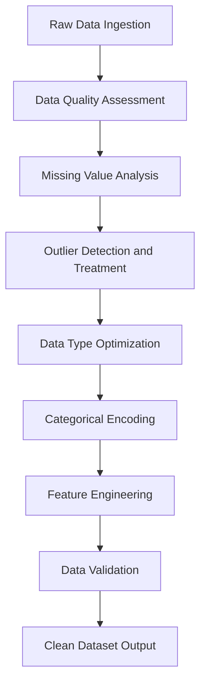
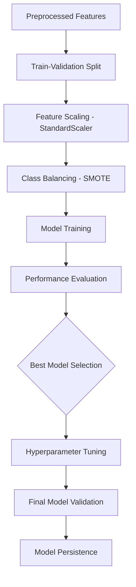
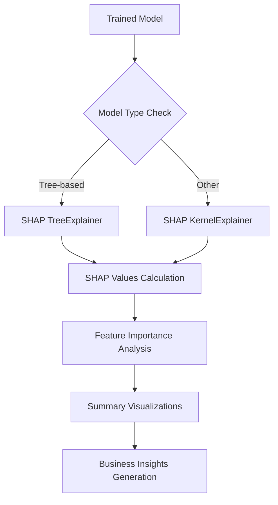
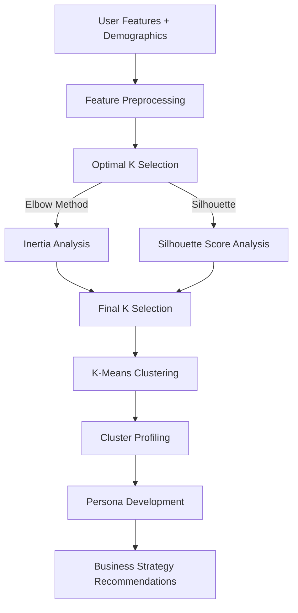

# DAZONE 2025 Round 2.2: Customer Retention Prediction for E-commerce Platform

## Project Overview

This project addresses a critical business challenge in e-commerce: predicting customer retention and return behavior on merchant platforms. The objective is to develop a comprehensive data science solution that can identify which customers are likely to return to specific merchants within the next 6 months, enabling targeted retention strategies and optimized resource allocation.

## Table of Contents

1. [Business Problem Statement](#business-problem-statement)
2. [Technical Architecture](#technical-architecture)
3. [Data Processing Pipeline](#data-processing-pipeline)
4. [Machine Learning Pipeline](#machine-learning-pipeline)
5. [Advanced Analytics Components](#advanced-analytics-components)
6. [Evaluation Framework](#evaluation-framework)
7. [Implementation Status](#implementation-status)
8. [Technical Questions for Review](#technical-questions-for-review)

## Business Problem Statement

**Primary Objective:** Predict customer return behavior to specific merchants within a 6-month timeframe.

**Key Business Value:**
- Enable targeted customer retention campaigns
- Optimize marketing budget allocation
- Improve customer lifetime value prediction
- Identify high-risk customer segments for proactive intervention

**Success Metrics:**
- Model prediction accuracy (AUC-ROC, Precision, Recall)
- Customer segmentation quality (Silhouette Score)
- Business actionability of insights
- Interpretability of model decisions

## Technical Architecture

### System Requirements
- **Environment:** Python 3.8+ with scientific computing stack
- **Core Libraries:** pandas, numpy, scikit-learn, xgboost, lightgbm, imblearn, shap
- **Visualization:** matplotlib, seaborn
- **Data Processing:** Optimized for large datasets (5M+ records)

### Data Sources
- `train.csv`: Historical customer-merchant interaction data with labels
- `test.csv`: Unlabeled data for final predictions
- `user_info.csv`: Customer demographic and profile information
- `user_log.csv`: Detailed customer behavior logs and transaction history

### Output Structure
```
round_2.2/
├── model_outputs/          # Trained models and performance metrics
├── segmentation_outputs/   # Customer clustering results and profiles
├── shap_outputs/          # Model interpretability analysis
├── visualizations/        # Charts and analytical visualizations
└── logs/                  # Processing logs and performance tracking
```

## Data Processing Pipeline

### Phase 1: Data Quality Assessment and Cleaning



**Key Processing Steps:**
1. **Comprehensive Data Profiling:** Automated assessment of completeness, consistency, and quality
2. **Outlier Detection:** IQR-based detection with domain-specific validation rules
3. **Missing Value Handling:** Strategy justified by data patterns and business logic
4. **Memory Optimization:** Efficient data types and categorical encoding for large datasets
5. **Feature Engineering:** Time-based features, behavioral aggregations, interaction metrics

### Phase 2: Feature Engineering Pipeline

**User Behavioral Features:**
- Total interactions, unique items/categories/brands explored
- Purchase conversion rates and frequencies
- Session patterns and engagement metrics
- Temporal behavior analysis (weekend/evening patterns)

**User-Merchant Relationship Features:**
- Interaction span and frequency
- Purchase history and loyalty indicators
- Category diversity and exploration patterns
- Recency, frequency, monetary (RFM) analysis

**Demographic Integration:**
- Age group segmentation
- Gender-based behavior patterns
- Geographic and carrier information

## Machine Learning Pipeline

### Model Development Strategy

#### Option 1: Focused Model Optimization
- **Target Models:** LightGBM, RandomForest, XGBoost, LogisticRegression
- **Approach:** Deep optimization of proven algorithms
- **Use Case:** Quick deployment and reliable performance

#### Option 2: Comprehensive Model Comparison
- **Models:** LR, RF, XGBoost, LightGBM, SVM, Neural Networks
- **Approach:** Extensive algorithm evaluation and selection
- **Use Case:** Maximum performance optimization

### Training Pipeline



**Key Technical Decisions:**
1. **Data Balancing:** SMOTE for addressing class imbalance
2. **Feature Scaling:** StandardScaler for numerical stability
3. **Validation Strategy:** Hold-out validation with temporal considerations
4. **Hyperparameter Optimization:** RandomizedSearchCV with cross-validation
5. **Model Selection:** Multi-metric evaluation (AUC, Precision, Recall, F1)

## Advanced Analytics Components

### SHAP Analysis for Model Interpretability



**Interpretability Outputs:**
- Global feature importance rankings
- Local prediction explanations
- Feature interaction analysis
- Model decision boundary visualization

### Customer Segmentation Analysis

**Methodology:** K-Means Clustering with optimal k selection



**Segmentation Outputs:**
- Customer personas with behavioral characteristics
- Segment-specific retention strategies
- Profiling based on demographics and behavior
- Actionable business recommendations per segment

## Evaluation Framework

### Model Performance Metrics
- **AUC-ROC:** Overall discriminative ability
- **Precision/Recall:** Class-specific performance
- **F1-Score:** Balanced performance measure
- **Confusion Matrix:** Detailed classification analysis

### Business Impact Assessment
- **Segmentation Quality:** Silhouette score and interpretability
- **Feature Importance:** Business relevance and actionability
- **Scalability:** Performance on large datasets
- **Interpretability:** SHAP analysis clarity and business alignment


## Implementation Status

### Completed Components
- ✅ Comprehensive data cleaning and quality assessment pipeline
- ✅ Advanced feature engineering for user behavior and demographics
- ✅ Multi-model training and evaluation framework
- ✅ Hyperparameter optimization with proper validation
- ✅ SHAP-based model interpretability analysis
- ✅ K-means customer segmentation with optimal k selection
- ✅ Automated reporting and documentation system

### Current Performance Highlights
- **Best Model:** RandomForest_Comp_Tuned (AUC: 0.6279)
- **Segmentation:** 4 distinct customer personas identified
- **Data Quality:** Comprehensive cleaning with documented justifications
- **Scalability:** Optimized for 5M+ record datasets

## Technical Questions for Review

### 1. Data Processing and Feature Engineering
- **Question:** Is the current approach to outlier detection (IQR + domain rules) sufficient, or should we implement more sophisticated methods like Isolation Forest or Local Outlier Factor?
- **Context:** Currently using IQR with business logic validation. Wondering about trade-offs between simplicity and detection accuracy.

### 2. Model Selection and Validation
- **Question:** Given the temporal nature of customer behavior, should we implement time-series cross-validation instead of random train-test splits?
- **Context:** Current validation uses random splits. Customer behavior may have temporal dependencies that standard CV doesn't capture.

### 3. Class Imbalance Handling
- **Question:** Is SMOTE the optimal choice for this use case, or should we explore other techniques like ADASYN, BorderlineSMOTE, or cost-sensitive learning?
- **Context:** Using SMOTE for class balancing. Unsure if synthetic samples adequately represent real customer behavior patterns.

### 4. Feature Selection Strategy
- **Question:** Should we implement automated feature selection (RFE, SelectKBest) before model training, or is the current domain-driven approach sufficient?
- **Context:** Currently using all engineered features. Concerned about potential overfitting and computational efficiency.

### 5. Customer Segmentation Optimization
- **Question:** Would hierarchical clustering or DBSCAN provide better customer segments than K-means, especially for identifying outlier customer behaviors?
- **Context:** Using K-means with optimal k selection. Wondering if other clustering methods might reveal more actionable customer segments.

### 6. Model Interpretability vs Performance Trade-off
- **Question:** How should we balance model interpretability (favoring simpler models) against predictive performance (favoring ensemble methods)?
- **Context:** Current best model is RandomForest (interpretable) vs potentially better performing but less interpretable neural networks.

### 7. Evaluation Metrics Selection
- **Question:** Given the business context, should we prioritize Precision (minimize false positives) or Recall (minimize false negatives) in model optimization?
- **Context:** Currently optimizing for AUC. Business cost of false positives vs false negatives is unclear.

### 8. Scalability and Production Considerations
- **Question:** What additional considerations should be implemented for production deployment (real-time scoring, model drift detection, automated retraining)?
- **Context:** Current solution is batch-oriented. Considering production requirements for real-time customer scoring.

---

**Project Status:** Ready for mentor review and guidance on optimization strategies.

**Last Updated:** [Current Date]

**Author:** [Student Name]

**Repository:** DAZONE 2025 Round 2.2 Submission 
