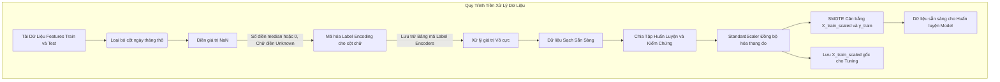

# README: Hành Trình Khai Phá Dữ Liệu Khách Hàng Sàn TMĐT - Sứ Mệnh DAZONE 2025 Vòng 2.2

Chào các chiến binh dữ liệu của đội! Chúng ta đang đứng trước một thử thách lớn từ "Sếp Tổng" tại cuộc thi DAZONE 2025: làm sao để sàn thương mại điện tử của chúng ta giữ chân được khách hàng, khiến họ quay lại mua sắm? File Python này chính là "bảo bối" và "kim chỉ nam" của đội trong hành trình khám phá những bí mật ẩn sâu trong dữ liệu khách hàng. Hãy cùng nhau giải mã nó và mang về chiến thắng nhé! 🚀

## Mục Lục

1. [Nhiệm Vụ Bí Mật: Hiểu Lòng Khách Hàng, Giữ Chân Doanh Thu](#nhiệm-vụ-bí-mật-hiểu-lòng-khách-hàng-giữ-chân-doanh-thu)
2. [Kích Hoạt "Cỗ Máy Thời Gian": Hướng Dẫn Vận Hành Script](#kích-hoạt-cỗ-máy-thời-gian-hướng-dẫn-vận-hành-script)
3. [Bản Thiết Kế "Cỗ Máy": Cấu Trúc Script và Câu Chuyện Đằng Sau](#bản-thiết-kế-cỗ-máy-cấu-trúc-script-và-câu-chuyện-đằng-sau)
   * [Tổng Quan Lộ Trình Khám Phá](#tổng-quan-lộ-trình-khám-phá)
   * [Chương 1: Thu Thập Thông Tin Tình Báo - Chuẩn Bị Dữ Liệu](#chương-1-thu-thập-thông-tin-tình-báo---chuẩn-bị-dữ-liệu)
   * [Chương 2: Chế Tạo Quả Cầu Tiên Tri - Xây Dựng và Đánh Giá Model](#chương-2-chế-tạo-quả-cầu-tiên-tri---xây-dựng-và-đánh-giá-model)
   * [Chương 3: Đọc Vị Quả Cầu & Phân Loại "Chiến Binh" - Phân Tích Sâu và Tạo Chân Dung Khách Hàng](#chương-3-đọc-vị-quả-cầu--phân-loại-chiến-binh---phân-tích-sâu-và-tạo-chân-dung-khách-hàng)
4. [Đáp Án Cho "Sếp Tổng": Đối Chiếu Với Barem Chấm Điểm DAZONE 2025](#đáp-án-cho-sếp-tổng-đối-chiếu-với-barem-chấm-điểm-dazone-2025)
5. [Báo Cáo Chiến Công Lên "Bộ Chỉ Huy": Gợi Ý Trực Quan Hóa Cho Bài Thuyết Trình](#báo-cáo-chiến-công-lên-bộ-chỉ-huy-gợi-ý-trực-quan-hóa-cho-bài-thuyết-trình)
6. [Thông Điệp Từ "Chỉ Huy Trưởng" Đội Đặc Nhiệm](#thông-điệp-từ-chỉ-huy-trưởng-đội-đặc-nhiệm)

## Nhiệm Vụ Bí Mật: Hiểu Lòng Khách Hàng, Giữ Chân Doanh Thu

Sàn thương mại điện tử của chúng ta có hàng triệu khách hàng. Nhưng, ai trong số họ sẽ thực sự gắn bó và quay lại mua hàng tại một gian hàng cụ thể trong 6 tháng tới? Đây không chỉ là một câu hỏi, mà là một "nhiệm vụ tối mật" ảnh hưởng trực tiếp đến doanh thu và sự phát triển bền vững. Nếu chúng ta biết được điều này, chúng ta có thể:

* Chăm sóc đúng người, đúng lúc.
* Tung ra các chương trình khuyến mãi hiệu quả hơn.
* Biến khách hàng mới thành khách hàng trung thành.

"Cỗ máy thời gian" (script Python này) sẽ giúp chúng ta giải quyết nhiệm vụ này bằng cách:

1. **"Thu thập và làm sạch các mảnh ghép quá khứ"**: Chuẩn bị dữ liệu giao dịch và thông tin khách hàng.
2. **"Chế tạo các phiên bản quả cầu tiên tri"**: Xây dựng các mô hình dự đoán.
3. **"Kiểm tra độ chính xác của từng quả cầu"**: Đánh giá model nào "phán" chuẩn nhất.
4. **"Nhận diện các nhóm chiến binh mua sắm"**: Phân loại khách hàng dựa trên hành vi và đặc điểm.
5. **"Vạch ra kế hoạch tác chiến"**: Đề xuất các chiến lược kinh doanh thông minh.

## Kích Hoạt "Cỗ Máy Thời Gian": Hướng Dẫn Vận Hành Script

Để "cỗ máy" của chúng ta bắt đầu hành trình xuyên không về quá khứ và dự đoán tương lai, cả đội cần chuẩn bị:

1. **"Trang bị cá nhân" (Môi trường):** Máy tính được cài Python và các "vũ khí" cần thiết (thư viện) như `pandas`, `numpy` (để xử lý số liệu), `matplotlib`, `seaborn` (để vẽ biểu đồ), `scikit-learn` (bộ công cụ xây model), `imblearn` (để cân bằng lực lượng các nhóm khách hàng), `xgboost`, `lightgbm` (2 "chiến mã" mạnh mẽ), và `shap` (kính lúp soi thấu model).

2. **"Bản đồ kho báu cổ" (Dữ liệu đầu vào):** Các file CSV đã được "lau chùi" từ vòng trước hoặc từ script `data_cleaning.py`, cất giữ trong `cleaning_results/cleaned_data/`:
   * `competition_train_features.csv`: Thông tin huấn luyện các "nhà tiên tri".
   * `competition_test_features.csv`: Thông tin để "thử tài" các "nhà tiên tri".
   * `cleaned_user_info.csv`: Hồ sơ chi tiết của từng khách hàng.

3. **"Niệm thần chú" (Chạy script):** Thực thi file `DAZONE2025_R2.2_Main_Analysis.py`.

4. **"Chiến lợi phẩm" (Kết quả):** Mọi "bí mật" và "kho báu" sẽ được tập hợp tại thư mục `round_2.2`:
   * `model_outputs`: Nơi cất giữ các "quả cầu tiên tri" mạnh nhất.
   * `segmentation_outputs`: "Hồ sơ mật" của từng nhóm khách hàng.
   * `shap_outputs`: "Bản giải mã" cách "quả cầu" đưa ra dự đoán.
   * `visualizations_from_main_analysis`: "Album ảnh" ghi lại những khám phá quan trọng.
   * `logs`: "Biên niên sử" của cuộc hành trình.

## Bản Thiết Kế "Cỗ Máy": Cấu Trúc Script và Câu Chuyện Đằng Sau

Hành trình của chúng ta được chia thành 3 chương lớn, mỗi chương hé lộ một phần của bức tranh toàn cảnh về khách hàng của sàn thương mại điện tử.

### Tổng Quan Lộ Trình Khám Phá

Đây là bức tranh toàn cảnh về hành trình của chúng ta, từ lúc bắt đầu với dữ liệu thô cho đến khi tìm ra những "viên ngọc" insight:

```mermaid
graph TD
    %% Data Sources
    A1["📊 competition_train_features.csv<br/><i>Training Features</i>"] --> SETUP
    A2["📊 competition_test_features.csv<br/><i>Test Features</i>"] --> SETUP
    A3["👥 cleaned_user_info.csv<br/><i>User Demographics</i>"] --> SETUP
      SETUP["🔧 Environment Setup<br/>Libraries & Config"] --> LOAD_TRAIN

    %% PART 1: Data Loading & Feature Preparation
    LOAD_TRAIN["📈 Load Training Data<br/>competition_train_features.csv"]
    LOAD_TEST["📈 Load Test Data<br/>competition_test_features.csv"]
    LOAD_USER["👥 Load User Info<br/>cleaned_user_info.csv"]
    
    DROP_DATES["🗓️ Drop Date Columns<br/>Non-predictive features"]
    ENCODE_CAT["🔤 Categorical Encoding<br/>Label/One-hot encoding"]
    HANDLE_MISSING["❓ Handle Missing Values<br/>Imputation strategies"]
    FEATURE_ENG["🛠️ Feature Engineering<br/>Create derived features"]
    
    LOAD_TRAIN --> DROP_DATES
    LOAD_TEST --> DROP_DATES
    DROP_DATES --> ENCODE_CAT
    ENCODE_CAT --> HANDLE_MISSING
    HANDLE_MISSING --> FEATURE_ENG
    
    FEATURE_ENG --> DF_ALIGNED["📊 Aligned Datasets<br/><i>Train & Test Ready</i>"]
    DF_ALIGNED --> TRAIN_VAL_SPLIT["🔀 Train/Validation Split<br/><i>80/20 split</i>"]
    
    TRAIN_VAL_SPLIT --> X_TRAIN["🎯 X_train<br/><i>Training Features</i>"]
    TRAIN_VAL_SPLIT --> Y_TRAIN["🏷️ y_train<br/><i>Training Labels</i>"]
    TRAIN_VAL_SPLIT --> X_VAL["🎯 X_val<br/><i>Validation Features</i>"]
    TRAIN_VAL_SPLIT --> Y_VAL["🏷️ y_val<br/><i>Validation Labels</i>"]
    
    X_TRAIN --> SCALING["📏 Feature Scaling<br/>StandardScaler"]
    X_VAL --> SCALING
    SCALING --> SCALED_DATA["✨ Scaled Features<br/><i>Normalized datasets</i>"]

    %% PART 2: Model Training, Evaluation & Optimization
    SCALED_DATA --> SMOTE_BALANCE["🔄 SMOTE Balancing<br/>Address class imbalance"]
    SMOTE_BALANCE --> BALANCED_DATA["⚖️ Balanced Training Set<br/><i>Equal class distribution</i>"]
    
    OPTION1["🎯 Option 1: Base Models<br/>Random Forest, Logistic Regression<br/>Gradient Boosting, Decision Tree"]
    OPTION2["🎯 Option 2: Extended Models<br/>+ MLP, SVC, Extra Trees<br/>AdaBoost, Naive Bayes"]
    
    BALANCED_DATA --> OPTION1
    BALANCED_DATA --> OPTION2
    
    OPTION1 --> METRICS1["📈 Performance Metrics 1<br/>Accuracy, Precision, Recall, F1"]
    OPTION2 --> METRICS2["📈 Performance Metrics 2<br/>Extended evaluation"]
    
    METRICS1 --> MODEL_SELECTION["🏆 Best Model Selection<br/>Based on validation performance"]
    METRICS2 --> MODEL_SELECTION
    
    MODEL_SELECTION --> RFECV["🔍 Recursive Feature Elimination<br/>Cross-Validation (RFECV)"]
    RFECV --> OPTIMAL_FEATURES["⭐ Optimal Feature Set<br/><i>~19 selected features</i>"]
    
    SCALED_DATA --> FILTER_FEATURES["🎛️ Apply Feature Selection<br/>Filter to optimal features"]
    OPTIMAL_FEATURES --> FILTER_FEATURES
    FILTER_FEATURES --> REDUCED_DATA["🎯 Feature-Reduced Dataset<br/><i>Optimized for performance</i>"]
    
    REDUCED_DATA --> FINAL_SMOTE["🔄 Final SMOTE Application<br/>On selected features"]
    FINAL_SMOTE --> FINAL_TRAINING_SET["⚖️ Final Training Set<br/><i>Balanced + Feature-Selected</i>"]
    
    MODEL_SELECTION --> SELECT_TOP2["🎯 Select Top 2 Models<br/>For intensive tuning"]
    SELECT_TOP2 --> GRID_SEARCH["🔧 Grid Search CV<br/>Hyperparameter optimization"]
    
    GRID_SEARCH --> TUNED_MODEL1["🔧 Tuned Model 1<br/><i>Optimized hyperparameters</i>"]
    GRID_SEARCH --> TUNED_MODEL2["🔧 Tuned Model 2<br/><i>Optimized hyperparameters</i>"]
    
    FINAL_TRAINING_SET --> FINAL_EVALUATION["📊 Final Model Evaluation<br/>Cross-validation + holdout"]
    TUNED_MODEL1 --> FINAL_EVALUATION
    TUNED_MODEL2 --> FINAL_EVALUATION
    
    FINAL_EVALUATION --> CHAMPION_MODEL["👑 Champion Model<br/><i>Best performing model</i>"]

    %% PART 3: SHAP Analysis, User Segmentation & Business Insights
    CHAMPION_MODEL --> SHAP_CALC["🔬 SHAP Value Calculation<br/>Feature importance analysis"]
    REDUCED_DATA --> SHAP_CALC
    
    SHAP_CALC --> SHAP_PLOTS["📊 SHAP Visualizations<br/>Summary, waterfall, dependence plots"]
    SHAP_CALC --> FEATURE_IMPORTANCE["⭐ Global Feature Importance<br/>Most predictive features"]
    
    DF_ALIGNED --> USER_BEHAVIOR["📊 Aggregate User Behavior<br/>Transaction patterns & metrics"]
    LOAD_USER --> USER_DEMOGRAPHICS["👤 User Demographics<br/>Age, location, preferences"]
    
    USER_BEHAVIOR --> MERGE_DATA["🔗 Merge Behavioral & Demographic<br/>Comprehensive user profiles"]
    USER_DEMOGRAPHICS --> MERGE_DATA
    
    MERGE_DATA --> SEGMENT_PREP["⚙️ Segmentation Preprocessing<br/>Scaling & normalization"]
    SEGMENT_PREP --> ELBOW_METHOD["📈 Optimal K Determination<br/>Elbow method analysis"]
    
    ELBOW_METHOD --> KMEANS["🎯 K-Means Clustering<br/><i>Typically K=4 segments</i>"]
    KMEANS --> USER_CLUSTERS["👥 User Clusters<br/>Behavioral segments"]
    
    USER_CLUSTERS --> CLUSTER_PROFILES["📊 Initial Cluster Profiling<br/>Segment characteristics"]
    
    DF_ALIGNED --> REPURCHASE_LABELS["🏷️ User-Level Repurchase Rates<br/>Aggregate purchase behavior"]
    
    CLUSTER_PROFILES --> MERGE_OUTCOMES["🔗 Merge Clusters with Outcomes<br/>Segment + repurchase data"]
    REPURCHASE_LABELS --> MERGE_OUTCOMES
    
    MERGE_OUTCOMES --> ENHANCED_PROFILES["✨ Enhanced Cluster Profiles<br/>Segments with repurchase rates"]
    
    ENHANCED_PROFILES --> PERSONA_RULES["👤 Define Persona Criteria<br/>Thresholds & characteristics"]
    PERSONA_RULES --> ASSIGN_PERSONAS["🎭 Assign User Personas<br/>Map clusters to personas"]
    
    ASSIGN_PERSONAS --> FINAL_PERSONAS["🎭 Final User Personas<br/>Named & characterized segments"]
    FINAL_PERSONAS --> PERSONA_ANALYSIS["📈 Persona Repurchase Analysis<br/>Conversion rates by persona"]
    
    ENHANCED_PROFILES --> VISUALIZATION["📊 Cluster Visualizations<br/>2D/3D scatter plots"]
    PERSONA_ANALYSIS --> PERSONA_VIZ["🎨 Persona Visualizations<br/>Business-friendly charts"]

    %% Business Impact & Recommendations
    CHAMPION_MODEL --> INSIGHTS_ENGINE["💡 Business Insights Generator<br/>Automated insight extraction"]
    FEATURE_IMPORTANCE --> INSIGHTS_ENGINE
    FINAL_PERSONAS --> INSIGHTS_ENGINE
    PERSONA_ANALYSIS --> INSIGHTS_ENGINE
    
    INSIGHTS_ENGINE --> KEY_INSIGHTS["📋 Key Business Insights<br/>Actionable recommendations"]
    INSIGHTS_ENGINE --> MARKETING_STRATEGY["🎯 Marketing Strategy<br/>Persona-based targeting"]
    INSIGHTS_ENGINE --> RETENTION_TACTICS["🔄 Retention Tactics<br/>Segment-specific approaches"]
    
    CHAMPION_MODEL --> DEPLOYMENT_PLAN["🚀 Model Deployment Plan<br/>Production implementation"]
    CHAMPION_MODEL --> PREDICTION_PIPELINE["🔮 Future Prediction Pipeline<br/>Real-time scoring"]

    %% Styling with GitHub-compatible colors
    classDef dataSource fill:#e1f5fe,stroke:#0277bd,stroke-width:2px,color:#000
    classDef process fill:#f3e5f5,stroke:#7b1fa2,stroke-width:2px,color:#000
    classDef model fill:#e8f5e8,stroke:#388e3c,stroke-width:2px,color:#000
    classDef decision fill:#fff3e0,stroke:#f57c00,stroke-width:2px,color:#000
    classDef analysis fill:#fce4ec,stroke:#c2185b,stroke-width:2px,color:#000
    classDef insights fill:#e0f2f1,stroke:#00695c,stroke-width:2px,color:#000
    classDef champion fill:#fff9c4,stroke:#f57f17,stroke-width:3px,color:#000,font-weight:bold
    classDef intermediate fill:#f5f5f5,stroke:#616161,stroke-width:1px,color:#000

    %% Apply classes
    class A1,A2,A3,LOAD_TRAIN,LOAD_TEST,LOAD_USER dataSource
    class DROP_DATES,ENCODE_CAT,HANDLE_MISSING,FEATURE_ENG,SCALING,SMOTE_BALANCE,FINAL_SMOTE,FILTER_FEATURES,SEGMENT_PREP process
    class OPTION1,OPTION2,RFECV,GRID_SEARCH,TUNED_MODEL1,TUNED_MODEL2,KMEANS,SHAP_CALC model
    class MODEL_SELECTION,SELECT_TOP2,ELBOW_METHOD,PERSONA_RULES,ASSIGN_PERSONAS decision
    class SHAP_PLOTS,FEATURE_IMPORTANCE,CLUSTER_PROFILES,ENHANCED_PROFILES,PERSONA_ANALYSIS,VISUALIZATION,PERSONA_VIZ analysis
    class KEY_INSIGHTS,MARKETING_STRATEGY,RETENTION_TACTICS,DEPLOYMENT_PLAN,PREDICTION_PIPELINE,INSIGHTS_ENGINE insights
    class CHAMPION_MODEL champion
    class SETUP,DF_ALIGNED,TRAIN_VAL_SPLIT,X_TRAIN,Y_TRAIN,X_VAL,Y_VAL,SCALED_DATA,BALANCED_DATA,METRICS1,METRICS2,OPTIMAL_FEATURES,REDUCED_DATA,FINAL_TRAINING_SET,FINAL_EVALUATION,USER_BEHAVIOR,USER_DEMOGRAPHICS,MERGE_DATA,USER_CLUSTERS,REPURCHASE_LABELS,MERGE_OUTCOMES,FINAL_PERSONAS intermediate
```



### Chương 1: Thu Thập Thông Tin Tình Báo - Chuẩn Bị Dữ Liệu

Trong chương này, chúng ta như những nhà khảo cổ, cẩn thận thu thập từng mảnh vỡ thông tin, làm sạch và sắp xếp chúng để chuẩn bị cho việc tái tạo lại bức tranh quá khứ và dự đoán tương lai. Đây là nền móng của mọi phân tích!

* **Khai Báo "Dụng Cụ Khảo Cổ" (Import Libraries)**
* **Thiết Lập "Khu Vực Khai Quật" (Configuration)**
* **Tạo Các "Hầm Trưng Bày" (Output Directory Setup)**
* **Ghi "Nhật Ký Khảo Cổ" (Logging Setup)**
* **Thu Thập "Cổ Vật" (Load Data)**
* **"Giám Định Sơ Bộ Cổ Vật" (Initial Data Exploration):** Vẽ biểu đồ tròn xem tỷ lệ khách hàng quay lại/không quay lại.
* **"Làm Sạch và Phục Chế Cổ Vật" (Data Preparation for Modeling):** Đây là một quy trình tỉ mỉ:



* **Chuẩn Bị Sẵn Các "Bản Phác Thảo Quả Cầu" (Model Options Storage)**
* **Dọn Dẹp "Phòng Thí Nghiệm" (Memory Management)**

### Chương 2: "Chế Tạo Quả Cầu Tiên Tri" - Xây Dựng và Đánh Giá Model

Sau khi "nguyên liệu" đã sẵn sàng, các "pháp sư dữ liệu" của chúng ta bắt tay vào việc chế tạo và thử nghiệm những "quả cầu tiên tri" có khả năng nhìn thấu tương lai.

* **Hàm "Thẩm Định Quả Cầu" (`evaluate_model_performance`):** "Hội đồng giám khảo" nội bộ của chúng ta, chuyên chấm điểm các "quả cầu".

* **Luồng Chế Tạo và Thử Nghiệm "Quả Cầu":**
  * **Quy Trình Chuẩn cho mỗi "Quả Cầu" được đánh giá ban đầu:**
    ```mermaid
    graph LR
        A[Dữ liệu huấn luyện đã chuẩn bị] --> B(SMOTE Cân bằng lực lượng);
        B --> C[Thôi miên Quả Cầu trên X_train_smote];
        C --> D[Thử tài Quả Cầu trên X_val_scaled];
        D --> E[Kết quả Điểm số và Biểu đồ];
    ```
  * **Quy Trình "Mài Giũa Quả Cầu" (Hyperparameter Tuning):**
    ```mermaid
    graph TD
        subgraph Quy Trình Tinh Chỉnh Siêu Tham Số
            A[Chọn Model Tốt Nhất Ban Đầu] --> B{Có Grid Tham Số cho Model này};
            B -- Có --> C[Xác định Model Instance và Dải Tham Số];
            C --> D[Sử dụng X_train_scaled và y_train gốc];
            D -- Truyền Class Weight hoặc Scale Pos Weight --> E(RandomizedSearchCV Tìm Cấu Hình Tốt Nhất);
            E --> F[Đánh giá Model Đã Tinh Chỉnh trên X_val_scaled];
            F --> G{Hiệu suất có cải thiện};
            G -- Có --> H[Cập nhật là Model Tốt Nhất Hiện Tại];
            G -- Không --> I[Giữ Model Gốc Tốt Hơn];
        end
    ```

* **Hai "Lò Rèn Thần Khí" (Two Modeling Options):**

  * **Lò Rèn 1: Tập Trung Rèn Giũa Những "Thần Khí" Đã Có Tiếng Tăm (Opt1 Models)**
    * *Chiến thuật:* Mời các "thợ rèn bậc thầy" (`LightGBM_Opt1`, `RandomForest_Opt1`, `XGBoost_Opt1`, `LogisticRegression_Opt1`) đến để chế tạo "vũ khí" theo công thức cơ bản của họ.
    * *Mục tiêu:* Xem xét nhanh hiệu suất của các model mạnh với cấu hình tiêu chuẩn, phù hợp với từng cấp độ thử thách.
    * *Luồng công việc:*
      ```mermaid
      graph TD
          A[Dữ liệu đã sơ chế và SMOTE] --> B1[Huấn luyện và Đánh giá LightGBM_Opt1];
          A --> B2[Huấn luyện và Đánh giá RandomForest_Opt1];
          A --> B3[Huấn luyện và Đánh giá XGBoost_Opt1];
          A --> B4[Huấn luyện và Đánh giá LogisticRegression_Opt1];
          B1 & B2 & B3 & B4 --> C[Tổng hợp kết quả Option 1];
      ```

  * **Lò Rèn 2: Tổ Chức "Thiên Hạ Đệ Nhất Lò Rèn" (Comp Models - Comparative Analysis)**
    * *Chiến thuật:* Mở một "đại hội võ lâm" cho nhiều "thợ rèn" từ các "môn phái" khác nhau, xem ai rèn ra "thần khí" lợi hại nhất.
    * *Mục tiêu:* So sánh một loạt thuật toán đa dạng để tìm ra "chân mệnh thiên tử".
    * *Luồng công việc:*
      ```mermaid
      graph TD
          A[Dữ liệu đã sơ chế và SMOTE] --> B[So Sánh Đồng Loạt Nhiều Models];
          B --> LR[Huấn luyện và Đánh giá LR_Comp];
          B --> RF[Huấn luyện và Đánh giá RF_Comp];
          B --> XGB[Huấn luyện và Đánh giá XGB_Comp];
          B --> LGBM[Huấn luyện và Đánh giá LGBM_Comp];
          B --> SVC[Huấn luyện và Đánh giá SVC_Comp];
          B --> MLP[Huấn luyện và Đánh giá MLP_Comp];
          LR & RF & XGB & LGBM & SVC & MLP --> C[Tổng hợp kết quả Option 2];
          C --> D[So sánh và chọn Model nổi bật từ Option 2];
      ```

* **Công Bố "Bảng Vàng" và Chọn "Võ Trạng Nguyên" (Model Comparison, Best Model Before Tuning)**
* **"Bế Quan Luyện Công" Cho "Võ Trạng Nguyên" (Hyperparameter Tuning)**
* **"Thần Khí Xuất Thế" (Final Best Model) và "Yếu Quyết Võ Công" (Feature Importance)**

### Chương 3: "Đọc Vị Quả Cầu" & Phân Loại "Chiến Binh" - Phân Tích Sâu và Tạo Chân Dung Khách Hàng

Khi đã có "thần khí" trong tay, chúng ta cần hiểu rõ sức mạnh của nó và dùng nó để "nhìn thấu" tâm can của từng nhóm khách hàng, từ đó đưa ra những chiến lược phù hợp cho sàn thương mại điện tử.

* **I. "Soi Gương Ma Thuật" - Hiểu Cách "Quả Cầu" Suy Nghĩ (SHAP Analysis):**
  * *Mục tiêu:* "Quả cầu tiên tri" không còn là một hộp đen bí ẩn nữa! SHAP giúp chúng ta hiểu rõ từng "luồng suy nghĩ" của nó.
  * *Luồng công việc:*
    ```mermaid
    graph TD
        A[Model Tốt Nhất Cuối Cùng] --> B[Lấy Mẫu Dữ Liệu X_val_scaled];
        A --> C{Model thuộc loại Tree-based};
        C -- Có --> D[Sử dụng SHAP TreeExplainer];
        C -- Không, có predict_proba --> E[Sử dụng SHAP KernelExplainer];
        E -- Cần dữ liệu nền --> D;
        D --> F[Tính toán SHAP Values];
        F --> G[Vẽ Biểu Đồ SHAP Summary];
        G --> H[Lưu Kết Quả Độ Quan Trọng SHAP];
    ```

* **II. "Điểm Binh Khách Hàng" - Phân Loại Khách Hàng Thông Minh (User Segmentation - K-Means Clustering):**
  * *Mục tiêu:* Không phải khách hàng nào cũng giống nhau. Chúng ta sẽ chia họ thành các "biệt đội" có cùng "chí hướng" và "phong cách".
  * *Luồng công việc:*
    ```mermaid
    graph TD
        A[Dữ Liệu Khách Hàng Tổng Hợp] --> B[Kết hợp Thông Tin Nhân Khẩu Học];
        B --> C[Tiền Xử Lý Dữ Liệu cho Clustering];
        C -- Dữ liệu đã Scale --> D{Tính Inertia và Silhouette Scores};
        D -- Cho các giá trị k khác nhau --> E[Vẽ Đồ Thị Elbow và Silhouette];
        E --> F{Chọn optimal_k theo K_SELECTION_METHOD};
        F -- optimal_k --> G[Chạy K-Means với optimal_k];
        G --> H[Gán Nhãn Cụm cho Khách Hàng];
        H --> I[Profiling Cụm Phân tích đặc điểm từng cụm];
        I --> J[Lưu Kết Quả Phân Cụm];
    ```

* **III. "Phong Tước Hiệu" Cho Các "Biệt Đội" (Persona Assignment):** Dựa trên đặc điểm của từng "biệt đội", chúng ta đặt cho họ những "biệt danh" thể hiện rõ bản chất (ví dụ: "Đại Gia Mua Sắm", "Thợ Săn Khuyến Mãi", "Khách Hàng Tiềm Năng Ngủ Đông").

* **IV. "Cẩm Nang Thượng Sách" Cho Sàn TMĐT (Business Insights & Recommendations):** Từ những gì "quả cầu" tiết lộ và các "biệt đội" được hình thành, chúng ta sẽ viết nên những "kế sách" giúp sàn TMĐT tăng doanh thu, giữ chân khách hàng.

* **V. "Báo Cáo Tổng Lực Lượng" và "Kế Hoạch Mở Rộng Bờ Cõi" (Final Summary & Next Steps).**

## Đáp Án Cho "Sếp Tổng": Đối Chiếu Với Barem Chấm Điểm DAZONE 2025

Phiên bản script này, khi chạy ở PRODUCTION TIER 2, đã thể hiện nhiều điểm mạnh:

### 1. Forecasting & Model Evaluation (30%)
* **Script làm được:** Rất nhiều model được thử nghiệm. So sánh rõ ràng. Metrics đầy đủ. Hyperparameter tuning được thực hiện nghiêm túc trên dữ liệu gốc và đã kiểm soát overfitting trong CV tốt hơn. Việc chọn `RandomForest_Comp_Tuned` làm model cuối cùng là hợp lý dựa trên kết quả validation.
* **Chấm điểm (ước lượng):** 75-90%. Phần này rất mạnh.

### 2. User Segmentation & Personalization Strategy (25%)
* **Script làm được:** K-Means với `optimal_k` được chọn linh hoạt theo cấu hình (`silhouette` trong log mới nhất, cho `k=4`). Có profiling và gán Persona cho 4 cụm. Các đề xuất chiến lược có cơ sở.
* **Chấm điểm (ước lượng):** 70-85%. Để tối đa, bài thuyết trình cần nhấn mạnh chiến lược cực kỳ chi tiết, cá nhân hóa cho từng persona (kênh, nội dung, thời điểm, KPI đo lường cụ thể, và có thể ước tính sơ bộ ROI nếu được).

### 3. Visualization & Storytelling (20%)
* **Script làm được:** Tạo ra bộ sưu tập biểu đồ tĩnh phong phú, làm nền tảng tốt cho việc kể chuyện.
* **Chấm điểm (ước lượng):** 50-70%. Điểm cộng cho sự đa dạng. Để cao hơn, bài thuyết trình cần sâu chuỗi chúng thành một câu chuyện kinh doanh mạch lạc, logic và hấp dẫn về hành trình tìm hiểu khách hàng của sàn TMĐT.

### 4. Business Insights (25%)
* **Script làm được:** Insight từ SHAP và 4 persona rõ ràng cung cấp nhiều hiểu biết giá trị. Các đề xuất chiến lược dựa trên kết quả phân tích.
* **Chấm điểm (ước lượng):** 70-85%. Hãy làm nổi bật những insight "đắt giá" nhất, có thể gây bất ngờ hoặc có tính ứng dụng cao cho việc giữ chân khách hàng trên sàn TMĐT.

**Tổng kết:** "Cỗ máy" của chúng ta đã được nâng cấp đáng kể, cho ra những "báu vật" chất lượng hơn!

## Báo Cáo Chiến Công Lên "Bộ Chỉ Huy": Gợi Ý Trực Quan Hóa Cho Bài Thuyết Trình

Dựa trên log chạy `PRODUCTION_TIER = 2` và `K_SELECTION_METHOD = "silhouette"` (kết quả `optimal_k=4`):

### 1. Câu Chuyện Mở Đầu - "Thử Thách Của Sàn TMĐT"
* `target_variable_distribution.png`: Đặt vấn đề về tỷ lệ khách hàng không quay lại.

### 2. Hành Trình "Tìm Kiếm Quả Cầu Tiên Tri Tốt Nhất"
* **Bảng So Sánh Model Ban Đầu:** Nêu bật `MLPClassifier_Comp` là ứng viên tiềm năng nhất ban đầu.
* **Tóm Tắt Kết Quả "Mài Giũa" (Tuning):**
  * Cho thấy `RandomForest_Comp_Tuned` đã cải thiện như thế nào so với bản gốc (AUC từ 0.6071 lên 0.6279).
  * So sánh với `MLPClassifier_Comp_Tuned` (AUC 0.6097) để thấy RF_Tuned vượt trội hơn.
* **"Minh Chứng Sức Mạnh" của `RandomForest_Comp_Tuned`:**
  * `confusion_matrix_RandomForest_Comp_Tuned.png`
  * ROC Curve và Precision-Recall Curve (có thể vẽ riêng cho model này, hoặc trích từ `roc_curves_comparative_models.png` và `pr_curves_comparative_models.png` nhưng chỉ làm nổi bật đường của model tốt nhất).
* `feature_importances_RandomForest_Comp_Tuned.png`: Những "thần chú" model này dựa vào.

### 3. "Bên Trong Quả Cầu" - Giải Mã Với SHAP
* `shap_summary_plot_RandomForest_Comp_Tuned.png` (dot plot).
* `shap_bar_plot_RandomForest_Comp_Tuned.png`.

### 4. "Bản Đồ Các Nhóm Khách Hàng Chiến Lược" (`k=4`)
* `kmeans_silhouette_scores.png` (và có thể cả `kmeans_elbow_method.png` để so sánh): Giải thích tại sao chọn `k=4`.
* `user_segment_distribution.png` (cho `k=4`): Quy mô của 4 "biệt đội".
* `cluster_profiles_boxplots.png` (cho `k=4`): So sánh trực quan các đặc điểm cốt lõi của 4 "biệt đội".
* **Slide Chân Dung Persona (4 personas):** Mỗi persona một slide (hoặc 2 persona/slide) với tên, đặc điểm nổi bật (trích từ `cluster_profiles_combined.csv`), và gợi ý chiến lược chính cho sàn TMĐT.

### 5. "Chân Dung Vàng" - Khách Hàng Lý Tưởng Của Sàn TMĐT
* `ideal_customer_profile_age_dist.png`
* `ideal_customer_profile_sex_dist.png`.

### 6. Slide "Kế Sách Vàng"
Tổng hợp các đề xuất chiến lược then chốt, liên kết với model insights và personas, tập trung vào việc "Làm sao để sàn TMĐT giữ chân khách hàng và tăng doanh thu?".

### Lời khuyên vàng ngọc cho đội khi kể chuyện:
* **Bắt đầu bằng vấn đề kinh doanh:** Sàn TMĐT muốn gì? (Giữ chân khách hàng).
* **Hành trình của đội:** Chúng ta đã làm gì để giải quyết? (Mô tả các bước bằng ngôn ngữ kinh doanh, sử dụng các pipeline Mermaid làm minh họa trực quan cho quy trình).
* **Kết quả và ý nghĩa:** Những khám phá chính là gì? Chúng có ý nghĩa gì cho sàn TMĐT?
* **Hành động:** Sàn TMĐT nên làm gì tiếp theo?

## Thông Điệp Từ "Chỉ Huy Trưởng" Đội Đặc Nhiệm

Các chiến binh, "cỗ máy thời gian" của chúng ta đã hoạt động hết công suất và mang về những thông tin vô giá từ "mỏ vàng" dữ liệu. Chúng ta đã hiểu rõ hơn về các "thời cơ" và "thách thức" trong việc giữ chân khách hàng trên sàn thương mại điện tử.

Giờ là lúc chúng ta, với vai trò là những nhà phân tích dữ liệu tài ba, trình bày những khám phá này một cách thuyết phục nhất, không chỉ là những con số, mà là một câu chuyện kinh doanh có tầm nhìn và giải pháp. Hãy cho "Sếp Tổng" DAZONE thấy giá trị mà đội chúng ta mang lại!

Chúc cả đội tự tin, đoàn kết và chiến thắng! 🌟🏆 
